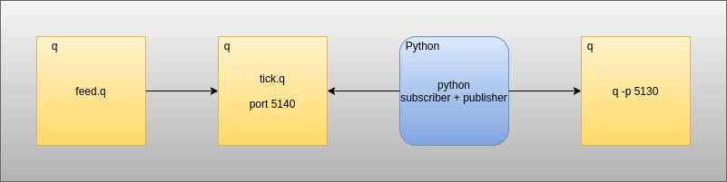

# IPC interface example

_This example provides a quickstart for interfacing with external q processes using PyKX._

This example should work whether or not a `#!python k4.lic` file is present. The purpose is to show the flexibility of this interface for users who had previously used PyKX or are familiar with qPython.

To follow along, feel free to download this <a href="./archive.zip" download>zip archive</a> that contains a copy of the Python script and this writeup.

## Quickstart

This example shows a basic tickerplant configured as follows:



Here we have:

1. A q data feed publishing trade messages to a tick process.
2. A q process running a modified `#!python tick.q`.
3. A Python process subscribing to the tick process, running a Python analytic on the trade data and pushing the results to another process.
4. A q process to which the results of the Python analytic can be pushed.

!!! tip "For more information about the differences between the licensed and unlicensed versions of this example consult `#!python readwrite.py` for a breakdown of the steps taken in the presence/absence of a licensed shared object."

### Start the required q processes

```q
// run tick.q
$ q tick/tick.q sym ./log/
q)

// run the mock feed
$ q tick/feed.q
q)

// Start the q process to receive data from PyKX
$ q -p 5130
q)
```

### Start the pykx subscriber/publisher

```bash
// When running with a valid k4.lic in $QHOME
$ python readwrite.py
Running example in presence of licensed q

// When running in the absence of a valid k4.lic in $QHOME
'2021.04.02T11:32:41.006 license error: k4.lic
Running example in absence of licensed q
```

### Outcome

On invocation of the above, the process running on 5130 should begin to receive summaries of the average size/price of the individual tick symbols being published. The licensed and unlicensed versions are not the same in this regard.

1. The licensed version will return the average over the entire trade table that it is subscribed to
2. The unlicensed version will display the the average over the most recent batch of data received
