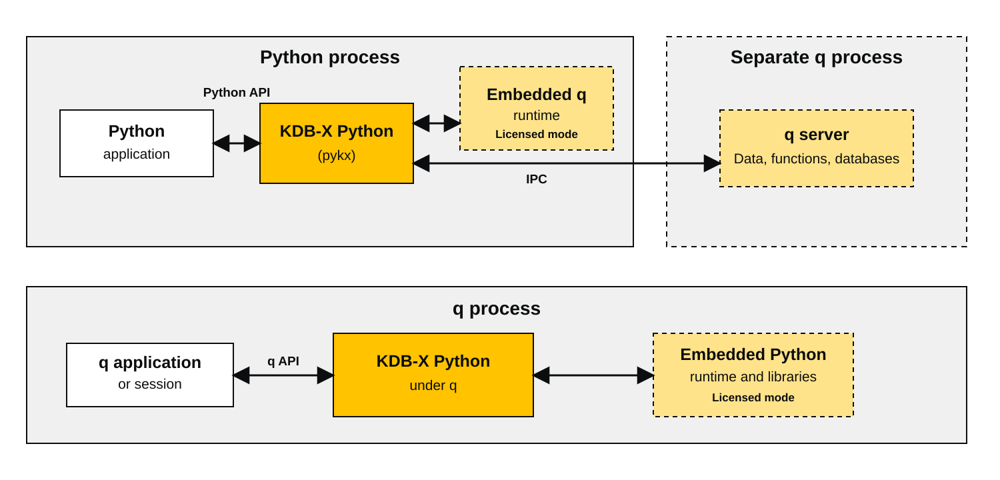
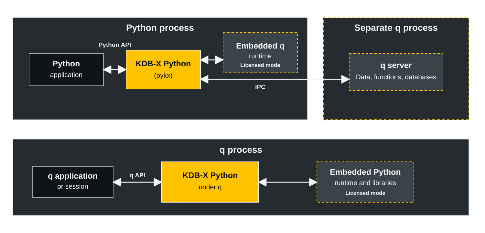

# About KDB-X Python

_This page describes KDB-X Python, its use cases, and its role in the KDB-X platform._

**KDB-X Python** is the official Python interface to **KDB-X**. Python code can create and query q objects, call q functions in the embedded runtime, and connect to separate q processes over IPC.

## Why use KDB-X Python

KDB-X Python brings KDB-X data and q execution into familiar Python workflows:

- Use q vector operations, temporal data types, and queries from a standard Python process.
- Keep licensed, in-process workloads in q memory instead of serializing data through an IPC-only client.
- Convert data to and from native Python, NumPy, pandas, and PyArrow representations when another Python tool needs it.
- Use one KX-supported interface for embedded q, remote q over IPC, and Python under q.

## Intended audience

This page applies to:

- **Python developers** who use q types, q functions, or KDB-X databases from Python.
- **q developers** who call Python libraries from q or manage q through Python.
- **[Existing PyKX users](../upgrades/3040.md)** migrating to KDB-X Python 4.0 or later.
- **Data engineers and data scientists** who access KDB-X data from Python.

## Use cases

KDB-X Python supports these main use cases:

1. Store, query, manipulate, and use [q objects](../learn/objects.md) within a Python process.
2. Query external q processes over an [interprocess communication (IPC)](../user-guide/advanced/ipc.md) interface.
3. Run Python code in a native q session with [KDB-X Python under q](../pykx-under-q/intro.md).

## KDB-X Python architecture

KDB-X Python supports Python-first and q-first applications. The following diagram shows how it integrates Python and q through embedded runtimes and IPC.

For license requirements and feature availability, [compare the modes of operation](../user-guide/advanced/modes.md).

{ .only-light .no-bg }
{ .only-dark .no-bg }

??? note "Learn more about q and KDB-X"

    KDB-X uses the kdb+ execution engine and the q programming language.

    - **KDB-X** extends the kdb+ execution engine with modules and interfaces for q, Python, SQL, and open data formats. It processes data in memory and on disk and treats temporal data as a first-class type.

    - **q** is a concise and expressive programming language that combines vector operations with functional programming. KDB-X Python exposes q types, functions, and the runtime through Python.

    To learn more about q and KDB-X, use these resources:

    - [An introduction to q and KDB-X](https://code.kx.com/q/learn/tour/)
    - [Tutorial videos that introduce q and KDB-X](https://code.kx.com/q/learn/q-for-all/)

## Python and q interfaces

Three historical interfaces connect Python with q and KDB-X:

1. [embedPy](https://code.kx.com/q/ml/embedpy)
2. [PyQ](https://github.com/KxSystems/pyq)
3. [qPython](https://github.com/exxeleron/qPython)

The following table summarizes the key differences between embedPy, PyQ, qPython, and KDB-X Python:

| **Feature**      | **embedPy**                       | **PyQ**                                | **qPython**                                      | **KDB-X Python**                                      |
| ---------------- | --------------------------------- | -------------------------------------- | ------------------------------------------------ | ----------------------------------------------------- |
| Interoperability | Calls Python from q               | Runs Python and q in the same process  | Connects Python to q over IPC                  | Runs q in process or connects to q over IPC            |
| Execution        | Runs from a q session             | Requires the PyQ binary or a q startup | Runs processing in q and deserializes in Python | Runs from a Python session with a class-based type system |
| Use case         | Adds Python features to q         | Operates on the same data in both languages | Connects Python applications to q          | Stores and queries q objects from Python or a q session |
| Access modes     | Calls Python from q               | Requires the PyQ binary                | IPC                                              | Embedded q, IPC, and Python under q                    |
| Data conversion  | Supports q, NumPy, and Python     | Supports q, NumPy, and pandas          | Converts data across the socket                 | Shares q memory and supports NumPy, pandas, and PyArrow |

??? note "Compare embedPy, PyQ, qPython, and KDB-X Python"

    Compare how each interface operates:
                                                                
    - **embedPy** calls Python from q but does not call q from Python. q developers use it for Python features such as machine learning, statistical methods, and plotting.
    - **PyQ** integrates Python and q interpreters in the same process but requires a PyQ binary or q startup instead of the standard Python executable.
    - **qPython** takes a Python-first approach but works entirely over IPC. It serializes Python objects, sends them to q over a socket, and deserializes returned q objects. These operations can use significant processing and memory resources.
    - **KDB-X Python** stores, queries, and manipulates q objects in a Python process and queries external q processes over IPC. It provides Python APIs for q types, q functions, q scripts, and IPC connections.

!!! tip "Support for embedPy, PyQ, and qPython"

	KX maintains embedPy and PyQ on a best-effort basis under the [Fusion](https://code.kx.com/q/interfaces) initiative. KX does not support qPython, which is in maintenance mode. KDB-X Python is the current KX-supported interface for Python and q integration.

## Next steps

- [Install KDB-X Python](installing.md)
- Already installed and licensed? [Run the quickstart](quickstart.md)
