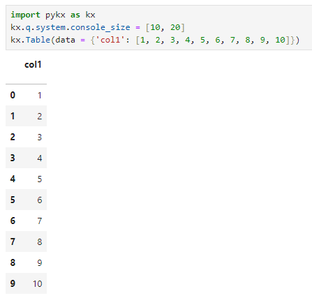

# PyKX Changelog

!!! Note

	The changelog presented here outlines changes to PyKX when operating within a Python environment specifically, if you require changelogs associated with PyKX operating under a q environment see [here](./underq-changelog.md).

## PyKX 3.1.6

#### Release Date

2025-12-01

### Fixes and Improvements

- Updated 4.1 to 2025.11.25 for all platforms.
- Fixed issue where setting `sort=True` when calling `merge` on two `kx.Tables` ignored the supplied `on` parameter.

	=== "Behavior prior to change"

        ```Python
        >>> da = kx.q.z.D
		>>> a = kx.toq(pd.DataFrame({'r':[2,3,4],'date':[da-2, da, da-1], 'k':[10, 11, 12]}))
		>>> b = kx.toq(pd.DataFrame({'r':[5,6,7],'date':[da-2, da-1, da], 'k':[13, 14, 15]}))
        >>> a.merge(b, on='date', sort=True)
		pykx.Table(pykx.q('
		r_x date       k_x r_y k_y
		--------------------------
		2   2025.11.25 10  5   13
		3   2025.11.27 11  7   15
		4   2025.11.26 12  6   14
		'))
        ```

	=== "Behavior post change"

        ```Python
        >>> da = kx.q.z.D
		>>> a = kx.toq(pd.DataFrame({'r':[2,3,4],'date':[da-2, da, da-1], 'k':[10, 11, 12]}))
		>>> b = kx.toq(pd.DataFrame({'r':[5,6,7],'date':[da-2, da-1, da], 'k':[13, 14, 15]}))
		>>> a.merge(b, on='date', sort=True)
		pykx.Table(pykx.q('
		r_x date       k_x r_y k_y
		--------------------------
		2   2025.11.25 10  5   13 
		4   2025.11.26 12  6   14 
		3   2025.11.27 11  7   15 
		'))
        ```

## PyKX 3.1.5

#### Release Date

2025-10-21

### Fixes and Improvements

- Availability for Intel Macs on PyPI has been restored.
- Paths starting with '~' will now have it expanded to users home path in `PYKX_CONFIGURATION_LOCATION`, `Encrypt`, `DB`, and `system.load` functionality (using `os.path.expanduser`).
- More strict listing of which tables to include in `db.tables`.
- Users will be warned when they attempt to create more than one `DB` object.

    ```python
    >>> import pykx as kx
    >>> db = kx.DB(path="tmp/db1")
    >>> db2 = kx.DB(path="tmp/db2")
    PyKXWarning: Only one DB object exists at a time within a process. Use overwrite=True to overwrite your existing DB object. This warning will error in future releases.
    >>> db3 = kx.DB(path="tmp/db3", overwrite=True)
    >>> 
    ```

- Use of `Table.astype()` was creating a `.papi.errorList` variable, this has been moved inside the `.pykx` namespace as `.pykx.i.errorList`.
- Added `no_allocator` keyword argument to `pykx.toq` that allows one time disabling of the PyKX allocator during a conversion. See [here](../help/issues.md#known-issues) for details.
- Fixed an issue when converting dataframes with embeddings arrays.

	=== "Behavior prior to change"

        ```Python
        >>> df=pd.DataFrame(dict(embeddings=list(np.random.ranf((500, 10)).astype(np.float32))))
        >>> kx.toq(df)
        segfault
        ```

	=== "Behavior post change"

        ```Python
        >>> df=pd.DataFrame(dict(embeddings=list(np.random.ranf((500, 10)).astype(np.float32))))
        >>> kx.toq(df)
        ```

- Addition of `__array__` method to Atom classes. Enables `np.asarray` to create typed arrays.

	=== "Behavior prior to change"

		```python
		>>> np.asarray(kx.FloatAtom(3.65)).dtype
		dtype('O')
		>>> np.asarray(kx.BooleanAtom(1)).dtype
		dtype('O')
		>>> np.asarray(kx.DateAtom(datetime.datetime(2003, 4, 5))).dtype
		dtype('O')
		```
	
	=== "Behavior post change"

		```python
		>>> np.asarray(kx.FloatAtom(3.65)).dtype
		dtype('float64')
		>>> np.asarray(kx.BooleanAtom(1)).dtype
		dtype('bool')
		>>> np.asarray(kx.DateAtom(datetime.datetime(2003, 4, 5))).dtype
		dtype('<M8[D]')
		```

- Fixed the returned type of an `exec` query with a single renamed column.

	=== "Behavior prior to change"

		```python
		>>> type(kx.q.qsql.exec(qtab, {'symcol': 'col1'}))
		pykx.wrappers.Dictionary
		>>> type(qtab.exec(kx.Column('col1').name('symcol')))
		pykx.wrappers.SymbolVector
		```
	
	=== "Behavior after change"

		```python
		>>> type(kx.q.qsql.exec(qtab, {'symcol': 'col1'}))
		pykx.wrappers.Dictionary
		>>> type(qtab.exec(kx.Column('col1').name('symcol')))
		pykx.wrappers.Dictionary
		```

### Deprecations & Removals

- Creating more than one `DB` instance without specifying `overwrite=True`

## PyKX 3.1.4

#### Release Date

2025-07-17

### Fixes and Improvements

- Resolved error on import when `PYKX_THREADING` was set.
- Fixed an issue where data could be corrupted in keyed columns of PyArrow backed Pandas dataframes.

## PyKX 3.1.3

#### Release Date

2025-06-12

### Additions

- Addition of the utility function `kx.util.delete_q_variable` which can be used to delete a named variable stored q memory within a namespace or in the global namespace

    ```python
    >>> import pykx as kx
    >>> kx.q['a'] = kx.random.random(1000, 1000)
    >>> kx.q['a']
    pykx.LongVector(pykx.q('908 360 522..'))
    >>> kx.util.delete_q_variable('a', garbage_collect=True)
    >>> kx.q['a']
    QError: a
    >>> kx.q('.test.a:til 1000')
    >>> kx.q('.test.a')
    pykx.LongVector(pykx.q('0 1 2 3 ..'))
    >>> kx.util.delete_q_variable('a', namespace='test')
    >>> kx.q('.test.a')
    QError: .test.a
    ```

- Added support for `numpy` ufuncs on `PyKX` atom types.

    ```python
    >>> np.add(kx.LongAtom(2), kx.LongAtom(3))
    pykx.LongAtom(pykx.q('5'))
    ```

- Added support for `_and`, `_or` and `_not` commands when using the `#!python pykx.Column` class

	=== "_and command"

		```python
		>>> import pykx as kx
		>>> tab = kx.Table(data={
		...     'a': [1, -1, 0],
		...     'b': [1, 2, 3]
		...     })
		>>> tab.select(where=(kx.Column('a') > 0)._and(kx.Column('b') > 0))
		pykx.Table(pykx.q('
		a b
		----
		1 1
		'))
		```

	=== "_or command"

		```python
		>>> import pykx as kx
		>>> tab = kx.Table(data={
		...     'a': [1, -1, 0],
		...     'b': [1, 2, 3]
		...     })
		>>> tab.select(where=(kx.Column('a') > 0)._or(kx.Column('b') > 0))
		pykx.Table(pykx.q('
		a b
		----
		1 1
		-1 2
		0 3
		'))
		```

	=== "_not command"

		```python
		>>> import pykx as kx
		>>> tab = kx.Table(data={
		...     'a': [1, -1, 0],
		...     'b': [1, 2, 3]
		...     })
		>>> tab.select(where=(kx.Column('a') > 0)._not())
		pykx.Table(pykx.q('
		a  b
		----
		-1 2
		0  3
		'))
		```

- Addition of `~` operator on `Column` objects using `__invert__` magic which calls q `not` operator.

    ```python
    >>> tab = kx.Table(data={'a':[1,2,3,4], 'b':[True, False, False, True]})
    >>> tab.select(where = ~ kx.Column('b'))
    pykx.Table(pykx.q('
    a b
    ---
    2 0
    3 0
    '))
    ```

- Added ability to input directory of PyKX license when installing.
	```python
	>>> import pykx as kx

	Thank you for installing PyKX!

	We have been unable to locate your license for PyKX. Running PyKX in unlicensed mode has reduced functionality.
	Would you like to install a license? [Y/n]: Y

	Do you have access to an existing license for PyKX that you would like to use? [N/y]: Y

	Please select the method you wish to use to activate your license:
		[1] Provide the location of your license
		[2] Input the activation key
	Enter your choice here [1/2]: 1

	Provide the download location of your license (for example, ~/path/to/kc.lic) : ~/test_folder/

	PyKX license successfully installed to: /home/user/q/kc.lic
	```

- Added the current number of secondary threads being used by q to `kx.util.debug_environment()` output
- Added option to pass `str` or `Path` to `pykx.install_into_QHOME` keyword `to_local_folder`

### Fixes and Improvements

- Updated 4.0 to 2025.02.18 for all platforms.
- Updated 4.1 to 2025.04.28 for all platforms.
- Mac ARM builds reintroduced on PyPI.
- Fix segfault when using kx.lic license file on Windows.
- Pandas dependency has been raised to allow `<=2.3.0` for Python versions greater than 3.8
- Removed in place modification side effect on following calls: `ParseTree.enlist`, `ParseTree.first`, `Column.call`, `Column.name`, `Column.__or__`, `QueryPhrase.__and__`. `Column.call` fix resolves the same issue for all [PyKX methods](../user-guide/fundamentals/query/pyquery.md#pykx-methods) off the `Column` object.

	=== "Behavior prior to change"

		```python
		>>> import pykx as kx
        >>> a = kx.Column('a')
        >>> a._value
        'a'
        >>> a.max()
        pykx.Column(name='a', value=<class 'list'>)
        >>> a._value
        [pykx.UnaryPrimitive(pykx.q('max')), 'a']
		```

	=== "Behavior post change"

		```python
		>>> import pykx as kx
        >>> a = kx.Column('a')
        >>> a._value
        'a'
        >>> kx.Column('a').max()
        pykx.Column(name='a', value=<class 'list'>)
        >>> a._value
        'a'
		```
- Improvement to error message on MacOS when hidden file `.DS_Store` is found when loading a database. This metadata file can commonly be placed by the system in directories during development without user knowledge.
- Previously attempts to load a database which resulted in an error would ignore any raised `QError` exceptions raised during initial loading of the `kx.DB` class. Errors relating to issues with a supplied database path now raise an appropriate new error type `DBError` and errors in loading the database raise a `QError`.
- Improved the installation steps for users activating an existing license
- Updates to `pykx.util.debug_environment` to fix the following:
	- Fix to retrieval of specified `pykx.licensed` value, previously this always returned `False`
	- Addition of environment variable definitions for `PYKX_UNLICENSED` and `PYKX_LICENSED`
        - Addition of information relating to the content of a `.pykx-config` file if one is used
- Removal of type information when using `db.find_column`, previously the type information retrieved could be incorrect.

	=== "Behavior prior to change"

		```python
		>>> import pykx as kx
		>>> db = kx.DB(path='database')
		>>> db.find_column('minutely', 'high')
		2025.02.17 17:15:06 column high (type 0) in `:/tmp/database/2019.01.01/minutely
		```

	=== "Behavior post change"

		```python
		>>> import pykx as kx
		>>> db = kx.DB(path='database')
		>>> db.find_column('minutely', 'high')
		2025.02.17 17:15:06 column high in `:/tmp/database/2019.01.01/minutely
		```

- Improved communication of `NotImplementedError` messaging.

	=== "Behavior prior to change"

		```python
		>>> key_tab = kx.q('([idx:1 2 3] data: 2 3 4)')
		>>> key_tab.rename({'idx':'index'}, inplace=True)
		Traceback (most recent call last):
		File "<stdin>", line 1, in <module>
		File "/home/pykx/pandas_api/pandas_indexing.py", line 456, in rename
			raise ValueError('nyi')
		ValueError: nyi
		```
	
	=== "Behavior post change"

		```python
		>>> key_tab = kx.q('([idx:1 2 3] data: 2 3 4)')
		>>> key_tab.rename({'idx':'index'}, inplace=True)
		Traceback (most recent call last):
			File "<stdin>", line 1, in <module>
			File "/home/andymc/work/KXI-57141/KXI-57141/lib/python3.10/site-packages/pykx/pandas_api/pandas_indexing.py", line 457, in rename
				raise NotImplementedError(f"pykx.{type(self).__name__}.{inspect.stack()[0][3]}() is only implemented for copy=None, inplace=False, level=None, errors='ignore'.") # noqa: E501
		NotImplementedError: pykx.KeyedTable.rename() is only implemented for copy=None, inplace=False, level=None, errors='ignore'.
		```

- Refactored `Vector.index()` from Python to q code to be more performant.
- Fixed `PartitionedTable.rename_column()` operation on anymap columns. The `#` and `##` files were not renamed. Now all files are renamed.
  
	=== "Behavior prior to change"

		```python
		>>> import pykx as kx 
		>>>N = 10000000
		>>>trade = kx.Table(data={
		...   	'date': kx.random.random(N, kx.DateAtom('today') - [1, 2, 3, 4]),
		...	    'time': kx.q.asc(kx.random.random(N, kx.q('1D'))),
		...	    'sym': kx.random.random(N, [b'AAPL', b'GOOG', b'MSFT']),
		...	    'price': kx.random.random(N, 10.0)
		... 	})
		>>> db = kx.DB(path='/tmp/db')
		>>> db.create(trade, 'trade', 'date')
		>>> kx.q('-1 system"tree /tmp/db/";')
		/tmp/db
		├── 2025.03.25
		│   └── trade
		│       ├── price
		│       ├── sym
		│       ├── sym#
		│       └── time
		...
		>>> db.rename_column('trade', 'sym', 'test')
		>>> kx.q('-1 system"tree /tmp/db/";')
		/tmp/db
		├── 2025.03.25
		│   └── trade
		│       ├── price
		│       ├── test
		│       ├── sym#
		│       └── time
		```

	=== "Behavior post change"

		```python
		>>> import pykx as kx 
		>>>N = 10000000
		>>>trade = kx.Table(data={
		...   	'date': kx.random.random(N, kx.DateAtom('today') - [1, 2, 3, 4]),
		...	    'time': kx.q.asc(kx.random.random(N, kx.q('1D'))),
		...	    'sym': kx.random.random(N, [b'AAPL', b'GOOG', b'MSFT']),
		...	    'price': kx.random.random(N, 10.0)
		... 	})
		>>> db = kx.DB(path='/tmp/db')
		>>> db.create(trade, 'trade', 'date')
		>>> kx.q('-1 system"tree /tmp/db/";')
		/tmp/db
		├── 2025.03.25
		│   └── trade
		│       ├── price
		│       ├── sym
		│       ├── sym#
		│       └── time
		...
		>>> db.rename_column('trade', 'sym', 'test')
		>>> kx.q('-1 system"tree /tmp/db/";')
		/tmp/db
		├── 2025.03.25
		│   └── trade
		│       ├── price
		│       ├── test
		│       ├── test#
		│       └── time
		```

- Fixed behavior for `PartitionedTable.copy_column()` operation on anymap columns. When copying `anymap` columns, the `#` and `##` files were not copied. Now all correct copying procedures are applied.
- Fixed behavior for `PartitionedTable.delete_column()` operation on anymap columns. When deleting `anymap` columns, the `#` and `##` files were left in. All relevant files are now deleted.
- Fix creation of `ParseTree` objects from `QueryPhrase` or `Column` objects.
- Fix or operator `|` for `Column | ParseTree` use cases.
- Fixed an issue around the installation process when users attempted to set unlicensed mode after PyKX failed to load with a kdb+ license.
- Improved flow when attempting to load an expired license.
- Removed `Early garbage collection requires a valid q license.` error thrown on import when loading PyKX in unlicensed mode with `PYKX_GC`.
- More helpful error messages in cases of missing/corrupt/incompatible licenses.
- `pykx.util.add_to_config` now accepts `bool` and `int` values instead of only `str` objects.
  
	```python
	>>> kx.util.add_to_config({'PYKX_GC': True, 'PYKX_MAX_ERROR_LENGTH': 1})
	
	Configuration updated at: /home/user/.pykx-config.
	Profile updated: default.
	Successfully added:
			- PYKX_GC = True
			- PYKX_MAX_ERROR_LENGTH = 1
	```

### Deprecations & Removals

- Deprecated `kx.q.system.console_size`, use `kx.q.system.display_size` instead.

## PyKX 3.1.2

#### Release Date

2025-03-18

### Fixes and Improvements

- Fixes an issue when using `PYKX_THREADING` that could cause a segfault in some scenarios.

## PyKX 3.1.1

#### Release Date

2025-02-14

### Fixes and Improvements

- Fixed issue whereby PyKX would prompt for user inputs if a license was not found in a non-interactive session, now correctly falls back to unlicensed mode.
- Fixed issue whereby PyKX could list splayed tables loaded outside of initialization of the `kx.DB` module as being supported elements of the database

	=== "Behavior prior to change"

		```python
		>>> import pykx as kx
		>>> kx.q('\l splay_db')
		>>> kx.q.tables().py()
		['splayed']
		>>> db = kx.DB(path='../db')
		>>> kx.q.tables().py()
		['splayed', 'dbsplay']
		>>> db.tables()
		['splayed', 'dbsplay']
		```

	=== "Behavior post change"

		```python
		>>> import pykx as kx
		>>> kx.q('\l splay_db')
		>>> kx.q.tables().py()
		['splayed']
		>>> db = kx.DB(path='../db')
		>>> kx.q.tables().py()
		['splayed', 'dbsplay']
		>>> db.tables()
		['dbsplay']
		```

## PyKX 3.1.0

#### Release Date

2025-02-11

### Additions

- Added support for `Python 3.13`.
- Added support for `NumPy 2.0`
- Added `kx.Lambda.value` property to return the value of the Lambda object, specific details on return values are available [here](https://code.kx.com/q/ref/value/#lambda).
- Added `kx.Lambda.string` property which returns the string of the Lambda function unaffected by console size as the inbuilt `str(Lambda)` method is.
- Added ability for user to explicitly create Lambda objects from strings.

	```python
	>>> import pykx as kx
	>>> kx.Lambda('{1+1}')
	pykx.Lambda(pykx.q('{1+1}'))
	```

- When using the `kx.tick` module users initializing a real-time processor (RTP) or historical database (HDB) can now provide the `tables` parameter at startup to allow definition of table schemas for derived data at initialization or using the `set_tables` method following process start.

	```python
	>>> import pykx as kx
	>>> prices = kx.schema.builder({
	...     'time': kx.TimespanAtom  , 'sym': kx.SymbolAtom,
	...     'exchange': kx.SymbolAtom, 'sz': kx.LongAtom,
	...     'px': kx.FloatAtom})
	>>> rte = kx.tick.RTP(port=5034,
	...                   subscriptions = ['trade', 'quote'],
	...                   tables = {'price': prices},
	...                   vanilla=False)
	>>> rte('price')
	pykx.Table(pykx.q('
	time sym exchange sz px
	-----------------------
	'))
	>>> rte.set_tables({'px': prices})
	>>> rte('px')
	pykx.Table(pykx.q('
	time sym exchange sz px
	-----------------------
	'))
	```

- Addition of `reshape` keyword to the `.np()` method of `kx.List` objects. This can provide two benefits:

	1. Conversions of `kx.List` objects to NumPy by default produce an array of NumPy arrays rather than an N-Dimensional NumPy array. Setting `reshape=True` when handling N-Dimensional rectangular lists allows the shape to be pre-processed prior to conversion and a more natural N-Dimensional NumPy array to be generated.

		=== "Default conversion"

			```python
			>>> kx.q('2 2#4?1f').np()
			array([
			        array([0.47078825, 0.63467162]),
			        array([0.96723983, 0.23063848])
			      ],
			    dtype=object)
			```

		=== "Using reshape=True"

			```python
			>>> kx.q('2 2#4?1f').np(reshape=True)
			array([[0.94997503, 0.43908099],
			       [0.57590514, 0.59190043]])
			```

	2. Provide a performance boost when converting regularly shaped (rectangular) N-Dimensional lists of uniform type when the shape of the resulting numpy array is known prior to conversion

		```python
		>>> import pykx as kx
		>>> lst = kx.q('100000 100 10#100000000?1f')
		>>> %timeit lst.np()
		9.72 s ± 272 ms per loop (mean ± std. dev. of 7 runs, 1 loop each)
		>>> %timeit lst.np(reshape=[100000, 100, 10])
		883ms ± 19.8 ms per loop (mean ± std. dev. of 7 runs, 1 loops each)
		```

- Added support for the creation and management of splayed format databases when using the `#!python pykx.DB` class.

	```python
	>>> import pykx as kx
	>>> db = kx.DB(path='/tmp/splay')
	>>> tab = kx.Table(data={
	...     'date': kx.q('2015.01.01 2015.01.01 2015.01.02 2015.01.02'),
	...     'ti': kx.q('09:30:00 09:31:00 09:30:00 09:31:00'),
	...     'p': kx.q('101 102 101.5 102.5'),
	...     'sz': kx.q('100 200 150 210'),
	...     'sym': kx.q('`a`b`b`c')
	... })
	>>> db.create(tab, 'trade', format='splayed')
	>>> db.list_columns('trade')
	['date', 'ti', 'p', 'sz', 'sym']
	>>> db.rename_columns('trade', 'p', 'price')
	2025.01.28 11:18:54 renaming p to price in `:/tmp/splay/trade
	>>> db.list_columns('trade')
	['date', 'ti', 'price', 'sz', 'sym']
	```

- Addition of `.copy()` method for all `pykx` objects allowing users to modify copied objects without interfering with the original object.

	```python
	>>> import pykx as kx
	>>> vec = kx.q.til(5)
	>>> as_vec = vec
	>>> cp_vec = vec.copy()
	>>> vec[1] = 20
	>>> vec
	pykx.LongVector(pykx.q('0 20 2 3 4'))
	>>> as_vec
	pykx.LongVector(pykx.q('0 20 2 3 4'))
	>>> cp_vec
	pykx.LongVector(pykx.q('0 1 2 3 4'))
	```

- IPC file execution logic now allows execution of `.py` files on remote servers by executing using the Python [`exec`](https://docs.python.org/3/library/functions.html#exec) function if PyKX is loaded on the remote server.

	```python
	>>> import pykx as kx
	>>> with kx.SyncQConnection(port=5050) as q:
	...     q.file_execute('./file.py')
	```

- Added `async_response` keyword argument when calling `AsyncQConnection` objects with `reuse=False` and `wait=False` to allow keeping the connection alive until an asynchronous response message has been received.

    ```python
    >>> async with kx.AsyncQConnection(port=5050) as q:
    >>>     future = await q('system"sleep 5"; show"x"; neg[.z.w]"til 5"', wait=False, reuse=False, async_response=True)
    >>>     print(await future)
	pykx.LongVector(pykx.q('0 1 2 3 4'))
    ```

### Fixes and Improvements

- Application of the `#!python str` function on empty PyKX objects could return unexpected results

	=== "Behavior prior to change"

		```python
		>>> import pykx as kx
		>>> str(kx.q('()!()'))
		''
		>>> str(kx.q('()'))
		''
		```

	=== "Behavior post change"

		```python
		>>> import pykx as kx
		>>> str(kx.q('()!()'))
		'()!()'
		>>> str(kx.q('()'))
		'()'
		```

- Removal of previously deprecated use of keyword `labels` when using the `rename` method for table objects. Users should use the `mapper` keyword to maintain the same behavior.
- Removal of now unneeded warning indicating that use of `.pykx.q` calls are not supported when operating in a threading environment.
- Attempting to generate an `fby` clause using the syntax `kx.Column().fby()` now errors, instead pointing to the correct syntax `kx.Column.fby()`.
- When a client attempted to retrieve an object which could not be serialized from a PyKX server it resulted in the client process hanging. An appropriate error is now sent to the client.

	```python
	q)h:hopen 5000
	q)h".pykx.getattr"
	'Result of query with return type '<class 'pykx.wrappers.Foreign'>' failed to serialize for IPC transport.
	```

- Addition of warning if the configuration value `QLIC` is set as a non directory path.

	```python
	>>> import os
	>>> os.environ['QLIC'] = 'invalid_path'
	>>> import pykx as kx
	UserWarning: Configuration value QLIC set to non directory value: invalid_path
	```

- Database generation functionality now allows users to pass any data-type which will convert to a `#!python pykx.Table` as the `#!python table` parameter, such as a `#!python pandas.DataFrame` or `#!python pyarrow.Table`.

	```python
	>>> import pykx as kx
	>>> import pandas as pd
	>>> import numpy as np
	>>> data = pd.DataFrame({
	...     'time': np.array([1,2,3], dtype='timedelta64[us]'),
	...     'sym': ['msft', 'ibm', 'ge'],
	...     'qty': [100, 200, 150]})
	>>> db = kx.DB(path='/tmp/db')
	>>> db.create(data, 'tab', kx.DateAtom(2020, 1, 1))
	Writing Database Partition 2020.01.01 to table tab
	```

- Attempting to create a partitioned databases/add a partition to a database with a `sym_enum` keyword but no `by_field` would result in a `KeyError`.
- Improved output when a licence file cannot be found, full paths checked for a license file are now shown and default license installation process is offered to user.
- Users are now given the option to input a base64 encoded string when activating an existing license 
- Using `math.inf` or `-math.inf` when creating numeric values now creates equivalent PyKX types

	```python
	>>> import pykx as kx
	>>> import math
	>>> kx.ShortAtom(math.inf)
	pykx.ShortAtom(pykx.q('0Wh'))
	>>> kx.FloatAtom(-math.inf)
	pykx.FloatAtom(pykx.q('-0w'))
	```

- Attempting to execute a local file on a remote connection containing multiple empty newlines would result in an execution error.

	```python
	>>> import pykx as kx
	>>> content = """.test.testFunc:{[x;y]
	...     z: 1+1;
	...
	...     k: 2+3;
	...
	...     x+y
	...     };
	...
	...
	... .test.testFunc[1;100]
	... """
	>>> with open('test.q', 'w') as file:
	...     file.write(content)
	>>> conn = kx.SyncQConnection(port=5010)
	>>> conn.file_execute('test.q', return_all=True)
	```

- Fixed a bug where `QFuture` objects returned by `AsyncQConnection` objects could block each other unnecessarily.

	```python
	async def async_query(port, qry):
	    async with await kx.AsyncQConnection(port=port) as q:
	        return await q(qry)

	async with asyncio.TaskGroup() as tg:
	    tg.create_task(async_query(5050, '{system"sleep 2"; til 10}[]'))
	    tg.create_task(async_query(5051, '{system"sleep 5"; til 20}[]'))
	    tg.create_task(async_query(5052, '{system"sleep 1"; til 5}[]'))
	    tg.create_task(async_query(5053, '{system"sleep 3"; til 7}[]'))
	# Previously took 11 seconds now correctly returns the results in the order they complete and
	# takes 5 seconds to run.
	```

!!! Note

        All QFuture objects returned from calls to `RawQConnection` objects must be awaited to receive their results. Previously you could use just `conn.poll_recv()` and then directly get the result with `future.result()`.

- Fixed error when attempting to convert `numpy.datetime64` variables to `kx.TimestampAtom` objects directly using the `kx.TimestampAtom` constructor method.

	=== "Behavior prior to change"

		```python
		>>> x = np.datetime64('now', 'ns')
		>>> kx.TimestampAtom(x)
		Traceback (most recent call last):
			File "<stdin>", line 1, in <module>
			File "/home/andymc/work/KXI-17767/KXI-17767/lib/python3.10/site-packages/pykx/wrappers.py", line 924, in __new__
				return toq(x, ktype=None if cls is K else cls, cast=cast) # TODO: 'strict' and 'cast' flags
			File "pykx/toq.pyx", line 2672, in pykx.toq.ToqModule.__call__
			File "pykx/toq.pyx", line 1922, in pykx.toq.from_datetime_datetime
		TypeError: unsupported operand type(s) for -: 'int' and 'datetime.datetime'
		```

	=== "Behavior post change"

		```python
		>>> x = np.datetime64('now', 'ns')
		>>> kx.TimestampAtom(x)
		pykx.TimestampAtom(pykx.q('2025.01.28D09:43:06.000000000'))
		```
 
- Fixed error when attempting to convert a `pandas.Categorical` to an existing `pykx.EnumVector` via `pykx.toq`. If the `pandas.Categorical` data contained a value outside of the `pykx.EnumVector` an error was thrown.

	=== "Behavior prior to change"

		```python
		>>> cat = pd.Series(['aaa', 'bbb', 'ccc'], dtype='category', name='cat')
		>>> kx.toq(cat)
		pykx.EnumVector(pykx.q('`cat$`aaa`bbb`ccc'))
		>>> cat = pd.Series(['aaa', 'bbb', 'ccc', 'ddd'], dtype='category', name='cat')
		>>> kx.toq(cat)
		Traceback (most recent call last):
		    File "<stdin>", line 1, in <module>
		    File "pykx/toq.pyx", line 2964, in pykx.toq.ToqModule.__call__
		    File "pykx/toq.pyx", line 1715, in pykx.toq.from_pandas_series
		    File "pykx/toq.pyx", line 1555, in pykx.toq._to_numpy_or_categorical
		    File "pykx/toq.pyx", line 1828, in pykx.toq.from_pandas_categorical
		    File "/home/phagan/brokeCategories/brokeCategoryEnv/lib/python3.11/site-packages/pykx/embedded_q.py", line 246, in __call__
		            return factory(result, False, name=query.__str__())
		                ^^^^^^^^^^^^^^^^^^^^^^^^^^^^^^^^^^^^^^^^^^^^
		    File "pykx/_wrappers.pyx", line 522, in pykx._wrappers._factory
		    File "pykx/_wrappers.pyx", line 515, in pykx._wrappers.factory
		pykx.exceptions.QError: cast
		```

	=== "Behavior post change"

		```python
		>>> cat = pd.Series(['aaa', 'bbb', 'ccc'], dtype='category', name='cat')
		>>> kx.toq(cat)
		pykx.EnumVector(pykx.q('`cat$`aaa`bbb`ccc'))
		>>> cat = pd.Series(['aaa', 'bbb', 'ccc', 'ddd'], dtype='category', name='cat')
		>>> kx.toq(cat)
		pykx.EnumVector(pykx.q('`cat$`aaa`bbb`ccc`ddd'))
		```

- IPC file execution now raises an error message if users attempt to use an unsupported file extension. Supported extensions: `.k`, `.q`, `.p`, `.py`.

	```python
	>>> conn = kx.SyncQConnection(port=5050)
	>>> conn.file_execute('file.l')
	QError: Provided file type 'l' unsupported
	```

- Error message when checking a license referenced a function `pykx.util.install_license` which is deprecated, this has now been updated to reference `pykx.license.install`

### Beta Features

- Added ability for users to convert between PyKX numeric vectors or N-Dimensional Lists and PyTorch Tensor objects using the `pt` method.

	```python
	>>> import os
	>>> os.environ['PYKX_BETA_FEATURES'] = 'True'
	>>> import pykx as kx
	>>> kx.q.til(10).pt()
	tensor([0, 1, 2, 3, 4, 5, 6, 7, 8, 9])
	>>> kx.q('4 5#20?1f').pt()
	tensor([[0.3928, 0.5171, 0.5160, 0.4067, 0.1781],
	        [0.3018, 0.7850, 0.5347, 0.7112, 0.4116],
	        [0.4932, 0.5785, 0.0839, 0.1960, 0.3756],
	        [0.6137, 0.5295, 0.6916, 0.2297, 0.6920]], dtype=torch.float64)
	```

## PyKX 3.0.1

#### Release Date

2024-12-04

!!! Note

        PyKX 3.0.1 is currently not available for Mac x86/ARM for all Python versions. Updated builds will be provided once available. To install PyKX 3.0.1 on Mac please install from source [here](https://github.com/kxsystems/pykx).

### Additions

- Addition of `.replace()` function to `kx.Vector` and `kx.List` objects to search for and replace items in each collection, retaining typing where appropriate.

	```python 
	>>> l = kx.q('("a";3;1.3;`b)')
	>>> l.replace(1.3, "junk")
	pykx.List(pykx.q('
	"a"
	3
	`junk
	`b
	'))
	```

- Addition of the property `#!python day` to `#!python kx.Column` objects to allow users to retrieve the day of month of a timestamp.

	```python
	>>> import pykx as kx
	>>> tab = kx.Table(data={
	...     'a': kx.random.random(100, kx.TimestampAtom.inf),
	...     'b': kx.random.random([100, 3], 10.0)
	...     })
	>>> tab.exec(kx.Column('a').day)
	pykx.IntVector(pykx.q('7 10 12..'))
	```

### Fixes and Improvements

- Added warning to `kx.q.system.load` and context registration when attempting to load path with a space. Can be suppressed by enabling `PYKX_SUPPRESS_WARNINGS`.
- Changed `%%python` heading to `%%py` when calling Python code during `jupyter_qfirst` mode so as not to conflict with inbuilt Jupyter cell magics. 
- Fixed `kx.license.check(format='string')` to remove newline characters during comparison.
- Configuration file `.pykx-config` now supports use of boolean toml configuration

	```python
	$ cat ~/.pykx-config
	[default]
	PYKX_QDEBUG = true
	$ python
	>>> import pykx as kx
	>>> kx.config.pykx_qdebug
	True
	```

- Reintroduced unsetting/setting of `PYKX_SKIP_UNDERQ` in `PyKXReimport` these had been removed in the 3.0.0 release.
- Added type checking for the `cast` flag when calling `kx.toq()` or creating a `kx.K` variable such as `kx.FloatVector()` or `kx.DatetimeAtom()`.
- Removed the need to enable `PYKX_BETA_FEATURES` to use `pykx_threading`.
- Fixed a memory leak when calling `pickle.loads` on a `PyKX` object which previously had been called with `pickle.dumps`.
- Removal of column `type` from the return of `#!python dtypes` method for `#!python kx.Table` objects, previously this had raised a deprecation warning

=== "Behavior prior to change"

	```python
	>>> tab = kx.q('([] a:1 2 3j;b:4 5 6i)')
	>>> tab.dtypes
	pykx.Table(pykx.q('
	columns datatypes     type
	-----------------------------------
	a       "kx.LongAtom" "kx.LongAtom"
	b       "kx.IntAtom"  "kx.IntAtom"
	'))
	```

=== "Behavior post change"

	```python
	>>> tab = kx.q('([] a:1 2 3j;b:4 5 6i)')
	>>> tab.dtypes
	pykx.Table(pykx.q('
	columns datatypes
	---------------------
	a       "kx.LongAtom"
	b       "kx.IntAtom" 
	'))
	```

## PyKX 3.0.0

#### Release Date

2024-11-12

!!! Note

        PyKX 3.0.0 is currently not available for Mac x86/ARM for all Python versions. Updated builds will be provided once available. To install PyKX 3.0.0 on Mac please install from source [here](https://github.com/kxsystems/pykx).

### Additions

- Addition of functionality to allow for development of end-to-end streaming workflows consisting of data-ingestion, persistence and query. This functionality is outlined in-depth [here](../user-guide/advanced/streaming/index.md) with a worked example [here](../examples/streaming/index.md).

- PyKX tabular objects now have access to `select`, `exec`, `update` and `delete` methods to allow queries to be performed directly against the objects. This provides a significant ease-of-use improvement while maintaining access to the previous behavior.

	```python
	>>> import pykx as kx
	>>> N = 1000
	>>> table = kx.Table(data={
	...     'time': kx.TimespanAtom('now'),
	...     'sym': kx.random.random(N, ['AAA', 'BBB', 'CCC']),
	...     'price': kx.random.random(N, 10.0)})
	>>> table.select(where = kx.Column('price') > 5)
	>>> table.exec(kx.Column('sym'))
	>>> table.delete(where = kx.Column('sym') == 'AAA')
	>>> table.update(2*kx.Column('price'))
	```

- Update to the PyKX Query API in licensed mode to support a significantly more Python first approach to querying kdb+ in-memory and on-disk databases. The following are a number of basic examples, see [here](../user-guide/fundamentals/query/pyquery.md) for more details.

	```python
	>>> table = kx.Table(data={
	...     'sym': kx.random.random(100, ['AAPL', 'GOOG', 'MSFT']),
	...     'date': kx.random.random(100, kx.q('2022.01.01') + [0,1,2]),
	...     'price': kx.random.random(100, 1000.0),
	...     'size': kx.random.random(100, 100) 
	... })
	>>> table.select(columns=kx.Column('price').max(), where=kx.Column('size') > 5)
	>>> table.update(column=kx.Column('price').wavg(kx.Column('size')).rename('vwap'), by=kx.Column('sym'))
	>>> table.delete(column=kx.Column('sym'))
	>>> table.update(column=(kx.Column('price') * kx.Column('size')).rename('total'))
	```

- Addition of a new method to PyKX IPC Connection objects `upd` which allows for the execution of a function `.u.upd` on remote processes with supplied data. In the case that data is supplied as a `#!python kx.Table` object the raw data required for execution of the update will be extracted.

    ```python
    >>> import pykx as kx
    >>> N = 1000
    >>> table = kx.Table(data={
    ...     'time': kx.TimespanAtom('now'),
    ...     'sym': kx.random.random(N, ['AAA', 'BBB', 'CCC']),
    ...     'price': kx.random.random(N, 10.0)})
    >>> with kx.SyncQConnection(port=5010) as q:
    ...     q.upd('trade', table)
    >>> with kx.SyncQConnection(port=5010) as q:
    ...     q.upd('trade', [kx.TimespanAtom('now'), 'AAA', 10.101])
    ```

- Beta features available in the 2.* versions of PyKX have now been migrated to full support.
	- The full list of these features are as follows:
		- [Database Creation and Management](../user-guide/advanced/database/index.md)
		- [Compression and Encryption Module](../user-guide/advanced/compress-encrypt.md)
		- [Remote Function Execution](../user-guide/advanced/remote-functions.md)
		- [Streamlit Integration](../user-guide/advanced/streamlit.md)
		- [Multi-threaded use of PyKX](../user-guide/advanced/threading.md)
	- Upgrade considerations for these features can be found [here](../upgrades/2030.md#remote-python-execution)

- Allows user to overwrite jupyter notebook kernel with q code by setting `PYKX_JUPYTERQ` to `True` before starting the notebook. This can also be accessed at runtime using `#!python kx.util.jupyter_qfirst_enable()` and `#!python kx.util.jupyter_qfirst_disable()`
- Tab completion for `reserved_words` list in `src/pykx/__init__.py` added for Jupyter Notebooks after the import of PyKX.
- Addition of method `reorder_columns` to `pykx.Table` objects allowing users to change the order of columns within an in-memory table, if the list of columns does not contain all columns within the table the supplied columns will be used as the first `N` columns of the resulting table.

	```python
	>>> tab = kx.Table(data={
	...     'a': [1, 2, 3],
	...     'b': ['a', 'b', 'c'],
	...     'c': [1.0, 2.0, 3.0]
	... })
	>>> tab.reorder_columns('c')
	pykx.Table(pykx.q('
	c a b
	-----
	1 1 a
	2 2 b
	3 3 c
	'))
	>>> tab.reorder_columns(['b', 'c', 'a'])
	pykx.Table(pykx.q('
	b c a
	-----
	a 1 1
	b 2 2
	c 3 3
	'))
	```

- Addition of methods `map` and `applymap` to `#!python kx.Table` and `#!python kx.KeyedTable` objects allowing users to apply a supplied function to every element of a table

	=== "Python lambda"

		```python
		>>> tab = kx.Table(data={
		...     'x': [[1, 2, 3], 1, [1, 2]],
		...     'y': [kx.LongAtom.null, 1, 2]})
		>>> tab.map(lambda x:len(str(x)))
		pykx.Table(pykx.q('
		x y
		---
		5 2
		1 1
		3 1
		'))
		>>> tab.map(lambda x:len(str(x)), na_action='ignore')
		pykx.Table(pykx.q('
		x y
		---
		5
		1 1
		3 1
		'))
		>>> tab.map(lambda x, y: y+len(str(x)), y = 1)
		pykx.Table(pykx.q('
		x y
		---
		6 3
		2 2
		4 2
		'))
		```

	=== "Python function"

		```python
		>>> tab = kx.Table(data={
		...     'x': [[1, 2, 3], 1, [1, 2]],
		...     'y': [kx.LongAtom.null, 1, 2]})
		>>> def _multi_arg_count(x, y=1):
		...      try:
		...          count = len(x)
		...      except TypeError as err:
		...          count = 1
		...      return count + y
		>>> tab.map(_multi_arg_count)
		pykx.Table(pykx.q('
		x y
		---
		4 2
		2 2
		3 2
		'))
		>>> tab.map(_multi_arg_count, y=3)
		pykx.Table(pykx.q('
		x y
		---
		6 4
		4 4
		5 4
		'))
		```

	=== "q function"

		```python
		>>> tab = kx.Table(data={
		...     'x': [[1, 2, 3], 1, [1, 2]],
		...     'y': [kx.LongAtom.null, 1, 2]})
		>>> tab.map(kx.q.count)
		pykx.Table(pykx.q('
		x y
		---
		3 1
		1 1
		2 1
		'))
		>>> tab.map(kx.q('{count string x}'))
		pykx.Table(pykx.q('
		x y
		---
		3 0
		1 1
		2 1
		'))
		```

- Added constructors for `EnumVector` and `EnumAtom` types. Added `values()` / `value()`, `domain()` and `indices()` / `index()` methods to access different components of the enumerations.

	```python
	>>>kx.q('l:`a`b`c')
	>>>v=('a', 'c')
	>>>e=kx.EnumVector('l', values=v)
	>>>e
	pykx.EnumVector(pykx.q('`l$`a`c'))
	>>>e.domain()
	pykx.SymbolAtom(pykx.q('`l'))
	>>>e.values()
	pykx.SymbolVector(pykx.q('`a`c'))
	>>>e.indices()
	pykx.LongVector(pykx.q('0 2'))
	```

- Addition to `#!python kx.DB` module to facilitate
    - Loading of a database to not move current working directory

        ```python
        >>> import pykx as kx
        >>> db = kx.DB(path='db', change_dir=False)
        ```

    - Loading of a database to not require loading of `.q` files which exist within the database.

        ```python
        >>> import pykx as kx
        >>> db = kx.DB(path='db', load_scripts=False)
        ```

- Added `cloud_libraries` kwarg to `#!python kx.install_into_QHOME` allowing installation of the kdb Insights cloud libraries to QHOME

- Addition of a new utility function `#!python kx.util.detect_bad_columns` to validate if the columns of a table object conform to the naming conventions supported by kdb+ and highlighting if the table contains duplicate column names raising a warning indicating potential issues and returning `#!python True` if the table contains invalid columns.

	```python
	>>> import pykx as kx
	>>> tab = kx.q('flip (`a;`$"!";`a;`$"a b")!4 4#16?1f')
	>>> kx.util.detect_bad_columns(tab)
	/usr/local/anaconda3/lib/python3.8/site-packages/pykx/util.py:593: UserWarning: 
	Duplicate columns or columns with reserved characters detected:
		Duplicate columns: ['a']
		Invalid columns: ['!', 'a b']
	See https://code.kx.com/pykx/help/troubleshooting.html to learn more about updating your table
	  warn(warn_string)
	True
	>>> kx.util.detect_bad_columns(tab, return_cols=True)
	/usr/local/anaconda3/lib/python3.8/site-packages/pykx/util.py:588: UserWarning:
	Duplicate columns or columns with reserved characters detected:
		Duplicate columns: ['a']
		Invalid columns: ['!', 'a b']
	See https://code.kx.com/pykx/help/troubleshooting.html to learn more about updating your table
	  warn(warn_string)
	['a', '!', 'a b']
	```

- Addition of functionality to allow operators to be generated from an input string

	```python
	>>> import pykx as kx
	>>> kx.Operator('?')
	pykx.Operator(pykx.q('?'))
	```

- Addition of named operators to allow use of single character operators available in q, for example:
	- [drop](../api/pykx-execution/q.md#drop)
	- [fill](../api/pykx-execution/q.md#fill)
	- [dict](../api/pykx-execution/q.md#dict)

	=== "Using operators"

		```python
		>>> kx.q.dict(['a', 'b', 'c'], [1, 2, 3])
		pykx.Dictionary(pykx.q('
		a| 1
		b| 2
		c| 3
		'))
		```

	=== "Getting help"

		```python
		>>> help(kx.q.fill)
		Help on Operator in module pykx.wrappers:

		pykx.Operator(pykx.q('!'))
		    • dict

		    Generate a dictionary by passing two lists of equal lengths

		        >>> kx.q.dict(['a', 'b', 'c'], [1, 2, 3])
		        pykx.Dictionary(pykx.q('
		        a| 1
		        b| 2
		        c| 3
		        '))
		```

- When generating IPC connections with `reconnection_attempts` users can now configure the initial delay between first and second attempts and the function which updates the delay on successive attempts using the `reconnection_delay` and `reconnection_function` keywords, for example setting a 1 second delay between successive attempts.

	```python
	>>> conn = kx.SyncQConnection(reconnection_attempts=5, reconnection_delay=1, reconnection_function=lambda x:x)
        >>> conn('1+1')  # after this call the server on port 5050 is shutdown for 3 seconds
	pykx.LongAtom(pykx.q('2'))
	>>> conn('1+2')
	WARNING: Connection lost attempting to reconnect.
	Failed to reconnect, trying again in 1.0 seconds.
	Failed to reconnect, trying again in 1.0 seconds.
	Failed to reconnect, trying again in 1.0 seconds.
	Connection successfully reestablished.
	pykx.LongAtom(pykx.q('3'))
	```

- Two new options added on first initialisation of PyKX to allow users to:
	- Use the path to their already downloaded `kc.lic`/`k4.lic` licenses without going through the "Do you want to install a license" workflow
	- Allow users to persist for future use that they wish to use the IPC only unlicensed mode of PyKX, this will persist a file `~/.pykx-config` which sets configuration denoting unlicensed mode is to be used.

- Addition of function `#!python kx.util.install_q` to allow users who do not have access to a `q` executable at the time of installing PyKX. See [here](../getting-started/installing.md) for instructions regarding its use
- Addition of function `#!python kx.util.start_q_subprocess` to allow a `q` process to be started on a specified port with supplied initialisation arguments, for example:

	```python
	>>> kx.util.start_q_subprocess(5050, load_file='qfile.q', init_args = ['-t', '1000'])
	```

- Added new constructor methods for `#!python kx.DateAtom`, `#!python kx.TimestampAtom` and `#!python TimespanAtom` so now users can create Temporal Type objects directly by passing numeric values in licensed mode.

    ```python
    >>> kx.DateAtom(2024, 9, 21)
    pykx.DateAtom(pykx.q('2024.09.21'))

    >>> kx.TimestampAtom(2150, 10, 22, 20, 31, 15, 70713856)
    pykx.TimestampAtom(pykx.q('2150.10.22D20:31:15.070713856'))

    >>> kx.TimespanAtom(43938, 19, 7, 31, 664551936)
    pykx.TimespanAtom(pykx.q('43938D19:07:31.664551936')))
    ```

- Added conversions for additional NumPy datatypes.

    ```python
    >>> kx.toq(np.array([1, 2], np.dtype('uint16')))
    pykx.IntVector(pykx.q('1 2i'))

    >>> kx.toq(np.array([1, 2], np.dtype('uint32')))
    pykx.LongVector(pykx.q('1 2'))

    >>> kx.toq(np.array([1, 2], np.dtype('int8')))
    pykx.ShortVector(pykx.q('1 2h'))

    >>> kx.toq(np.array([1, 2], np.dtype('float16')))
    pykx.RealVector(pykx.q('1 2e'))

    >>> kx.toq(np.bytes_('a'))
    pykx.CharAtom(pykx.q('"a"'))

    >>> kx.toq(np.bytes_('aa'))
    pykx.CharVector(pykx.q('"aa"'))
    ```

- Added conversion for `pandas.NA` to the `pykx.Identity` `(::)`.
- Added conversions for PyArrow Scalar types. Note: These conversions rely on PyArrow `.as_py()` and as such mirror it's limitations.

    ```python
    >>> kx.toq(pa.array([0.0, 1.0, 2.0], type=pa.float32())[0])
    pykx.FloatAtom(pykx.q('0f'))
    ```

- Addition of `is_pos_inf` and `is_neg_inf` properties to PyKX atom objects to check for positive and negative infinity values.

    ```python
    >>> kx.q('0W').is_pos_inf
    True
    >>> kx.q('0W').is_neg_inf
    False
    >>> kx.q('-0W').is_neg_inf
    True
    ```

- Addition of `inf_neg` property to PyKX atom objects.

    ```python
    >>> kx.IntAtom.inf
    pykx.IntAtom(pykx.q('0Wi'))
    >>> kx.IntAtom.inf_neg
    pykx.IntAtom(pykx.q('-0Wi'))
    ```

- All infinity and null properties on atom classes are now usable in unlicensed mode: `null`, `inf`, `inf_pos`, `inf_neg`, `is_inf`, `is_neg_inf`, `is_pos_inf`.

### Fixes and Improvements

- Previously built-in `#!python help()` python function, when called on q keywords such as `#!python kx.q.rand` or `#!python kx.q.max` was displaying the generic `wrappers` object help message. As noted in [the installation docs](../getting-started/installing.md#dependencies), this functionality requires the installation of optional libraries available through `pip install pykx[help]`.

	=== "Behavior prior to change"

		```
		Help on Lambda in module pykx.wrappers object:

		class Lambda(Function)
		|  Lambda(x: Any, *, cast: bool = None)
		|
		|  Wrapper for q lambda functions.
		|
		|  Lambda's are the most basic kind of function in q. They can take between 0 and 8 parameters
		|  (inclusive), which all must be q objects themselves. If the provided parameters are not
		|  [`pykx.K`][] objects, they will be converted into them using [`pykx.toq`][].
		|
		|  Unlike other [`pykx.Function`][] subclasses, `Lambda` objects can be called with keyword
		|  arguments, using the names of the parameters from q.
		```

	=== "Behavior post change"

		```
		Help on Lambda in pykx:

		pykx.Lambda = pykx.Lambda(pykx.q('k){*1?x}'))
			• rand

			Pick randomly.

				>>> pykx.q.rand([1, 2, 3, 4, 5])
				pykx.LongAtom(q('2'))
		```

- When establishing a `#!python kx.SecureQConnection` the first item could not be passed as a `#!python kx.SymbolAtom` object, this created issues for some users making IPC calls against restricted/secure APIs, this has been resolved.
- Fix for `#!python TypeError` if `.pykx-config` config file exists but does not contain specified PyKX profile.

	=== "Behavior prior to change"

		```python
		>>> import pykx as kx
		Traceback (most recent call last):
		File "C:\Users\user\AppData\Local\Packages\PythonSoftwareFoundation.Python.3.11_qbz5n2kfra8p0\LocalCache\local-packages\Python311\site-packages\pykx\config.py", line 68, in <module>
			_pykx_profile_content = _pykx_config_content[pykx_config_profile]
									~~~~~~~~~~~~~~~~~~~~^^^^^^^^^^^^^^^^^^^^^
		KeyError: 'default'

		During handling of the above exception, another exception occurred:

		Traceback (most recent call last):
		File "<stdin>", line 1, in <module>
		File "C:\Users\user\AppData\Local\Packages\PythonSoftwareFoundation.Python.3.11_qbz5n2kfra8p0\LocalCache\local-packages\Python311\site-packages\pykx\__init__.py", line 17, in <module>
			from ._pyarrow import pyarrow
		File "C:\Users\user\AppData\Local\Packages\PythonSoftwareFoundation.Python.3.11_qbz5n2kfra8p0\LocalCache\local-packages\Python311\site-packages\pykx\_pyarrow.py", line 12, in <module>
			from .config import load_pyarrow_unsafe
		File "C:\Users\user\AppData\Local\Packages\PythonSoftwareFoundation.Python.3.11_qbz5n2kfra8p0\LocalCache\local-packages\Python311\site-packages\pykx\config.py", line 71, in <module>
			print("Unable to locate specified 'PYKX_PROFILE': '" + pykx_config_profile + "' in file '" + config_path + "'") # noqa E501
				~~~~~~~~~~~~~~~~~~~~~~~~~~~~~~~~~~~~~~~~~~~~~~~~~~~~~~~~~~~~~~~~~~~~~~~~~~~~~~~~~~~~~^~~~~~~~~~~~~
		TypeError: can only concatenate str (not "WindowsPath") to str
		```

	=== "Behavior post change"

		```python
		>>> import pykx as kx
		Unable to locate specified 'PYKX_PROFILE': 'default' in file 'C:\Users\user\.pykx-config'
		```

- Previously loading pykx.q during q startup using `QINIT` or `QHOME/q.q` resulted in a segfault or a corruption.
- Removal of several deprecated configuration variables which previously noted to be deprecated at the next major release. See [here](../upgrades/2030.md#deprecations) for more information.
- Attempts to convert `#!python kx.List` objects with non-conforming types previously resulted in an ambiguous error, updated error message indicates the root cause.

	=== "Behavior prior to change"

		```python
		>>> kx.q('(.z.p;4)').pa()
		...
		pyarrow.lib.ArrowNotImplementedError: Expected np.datetime64 but got: int64
		>>>
		>>> kx.q('(4;.z.p)').pa()
		...
		pyarrow.lib.ArrowInvalid: Cannot mix NumPy dtypes int64 and datetime64
		```

	=== "Behavior post change"

		```python
		>>> kx.q('(.z.p;4)').pa()
		...
		QError: Unable to convert pykx.List with non conforming types to PyArrow,
		        failed with error: Expected np.datetime64 but got: int64
		>>>
		>>> kx.q('(4;.z.p)').pa()
		...
		QError: Unable to convert pykx.List with non conforming types to PyArrow,
		        failed with error: Cannot mix NumPy dtypes int64 and datetime64
		```

- The function `#!python kx.util.debug_environment` now returns the applied configuration values at startup instead of customised values, this ensures that configuration set in `.pykx-config` file will be used and limits chances of future default changes being missed in debugging.

	=== "Behavior prior to change"

		```python
		>>> kx.util.debug_environment()
		..
		**** PyKX Environment Variables ****
		PYKX_IGNORE_QHOME: 
		PYKX_KEEP_LOCAL_TIMES: 
		PYKX_ALLOCATOR: 
		PYKX_GC: 
		PYKX_LOAD_PYARROW_UNSAFE: 
		PYKX_MAX_ERROR_LENGTH: 
		PYKX_NOQCE: 
		PYKX_Q_LIB_LOCATION: 
		PYKX_RELEASE_GIL: 
		PYKX_Q_LOCK: 
		PYKX_DEFAULT_CONVERSION: 
		..
		```

        === "Behavior post change"

		```python
		>>> kx.util.debug_environment()
		..
		**** PyKX Configuration Variables ****
		PYKX_IGNORE_QHOME: False
		PYKX_KEEP_LOCAL_TIMES: False
		PYKX_ALLOCATOR: False
		PYKX_GC: False
		PYKX_LOAD_PYARROW_UNSAFE: False
		PYKX_MAX_ERROR_LENGTH: 256
		PYKX_NOQCE: False
		PYKX_RELEASE_GIL: False
		PYKX_Q_LIB_LOCATION: /Library/Frameworks/Python.framework/Versions/3.12/lib/python3.12/site-packages/pykx/lib
		PYKX_Q_LOCK: False
		PYKX_SKIP_UNDERQ: False
		PYKX_Q_EXECUTABLE: /usr/local/anaconda3/envs/qenv/q/m64/q
                PYKX_THREADING: False
		PYKX_4_1_ENABLED: False
		PYKX_QDEBUG: False
		PYKX_DEBUG_INSIGHTS_LIBRARIES: False
		..
		```

- Use of the `#!python has_nulls` property on keyed tables failed to appropriately check for the presence of null values checking for nulls column names rather than null values within the table content. This has been rectified.
- Operations on `#!python kx.GroupbyTable` objects which have been indexed previously would raise an error indicating invalid key access, this has now been resolved

	=== "Behavior prior to change"

		```python
		>>> tab = kx.Table(data={
		...     'sym': kx.random.random(100, ['a', 'b', 'c']),
		...     'size': kx.random.random(100, 100),
		...     'price': kx.random.random(100, 10.0)})
		>>> tab.groupby('sym')['price'].max()
		KeyError: "['['sym', 'price']'] is not an index"
		```

	=== "Behavior post change"

		```python
		>>> tab = kx.Table(data={
		...     'sym': kx.random.random(100, ['a', 'b', 'c']),
		...     'size': kx.random.random(100, 100),
		...     'price': kx.random.random(100, 10.0)})
		>>> tab.groupby('sym')['price'].max()
		pykx.KeyedTable(pykx.q('
		sym| price   
		---| --------
		a  | 9.830794
		b  | 9.761246
		c  | 9.592286
		'))
		```

- Support has now been added for conversion of `timedelta64[us]` to `#!python kx.Timespan` type objects

	=== "Behavior prior to change"

		```python
		>>> import pandas as pd
		>>> import numpy as np
		>>> import pykx as kx
		>>> df = pd.DataFrame({
		...     'time': np.array([1,2,3], dtype='timedelta64[us]'),
		...     'sym': ['msft', 'ibm', 'ge'],
		...     'qty': [100, 200, 150]})
		>>> kx.toq(df)
		TypeError: ktype cannot be inferred from Numpy dtype timedelta64[us]
		```

	=== "Behavior post change"

		```python
		>>> import pandas as pd
		>>> import numpy as np
		>>> import pykx as kx
		>>> df = pd.DataFrame({
		...     'time': np.array([1,2,3], dtype='timedelta64[us]'),
		...     'sym': ['msft', 'ibm', 'ge'],
		...     'qty': [100, 200, 150]})
		>>> kx.toq(df)
		pykx.Table(pykx.q('
		time                 sym  qty
		-----------------------------
		0D00:00:00.000001000 msft 100
		0D00:00:00.000002000 ibm  200
		0D00:00:00.000003000 ge   150
		'))
		```
- Previously loading pykx.q during q startup using `q.q` results in a segfault or a corruption.

	=== "Behavior prior to change"

		```bash
		$ echo "\l pykx.q" > $QHOME/q.q

		$ q
		<frozen importlib._bootstrap>:241: PyKXWarning: Failed to initialize PyKX successfully with the following error: Captured output from initialization attempt:
			double free or corruption (out)

		License location used:
		/usr/pykx/kc.lic
		```

	=== "Behavior post change"

		```bash
		$ echo "\l pykx.q" > $QHOME/q.q

		$ q
		q)
		```

- Addition of keyword argument to `#!python kx.toq` functionality to allow Python strings to be returned as `#!python pykx.CharVector` objects rather than `#!python pykx.SymbolAtom` objects.

	```python
	>>> import pykx as kx
	>>> kx.toq('str')
	pykx.SymbolAtom(pykx.q('`str'))
	>>> kx.toq('str', strings_as_char=True)
	pykx.CharVector(pykx.q('"str"'))
	>>>
	>>> kx.toq({'a': {'b': 'test'}, 'b': 'test1'})
	pykx.Dictionary(pykx.q('
	a| (,`b)!,`test
	b| `test1
	'))
	>>> kx.toq({'a': {'b': 'test'}, 'b': 'test1'}, strings_as_char=True)
	pykx.Dictionary(pykx.q('
	a| (,`b)!,"test"
	b| "test1"
	'))
	```

- Previously remote function calls required user defined functions to supply at least one argument, attempts to generate a zero-argument function would result in a `type` error being raised.

	=== "Behavior prior to change"

		```python
		>>> import pykx as kx
		>>> session = kx.remote.session(port=5050)
		>>> @kx.remote.function(session)
		... def zero_arg_function():
		...     return 10
		>>> zero_arg_function()
		pykx.exceptions.QError: type
		```

	=== "Behavior post change"

		```python
		>>> import pykx as kx
		>>> session = kx.remote.session(port=5050)
		>>> @kx.remote.function(session)
		>>> @function(remote_session)
		... def zero_arg_function():
		...     return 10
		>>> zero_arg_function()
		pykx.LongAtom(pykx.q('10'))
		```

- Previously `append` on two `#!python pykx.List` objects was not correctly inserting the new contents.

	=== "Behavior prior to change"

		```python
		>>> a = kx.toq(['a',1])
		>>> a.append(['b',2])
		>>> a
		pykx.List(pykx.q('
		`a
		1
		`b
		2
		'))
		```

	=== "Behavior post change"

		```python
		>>> a = kx.toq(['a',1])
		>>> a.append(['b',2])
		>>> a
		pykx.List(pykx.q('
		`a
		1
		(`b;2)
		'))
		```

- Previously users could not convert `<class 'pykx.wrappers.PandasUUIDArray'>` using `#!python pykx.toq`. It now returns a `<class 'pykx.wrappers.GUIDVector'>`.

	=== "Behavior prior to change"

		```python
		>> t = kx.q('([] g:2?0Ng)')
		>>> kx.toq(t['g'].pd(raw=True))
		Traceback (most recent call last):
		File "<stdin>", line 1, in <module>
		File "pykx/toq.pyx", line 2539, in pykx.toq.ToqModule.__call__
		File "pykx/toq.pyx", line 242, in pykx.toq._default_converter
		TypeError: Cannot convert <class 'pykx.wrappers.PandasUUIDArray'> '<PandasUUIDArray>
		[(-1120411.5051955811-2.2494901007079993e+40j), (1.0810316408884467e+40+2.3725570805246122e+135j)]
		Length: 2, dtype: pykx.uuid' to K object
		```

	=== "Behavior post change"

		```Python
		>>> t = kx.q('([] g:2?0Ng)')
		>>> kx.toq(t['g'].pd(raw=True))
		pykx.GUIDVector(pykx.q('8c6b8b64-6815-6084-0a3e-178401251b68 5ae7962d-49f2-404d-5aec-f7c8abbae288'))
		>>> type(kx.toq(t['g'].pd(raw=True)))
		<class 'pykx.wrappers.GUIDVector'>
		```

- Attempts to load a database using the `#!python kx.DB` module previously would raise an `nyi` error if the path to the database contained a space

	=== "Behavior prior to change"

		```python
		>>> import pykx as kx
		>>> db = kx.DB(path='/tmp/test directory/mydb')
		..
		QError: Failed to load Database with error: nyi
		```

	=== "Behavior post change"

		```python
		>>> import pykx as kx
		>>> db = kx.DB(path='/tmp/test directory/mydb')
		>>> db.tables
		['trade']		
		```

- Improved handling of invalid methods for Splayed and Partitioned Tables.

	=== "Behavior prior to change"

		```python
		>>> tab.head()
		Traceback (most recent call last):
		File "<stdin>", line 1, in <module>
		File "/home/andymc/work/KXI-47027/KXI-47027/lib/python3.10/site-packages/pykx/pandas_api/__init__.py", line 57, in return_val
			res = func(*args, **kwargs)
		File "/home/andymc/work/KXI-47027/KXI-47027/lib/python3.10/site-packages/pykx/pandas_api/pandas_indexing.py", line 345, in head
			return q(f'{{{n}#x}}', self)
		File "/home/andymc/work/KXI-47027/KXI-47027/lib/python3.10/site-packages/pykx/embedded_q.py", line 249, in __call__
			return factory(result, False)
		File "pykx/_wrappers.pyx", line 493, in pykx._wrappers._factory
		File "pykx/_wrappers.pyx", line 486, in pykx._wrappers.factory
		pykx.exceptions.QError: par
		```

	=== "Behavior post change"

		```python
		>>> tab.head()
		AttributeError: Operation 'head' not supported for PartitionedTable type
		```

- Resolved issue in `_repr_html_` on table objects which was not displaying the final row when table count equaled console height.

	=== "Behavior prior to change"

		

	=== "Behavior post change"

		

- When using Jupyter Notebooks if a table to be presented in HTML format contains invalid columns resulting in a return of `#!python True` when `#!python kx.util.detect_bad_columns` is called a warning will be raised to a user highlighting the invalid columns and the printed `#!python table.__repr__` will be presented.
- Updates to various error messages to provide more descriptive explanations, see [here](../upgrades/2030.md) for more information on changes you may need to consider.
- Resolved `No Such file or directory` error for `libe.so` when attempting to initialize unlicensed mode with `PYKX_4_1_ENABLED=True`.
- Resolved `WARN: Failed to load KX Insights Core library` when using PyKX with `PYKX_4_1_ENABLED=True`.
- Removal of various deprecated keywords used in table operations:
	- `#!python modify` keyword for `#!python select`, `#!python exec`, `#!python update` and `#!python delete` operations on `#!python pykx.Table` and `#!python pykx.KeyedTable`. This has been permanently changed to use `#!python inplace`.
	- `#!python replace_self` keyword when attempting to overwrite a `#!python pykx.Table` or `#!python KeyedTable` using insert/upsert functionality. This has been permanently changed to use `#!python inplace`.

- Binary updates
	- Linux ARM `e.o` library updated to 2023.11.22. Fixes the following issues:
		- Support for SSL3 for remote unlicensed querying
		- PyKX will no longer overwrite Numpy subnormal definition
	- Windows `e.dll` and `e.lib` libraries updated to 2024.08.21. Underlying libraries now compiled using `MSVC 2017`. This removed the dependency on `msvcr100.dll` for PyKX on Windows.
	- Updates to Windows, Linux and Mac binaries `q.[so|dll]` for kdb+ 4.0 to 2024.10.25 and for kdb+ 4.1 to 2024.10.16. Fixes the following issue:
		- Function defined by `vk` available for use.

- Changed the logic of `#!python list(KeyedTable)` and the `#!python pykx.KeyedTable` iterator to return the values of that table as a list of lists instead of the `keys` as a list of tuple objects.

	=== "Behavior prior to change"

		```python
		>>> tk=kx.q('([a:1 2 3] b:5 6 7;c:8 9 10)')
		>>> [print(x) for x in tk]
		(pykx.LongAtom(pykx.q('1')),)
		(pykx.LongAtom(pykx.q('2')),)
		(pykx.LongAtom(pykx.q('3')),)

		>>> list(tk)
		[(pykx.LongAtom(pykx.q('1')),), (pykx.LongAtom(pykx.q('2')),), (pykx.LongAtom(pykx.q('3')),)]
		```

	=== "Behavior post change"

		```python
		>>> tk=kx.q('([a:1 2 3] b:5 6 7;c:8 9 10)')
		>>> [print(x) for x in tk]
		[pykx.LongAtom(pykx.q('5')), pykx.LongAtom(pykx.q('8'))]
		[pykx.LongAtom(pykx.q('6')), pykx.LongAtom(pykx.q('9'))]
		[pykx.LongAtom(pykx.q('7')), pykx.LongAtom(pykx.q('10'))]

		>>> list(tk)
		[[pykx.LongAtom(pykx.q('5')), pykx.LongAtom(pykx.q('8'))], [pykx.LongAtom(pykx.q('6')), pykx.LongAtom(pykx.q('9'))], [pykx.LongAtom(pykx.q('7')), pykx.LongAtom(pykx.q('10'))]]
		```

- Changed return of `pykx.KeyedTable.keys()` from a list of tuples to a `pykx.Table` to be consistent with `pykx.KeyedTable.values()` and unkeyed `pykx.Table`.
  
	=== "Behavior prior to change"

		```python
		>>> tk=kx.q('([a:1 2 3] b:5 6 7;c:8 9 10)')
		>>> tk.keys()
		[(pykx.LongAtom(pykx.q('1')),), (pykx.LongAtom(pykx.q('2')),), (pykx.LongAtom(pykx.q('3')),)]
		```

	=== "Behavior post change"

		```python
		>>> tk=kx.q('([a:1 2 3] b:5 6 7;c:8 9 10)')
		>>> tk.keys())
		pykx.Table(pykx.q('
		a
		-
		1
		2
		3
		'))
		```

- PyKX conversions during `.py()`/`.np()`/`.pd()`/`.pa()` now convert null values to Python values rather than leaving as PyKX objects. The changes are outlined in full on the [nulls and infinities](../user-guide/fundamentals/nulls_and_infinities.md) page.

    === "Behavior prior to change"

        ```python
        >>> kx.q('1 2 0N').py()
        [1, 2, pykx.LongAtom(pykx.q('0N'))]
        ```

    === "Behavior post change"

        ```python
        >>> kx.q('1 2 0N').py()
        [1, 2, <NA>]
        ```

- Infinity values are no longer blocked from converting for `ShortAtom`/`IntAtom`/`LongAtom` datatypes. The changes are outlined in full on the [nulls and infinities](../user-guide/fundamentals/nulls_and_infinities.md) page.

    === "Behavior prior to change"

        ```python
        >>> kx.q('0W').np()
        Traceback (most recent call last):
        File "<stdin>", line 1, in <module>
        File "/home/user/.pyenv/versions/3.11.5/lib/python3.11/site-packages/pykx/wrappers.py", line 1279, in np
            return self._np_null_or_inf(np.int64(_wrappers.k_j(self)), raw)
                ^^^^^^^^^^^^^^^^^^^^^^^^^^^^^^^^^^^^^^^^^^^^^^^^^^^^^^^^
        File "/home/user/.pyenv/versions/3.11.5/lib/python3.11/site-packages/pykx/wrappers.py", line 1245, in _np_null_or_inf
            raise PyKXException('Numpy does not support infinite atomic integral values')
        pykx.exceptions.PyKXException: Numpy does not support infinite atomic integral values
        ```

    === "Behavior post change"

        ```python
        >>> kx.q('0W').np()
        9223372036854775807
        ```

- Fix Pandas Timedelta atom conversions for Pandas<2.0

    === "Behavior prior to change"

        ```python
        >>> kx.toq(pd.Timedelta('0 days 16:36:29.214000'))
        Traceback (most recent call last):
        File "<stdin>", line 1, in <module>
        File "pykx/toq.pyx", line 2692, in pykx.toq.ToqModule.__call__
        File "pykx/toq.pyx", line 270, in pykx.toq._default_converter
        TypeError: Cannot convert <class 'pandas._libs.tslibs.timedeltas.Timedelta'> 'Timedelta('0 days 16:36:29.214000')' to K object. See pykx.register to register custom conversions.
        ```

    === "Behavior post change"

        ```python
        >>> kx.toq(pd.Timedelta('0 days 16:36:29.214000'))
        pykx.TimespanAtom(pykx.q('0D16:36:29.214000000'))
        ```

- Changed logic of `pykx.KeyedTable.get()` and `pykx.Table.get()` function to return a vector in cases where a single column table would previously have been returned.
- When attempting to get a column not present in the table, calling `pykx.KeyedTable.get()` or `pykx.Table.get()` raises an error if `default` is not set by the user instead of returning `None`.

	=== "Behavior prior to change"

		```python
		>>> tab=kx.q('1!([] x: til 3; y: 3 - til 3; z: 3?`a`b`c)')
		>>> tab2.get('y')
		pykx.Table(pykx.q('
		y
		-
		3
		2
		1
		'))

		>>> tab.get('r')
		>>>
		```

	=== "Behavior post change"

		```python
		>>> tab=kx.q('1!([] x: til 3; y: 3 - til 3; z: 3?`a`b`c)')
		>>> tab2.get('y')
		pykx.LongVector(pykx.q('3 2 1'))

		>>> tab.get('r')
		Traceback (most recent call last):
			File "<stdin>", line 1, in <module>
			File "/home/andymc/work/KXI-50017/KXI-50017/lib/python3.10/site-packages/pykx/pandas_api/__init__.py", line 57, in return_val
				res = func(*args, **kwargs)
			File "/home/andymc/work/KXI-50017/KXI-50017/lib/python3.10/site-packages/pykx/pandas_api/pandas_indexing.py", line 366, in get
				return _get(self, key, default)
			File "/home/andymc/work/KXI-50017/KXI-50017/lib/python3.10/site-packages/pykx/pandas_api/pandas_indexing.py", line 41, in _get
				raise QError(f'Attempted to retrieve inaccessible column: {key}')
		pykx.exceptions.QError: Attempted to retrieve inaccessible column: r
		```

- `select_dtypes` will now return `pykx.Identity(pykx.q('::'))` if all columns are excluded, or if no columns are included.

	=== "Behavior prior to change"

		```python
		>>> tab = kx.q('([] a:1 2 3j;b:4 5 6i)')

		>>> tab.dtypes
		pykx.Table(pykx.q('
		columns datatypes     type         
		-----------------------------------
		a       "kx.LongAtom" "kx.LongAtom"
		b       "kx.IntAtom"  "kx.IntAtom" 
		'))

		>>> tab.select_dtypes(include=['SymbolAtom'])
		pykx.Table(pykx.q('
		a b
		---
		1 4
		2 5
		3 6
		'))

		>>> tab.select_dtypes(exclude=['kx.LongAtom', 'kx.IntAtom'])
		pykx.Table(pykx.q('
		a b
		---
		1 4
		2 5
		3 6
		'))
		```

	=== "Behavior post change"

		```python
		>>> tab = kx.q('([] a:1 2 3j;b:4 5 6i)')

		>>> tab.dtypes
		pykx.Table(pykx.q('
		columns datatypes     type         
		-----------------------------------
		a       "kx.LongAtom" "kx.LongAtom"
		b       "kx.IntAtom"  "kx.IntAtom" 
		'))

		>>> tab.select_dtypes(include=['SymbolAtom'])
		pykx.Identity(pykx.q('::'))

		>>> tab.select_dtypes(exclude=['kx.LongAtom', 'kx.IntAtom'])
		pykx.Identity(pykx.q('::'))
		```

- `select_dtypes` now functions on `KeyTable` objects. Always returning key columns, performing column filtering on value columns.

	=== "Behavior prior to change"

		```python
		>>> dfk = kx.q('([c1:`a`b`c]; c2:1 2 3h; c3:1 2 3j; c4:1 2 3i)')
		>>> dfk.select_dtypes(include=[kx.ShortAtom])
		Traceback (most recent call last):
		File "<stdin>", line 1, in <module>
		File "/home/user/.pyenv/versions/3.11.5/lib/python3.11/site-packages/pykx/pandas_api/__init__.py", line 57, in return_val
		res = func(*args, **kwargs)
		      ^^^^^^^^^^^^^^^^^^^^^
		File "/home/user/.pyenv/versions/3.11.5/lib/python3.11/site-packages/pykx/pandas_api/pandas_conversions.py", line 337, in select_dtypes
		table_out = q('''{[qtab;inc] tCols:cols qtab;
                       ^^^^^^^^^^^^^^^^^^^^^^^^^^^^^^^^^
		File "/home/user/.pyenv/versions/3.11.5/lib/python3.11/site-packages/pykx/embedded_q.py", line 251, in __call__
		return factory(result, False)
		    ^^^^^^^^^^^^^^^^^^^^^^
		File "pykx/_wrappers.pyx", line 493, in pykx._wrappers._factory
		File "pykx/_wrappers.pyx", line 486, in pykx._wrappers.factory
		pykx.exceptions.QError: nyi
		```
                        

	=== "Behavior post change"

		```python
		>>> dfk = kx.q('([c1:`a`b`c]; c2:1 2 3h; c3:1 2 3j; c4:1 2 3i)')
		>>> dfk.select_dtypes(include=[kx.ShortAtom])
		pykx.KeyedTable(pykx.q('
		c1| c2
		--| --
		a | 1
		b | 2
		c | 3
		'))
		```

- Addition of support for configuration/environment variable `PYKX_SUPPRESS_WARNINGS` which allows users to suppress the raising of warnings by PyKX to highlight users need to be careful of the outputs/behavior of the results/features. For example:

	=== "Behavior before change"

		```python
		>>> import pykx as kx
		>>> import numpy as np
		>>> np.max(kx.q.til(10))
		/usr/python/site-packages/pykx/wrappers.py:2246: UserWarning: Attempting to call numpy..
		  warn('Warning: Attempting to call numpy __array_function__ on a '
		9
		```	

	=== "Behavior post change"

		```python
		>>> import os
		>>> os.environ['PYKX_SUPPRESS_WARNINGS'] = 'True'
		>>> import pykx as kx
		>>> import numpy as np
		>>> np.max(kx.q.til(10))
		9
		```

- If a `QARGS` configuration value has been supplied on the startup of PyKX which has no effect when running in Python PyKX will now print a warning to users. For example:

	```python
	$ export QARGS='-p 5050 -t 1000'
	$ python
	>>> import pykx as kx
	/usr/python/site-packages/pykx/config.py: RuntimeWarning: '-p' argument unsupported in QARGS..
	/usr/python/site-packages/pykx/config.py: RuntimeWarning: '-t' argument unsupported in QARGS..
	```

### Upgrade considerations

- PyKX 3.0.0 is a major version update which includes changes requiring review before upgrading from 2.5.*. A page details these changes in full [here](../upgrades/2030.md)

## PyKX 2.5.5

#### Release Date

2024-11-28

### Fixes and Improvements

- PyKX Pandas dependency has been raised to allow `<=2.2.3` for Python>3.8
- PyKX Pandas dependency for Python 3.8 has been clamped to `<2.0` due to support being dropped for it by Pandas after 2.0.3.

## PyKX 2.5.4

#### Release Date

2024-10-22

!!! Note

        PyKX 2.5.4 is currently not available for Mac x86/ARM for all Python versions. Updated builds will be provided once available.

### Fixes and Improvements

- Resolved context interface failing to load files on Windows.

	=== "Behavior prior to change"

		```python
		>>> kx.q.context
		Traceback (most recent call last):
		File "C:\Users\user\AppData\Local\Packages\PythonSoftwareFoundation.Python.3.11_qbz5n2kfra8p0\LocalCache\local-packages\Python311\site-packages\pykx\__init__.py", line 162, in __getattr__
			self.__getattribute__('_register')(name=key)
		File "C:\Users\user\AppData\Local\Packages\PythonSoftwareFoundation.Python.3.11_qbz5n2kfra8p0\LocalCache\local-packages\Python311\site-packages\pykx\__init__.py", line 248, in _register
			self._call(
		File "C:\Users\user\AppData\Local\Packages\PythonSoftwareFoundation.Python.3.11_qbz5n2kfra8p0\LocalCache\local-packages\Python311\site-packages\pykx\embedded_q.py", line 246, in __call__
			return factory(result, False, name=query.__str__())
				^^^^^^^^^^^^^^^^^^^^^^^^^^^^^^^^^^^^^^^^^^^^
		File "pykx\\_wrappers.pyx", line 521, in pykx._wrappers._factory
		File "pykx\\_wrappers.pyx", line 514, in pykx._wrappers.factory
		pykx.exceptions.QError: "C:\lib"

		The above exception was the direct cause of the following exception:

		Traceback (most recent call last):
		File "<stdin>", line 1, in <module>
		File "C:\Users\user\AppData\Local\Packages\PythonSoftwareFoundation.Python.3.11_qbz5n2kfra8p0\LocalCache\local-packages\Python311\site-packages\pykx\__init__.py", line 166, in __getattr__
			raise attribute_error from inner_error
		File "C:\Users\user\AppData\Local\Packages\PythonSoftwareFoundation.Python.3.11_qbz5n2kfra8p0\LocalCache\local-packages\Python311\site-packages\pykx\__init__.py", line 159, in __getattr__
			return ctx.__getattr__(key)
				^^^^^^^^^^^^^^^^^^^^
		File "C:\Users\user\AppData\Local\Packages\PythonSoftwareFoundation.Python.3.11_qbz5n2kfra8p0\LocalCache\local-packages\Python311\site-packages\pykx\ctx.py", line 153, in __getattr__
			raise AttributeError(
		AttributeError: 'pykx.ctx.QContext' object has no attribute 'context'
		QError: '.context
		```

	=== "Behavior post change"

		```python
		>>> kx.q.context
		<pykx.ctx.QContext of .context with [success]>
		```

### Version Support Changes

- Version 2.5.4 marks the removal of support for releases to PyPI/Anaconda of Python 3.7 supported versions of PyKX


## PyKX 2.5.2

#### Release Date

2024-07-05

### Fixes and Improvements

- Converting PyKX generic lists using the keyword parameter `raw=True` would previously return incorrect results, the values received being the memory address of the individual elements of the list, this has now been resolved

	=== "Behavior prior to change"

		```python
		>>> a = kx.q('(1; 3.4f; `asad; "asd")')
		>>> a.np(raw=True)
		array([3012581664,      30547, 3012579792,      30547], dtype=uint64)
		```

	=== "Behavior post change"

		```python
		>>> a = kx.q('(1; 3.4f; `asad; "asd")')
		>>> a.np(raw=True)
		array([1, 3.4, b'asad', b'asd'], dtype=object)
		```

- Converting PyKX generic lists using the keyword parameter `raw=True` when explicitly required previously would error indicating that the keyword argument was not supplied. This has been resolved with the parameter now appropriately passed to all items

	=== "Behavior prior to change"

		The errors below are truncated for readability

		```python
		>>> kx.q("(1;2;3;`a;2024.01.01T12:00:00)").py(raw=True)
		TypeError: The q datetime type is deprecated, and can only be accessed ..
		>>> kx.q("(1;2;3;`a;2024.01.01T12:00:00)").np(raw=True)
		TypeError: The q datetime type is deprecated, and can only be accessed ..
		>>> kx.q("(1;2;3;`a;2024.01.01T12:00:00)").pd(raw=True)
		TypeError: The q datetime type is deprecated, and can only be accessed ..
		```

	=== "Behavior post change"

		```python
		>>> kx.q("(1;2;3;`a;2024.01.01T12:00:00)").py(raw=True)
		[1, 2, 3, b'a', 8766.5]
		>>> kx.q("(1;2;3;`a;2024.01.01T12:00:00)").np(raw=True)
		array([1, 2, 3, b'a', 8766.5], dtype=object)
		>>> kx.q("(1;2;3;`a;2024.01.01T12:00:00)").pd(raw=True)
		0         1
		1         2
		2         3
		3      b'a'
		4    8766.5
		```

- Use of `get` method on `kx.Table` with a `str` input will now raise a [`FutureWarning`](https://docs.python.org/3/library/exceptions.html#FutureWarning) indicating that the return type of this method will change with release 3.0.0. Currently this function returns a `kx.Table` with a single column, in version 3.0.0 this will return a list/vector containing the content of the column to better align with the Pandas API approach.

	```python
	>>> import pykx as kx
	>>> tab = kx.Table(data={'x': [1, 2, 3], 'y': [2, 3, 4]})
	>>> tab.get('x')
	/usr/python/3.12/lib/python3.12/site-packages/pykx/pandas_api/pandas_indexing.py:42: FutureWarning:

		Single column retrieval using 'get' method will return a vector/list object in release 3.0+
		To access the vector/list directly use table['column_name']
	  warnings.warn("Single column retrieval using 'get' method will a return vector/list object "
	pykx.Table(pykx.q('
	x
	-
	0
	1
	2
	'))
	>>> tab['x']
	pykx.LongVector(pykx.q('1 2 3'))
	```


- Fix to issue where use of `kx.SymbolAtom` with `__getitem__` method on `kx.Table` objects would return a table rather then vector/list. The return now mirrors the expected return which matches `str` type inputs

	=== "Behavior prior to change"

		```python
		>>> import pykx as kx
		>>> tab = kx.Table(data={'x': [1, 2, 3], 'y': ['a', 'b', 'c']})
		>>> tab['x']
		pykx.LongVector(pykx.q('1 2 3'))
		>>> tab[kx.SymbolAtom('x')]
		pykx.Table(pykx.q('
		x
		-
		1
		2
		3
		'))
		```

	=== "Behavior post change"

		```python
		>>> import pykx as kx
		>>> tab = kx.Table(data={'x': [1, 2, 3], 'y': ['a', 'b', 'c']})
		>>> tab['x']
		pykx.LongVector(pykx.q('1 2 3'))
		>>> tab[kx.SymbolAtom('x')]
		pykx.LongVector(pykx.q('1 2 3'))
		```

- Reworked `Table.std()` method to better handle edge cases relating to mixed columns and nulls. Now matching Pandas results. This addresses issues raised [here](https://github.com/KxSystems/pykx/issues/28).
-  Fix to issue where loading PyKX on Windows from 2.5.0 could result in a users working directory being changed to `site-packages/pykx`.

## PyKX 2.5.1

#### Release Date

2024-06-11

### Additions

- Addition of methods to `pykx.Table` and `pykx.KeyedTable` objects for the application of `sql`, `select`, `exec`, `delete` and `update` queries

	=== "SQL"

		```python
		>>> tab = kx.Table(data = {'x': [1, 2, 3], 'x1': ['a', 'b', 'a']})
		>>> tab.sql("select * from $1 where x1='a'")
		>>> tab.sql("select * from $1 where x1=$2 and x=$3", 'a', 1)
		```

	=== "select"

		```python
		>>> qtab = kx.Table(data = {
		...     'col1': kx.random.random(100, ['a', 'b', 'c']),
		...     'col2': kx.random.random(100, 1.0),
		...     'col3': kx.random.random(100, False),
		...     'col4': kx.random.random(100, 10.0)})
		>>> qtab.select(where='col2<0.5')
		>>> qtab.select(columns={'avgCol2': 'avg col2', 'minCol4': 'min col4'}, by={'col1': 'col1'})
		>>> qtab.select(columns={'avgCol2': 'avg col2', 'minCol4': 'min col4'},
		...             by={'col1': 'col1'},
                ...             where='col3=0b')
		```

	=== "exec"

		```python
		>>> qtab = kx.Table(data = {
		...     'col1': kx.random.random(100, ['a', 'b', 'c']),
		...     'col2': kx.random.random(100, 1.0),
		...     'col3': kx.random.random(100, False),
		...     'col4': kx.random.random(100, 10.0)})
		>>> qtab.exec('col3')
		>>> qtab.exec({'symcol': 'col1', 'maxcol4': 'max col4'}, where=['col1=`a', 'col2<0.3'])
		>>> qtab.exec(columns={'avgCol2': 'avg col2', 'minCol4': 'min col4'},
                ...           by={'col1': 'col1'},
                ...           where='col3=0b')
		```

	=== "delete"

		```python
		>>> qtab = kx.Table(data = {
		...     'name': ['tom', 'dick', 'harry'],
		...     'age': [28, 29, 35],
		...     'hair': ['fair', 'dark', 'fair'],
		...     'eye': ['green', 'brown', 'gray']})
		>>> qtab.delete(['age', 'eye'])
		>>> qtab.delete(where=['hair=`fair', 'age=28'])
		>>> qtab.delete('age', modify=True)
		```

	=== "update"

		```python
		>>> qtab = kx.Table(data={
		...         'name': ['tom', 'dick', 'harry'],
		...         'age': [28, 29, 35],
		...         'hair': ['fair', 'dark', 'fair'],
		...         'eye': ['green', 'brown', 'gray']})
		>>> qtab.update({'eye': '`blue`brown`green'})
		>>> qtab.update({'eye': ['blue']}, where='hair=`fair')

- [Pandas API](../user-guide/advanced/Pandas_API.ipynb) additions: `isnull`, `isna`, `notnull`, `notna`, `idxmax`, `idxmin`, `kurt`, `sem`.
- Addition of `filter_type`, `filter_columns`, and `custom` parameters to `QReader.csv()` to add options for CSV type guessing.

	```python
	>>> import pykx as kx
	>>> reader = kx.QReader(kx.q)
	>>> reader.csv("myFile0.csv", filter_type = "like", filter_columns="*name", custom={"SYMMAXGR":15})
	pykx.Table(pykx.q('
	firstname  lastname
	----------------------
	"Frieda"   "Bollay"
	"Katuscha" "Paton"
	"Devina"   "Reinke"
	"Maurene"  "Bow"
	"Iseabal"  "Bashemeth"
	..
	'))
	```

### Fixes and Improvements

- Fix to regression in PyKX 2.5.0 where PyKX initialisation on Windows would result in a segmentation fault when using an `k4.lic` license type.
- Previously users could not make direct use of `kx.SymbolicFunction` type objects against a remote process, this has been rectified

	=== "Behavior prior to change"

		```python
		>>> import pykx as kx
		>>> kx.q('.my.func:{x+1}')
		pykx.Identity(pykx.q('::'))
		>>> kx.q.my.func
		pykx.SymbolicFunction(pykx.q('`.my.func'))
		>>> conn = kx.q.SyncQConnection(port=5050)
		>>> conn(kx.q.my.func, 1)
		... Error Message ...
		pykx.exceptions.QError: .my.func
		```

	=== "Behavior post change"

		```python
		>>> import pykx as kx
		>>> kx.q('.my.func:{x+1}')
		pykx.Identity(pykx.q('::'))
		>>> kx.q.my.func
		pykx.SymbolicFunction(pykx.q('`.my.func'))
		>>> conn = kx.q.SyncQConnection(port=5050)
		>>> conn(kx.q.my.func, 1)
		pykx.LongAtom(pykx.q('2'))
		```

- Previously use of the context interface for q primitive functions in licensed mode via IPC would partially run the function on the client rather than server, thus limiting usage for named entities on the server.

	=== "Behavior prior to change"

		```python
		>>> import pykx as kx
		>>> conn = kx.SyncQConnection(port=5050)
		>>> conn.q('tab:([]10?1f;10?1f)')
		>>> conn.q.meta('tab')
		... Error Message ...
		pykx.exceptions.QError: tab
		```

	=== "Behavior post change"

		```python
		>>> import pykx as kx
		>>> conn = kx.SyncQConnection(port=5050)
		>>> conn.q('tab:([]10?1f;10?1f)')
		>>> conn.q.meta('tab')
		pykx.KeyedTable(pykx.q('
		c | t f a
		--| -----
		x | f
		x1| f
		'))
		```

- With the release of PyKX 2.5.0 and support of PyKX usage in paths containing spaces the context interface functionality could fail to load a requested context over IPC if PyKX was not loaded on the server.

	=== "Behavior prior to change"

		```python
		>>> import pykx as kx
		>>> conn = kx.SyncQConnection(port=5050)
		>>> conn.my_ctx
		... Error Message ...
		```

	=== "Behavior post change"

		```python
		>>> import pykx as kx
		>>> conn = kx.SyncQConnection(port=5050)
		>>> conn.my_ctx
		<pykx.ctx.QContext of .csvutil with [my_function]>
		```

- Updated CSV analysis logic to be based on `csvutil.q` 2020.06.20.
- Fix for config value `PYKX_4_1_ENABLED` to only use 4.1 if set to `True`, `true`, or `1`. Previously any non empty value enabled 4.1.

## PyKX 2.5.0

#### Release Date

2024-05-15

### Additions

- Addition of a method for `pykx.Table` objects to apply `xbar` calculations on specified columns names

	```python
	>>> import pykx as kx
	>>> N = 5
	>>> kx.random.seed(42)
	>>> tab = kx.Table(data = {
	...     'x': kx.random.random(N, 100.0),
	...     'y': kx.random.random(N, 10.0)})
	>>> tab
	pykx.Table(pykx.q('
	x        y
	-----------------
	77.42128 8.200469
	70.49724 9.857311
	52.12126 4.629496
	99.96985 8.518719
	1.196618 9.572477
	'))
	>>> tab.xbar('x', 10)
	pykx.Table(pykx.q('
	x  y
	-----------
	70 8.200469
	70 9.857311
	50 4.629496
	90 8.518719
	0  9.572477
	'))
	```

- Addition of the method `window_join` to `pykx.Table` objects allowing Window joins to be applied to specified tables

	```python
	>>> trades = kx.Table(data={
	...     'sym': ['ibm', 'ibm', 'ibm'],
	...     'time': kx.q('10:01:01 10:01:04 10:01:08'),
	...     'price': [100, 101, 105]})
	>>> quotes = kx.Table(data={
	...     'sym': 'ibm',
	...     'time': kx.q('10:01:01+til 9'),
	...     'ask': [101, 103, 103, 104, 104, 107, 108, 107, 108],
	...     'bid': [98, 99, 102, 103, 103, 104, 106, 106, 107, 108]})
	>>> windows = kx.q('{-2 1+\:x}', trades['time'])
        >>> trades.window_join(quotes,
        ...                    windows,
        ...                    ['sym', 'time'],
        ...                    {'ask_minus_bid': [lambda x, y: x - y, 'ask', 'bid'],
        ...                     'ask_max': [lambda x: max(x), 'ask']})
	pykx.Table(pykx.q('
        sym time     price ask_minus_bid ask_max
        ----------------------------------------
        ibm 10:01:01 100   3 4           103
        ibm 10:01:04 101   4 1 1 1       104
        ibm 10:01:08 105   3 2 1 1       108
	'))
	```

- On failure to initialize PyKX with an expiry error PyKX can now install an updated license using the environment variables `KDB_LICENSE_B64` or `KDB_K4LICENSE_B64` for `kc.lic` and `k4.lic` licenses respectively. This allows users to pre-emptively set an environment variable to be used for upgrade prior to expiry.

	=== "Successful update of License"

		```python
		>>> import pykx as kx
		Initialisation failed with error: exp
		Your license has been updated using the following information:
		  Environment variable: KDB_K4LICENSE_B64
		  License write location: /user/path/to/license/k4.lic
		>>> kx.q.til(5)
		pykx.LongVector(pykx.q('0 1 2 3 4'))
		```

	=== "Error where environment variable matches license content"

		```python
		>>> import pykx as kx
		We have been unable to update your license for PyKX using the following information:
		  Environment variable: KDB_K4LICENSE_B64
		  License location: /user/path/to/license/k4.lic
		Reason: License content matches supplied Environment variable

		Your PyKX license has now expired.

		Captured output from initialization attempt:
		    '2024.04.26T12:04:49.514 licence error: exp

		License location used:
		/user/path/to/license/k4.lic

		Would you like to renew your license? [Y/n]:
		```

- Initialization workflow for PyKX using form based install process now allows users to install Commercial "k4.lic" licenses using this mechanism. The updated workflow provides the following outputs

	=== "License initialization"

		```python
		>>> import pykx as kx
		Thank you for installing PyKX!

		We have been unable to locate your license for PyKX. Running PyKX in unlicensed mode has reduced functionality.
		Would you like to continue with license installation? [Y/n]: Y

		Is the intended use of this software for:
		    [1] Personal use (Default)
		    [2] Commercial use
		Enter your choice here [1/2]: 2

		To apply for your PyKX license, contact your KX sales representative or sales@kx.com.
        Alternately apply through https://kx.com/book-demo.
		Would you like to open this page? [Y/n]: n

		Select the method you wish to use to activate your license:
		    [1] Download the license file provided in your welcome email and input the file path (Default)
		    [2] Input the activation key (base64 encoded string) provided in your welcome email
		    [3] Proceed with unlicensed mode
		Enter your choice here [1/2/3]: 1

		Provide the download location of your license (for example, ~/path/to/k4.lic) : ~/path/to/k4.lic
		```

	=== "Unlicensed initialization"

		```python
		Thank you for installing PyKX!

		We have been unable to locate your license for PyKX. Running PyKX in unlicensed mode has reduced functionality.
		Would you like to continue with license installation? [Y/n]: n

		PyKX unlicensed mode enabled. To set this as your default behavior please set the following environment variable PYKX_UNLICENSED='true'

		For more information on PyKX modes of operation, please visit https://code.kx.com/pykx/user-guide/advanced/modes.html.
		To apply for a PyKX license please visit

		   Personal License:   https://kx.com/kdb-insights-personal-edition-license-download
		   Commercial License: Contact your KX sales representative or sales@kx.com or apply on https://kx.com/book-demo
		```

- Addition of `Table.replace()` method allowing users to replace all elements in a table of a given value with a different value.

	```python
	>>> tab = kx.q('([] a:2 2 3; b:4 2 6; c:(1b;0b;1b); d:(`a;`b;`c); e:(1;2;`a))')
	>>> tab.replace(2, "test")
	pykx.Table(pykx.q('
	a     b     c d e
	---------------------
	`test 4     1 a 1
	`test `test 0 b `test
	3     6     1 c `a
	'))
 	```

- Added `as_arrow` keyword to the `.pd()` method on PyKX Wrapped objects, using `as_arrow=True` will use PyArrow backed data types instead of the default NumPy backed data types.

### Fixes and Improvements

- When importing PyKX from a source file path containing a space initialisation would fail with an `nyi` error message, this has now been resolved

	=== "Behavior prior to change"

		```python
		>>> import pykx as kx
		Traceback (most recent call last):
		File "<stdin>", line 1, in <module>
		File "C:\Program Files\choco\miniconda\lib\site-packages\pykx\__init__.py", line 285, in <module>
                  from .embedded_q import EmbeddedQ, EmbeddedQFuture, q
		..
		pykx.exceptions.QError: nyi
		```

	=== "Behavior post change"

		```python
		>>> import pykx as kx
		>>> kx.q.til(5)
		pykx.LongVector(pykx.q('0 1 2 3 4'))
		```

- When using `pykx.q.system.load` users can now load files and splayed tables at folder locations containing spaces.
- Updated libq to 4.0 2024.05.07 and 4.1 to 2024.04.29 for all supported OS's.
- `kx.util.debug_environment()` now uses `PyKXReimport` when running the `q` subprocess and captures `stderr` in case of failure.
- When using debug mode, retrieval of unknown context's would incorrectly present a backtrace to a user, for example:

	=== "Behavior prior to change"

		```python
		>>> import os
		>>> os.environ['PYKX_QDEBUG'] = 'true'
		>>> import pykx as kx
		>>> kx.q.read.csv('/usr/local/anaconda3/data/taxi/yellow_tripdata_2019-12.csv')
		backtrace:
		  [2]  k){x:. x;$[99h<@x;:`$"_pykx_fn_marker";99h~@x;if[` in!x;if[(::)~x`;:`$"_pykx_ctx_marker"]]]x}
		            ^
		  [1]  (.Q.trp)

		  [0]  {[pykxquery] .Q.trp[value; pykxquery; {2@"backtrace:
		                    ^
		",.Q.sbt y;'x}]}

		pykx.Table(pykx.q('
		VendorID tpep_pickup_datetime          tpep_dropoff_datetime         passenge..
		-----------------------------------------------------------------------------..
		1        2019.12.01D00:26:58.000000000 2019.12.01D00:41:45.000000000 1       ..
		1        2019.12.01D00:12:08.000000000 2019.12.01D00:12:14.000000000 1       ..
		1        2019.12.01D00:25:53.000000000 2019.12.01D00:26:04.000000000 1       ..
		```

	=== "Behavior post change"

		```python
		>>> import os
		>>> os.environ['PYKX_QDEBUG'] = 'true'
		>>> import pykx as kx
		>>> kx.q.read.csv('/usr/local/anaconda3/data/taxi/yellow_tripdata_2019-12.csv')
		pykx.Table(pykx.q('
		VendorID tpep_pickup_datetime          tpep_dropoff_datetime         passenge..
		-----------------------------------------------------------------------------..
		1        2019.12.01D00:26:58.000000000 2019.12.01D00:41:45.000000000 1       ..
		1        2019.12.01D00:12:08.000000000 2019.12.01D00:12:14.000000000 1       ..
		1        2019.12.01D00:25:53.000000000 2019.12.01D00:26:04.000000000 1       ..
		```

- When using debug mode, PyKX could run into issues where attempts to compare single character atoms would result in an error. This has now been fixed.

	=== "Behavior prior to change"

		```python
		>>> import os
		>>> os.environ['PYKX_QDEBUG'] = 'true'
		>>> import pykx as kx
		>>> kx.q('"z"') == b'z'
		backtrace:
		  [2]  =zz
		       ^
		  [1]  (.Q.trp)

		  [0]  {[pykxquery] .Q.trp[value; pykxquery; {2@"backtrace:
		                    ^
		",.Q.sbt y;'x}]}
		Traceback (most recent call last):
		  File "<stdin>", line 1, in <module>
		  File "/usr/local/anaconda3/lib/python3.8/site-packages/pykx/wrappers.py", line 361, in __eq__
		    return self._compare(other, '=')
		  File "/usr/local/anaconda3/lib/python3.8/site-packages/pykx/wrappers.py", line 338, in _compare
		    r = q(op_str, self, other)
		  File "/usr/local/anaconda3/lib/python3.8/site-packages/pykx/embedded_q.py", line 233, in __call__
		    return factory(result, False)
		  File "pykx/_wrappers.pyx", line 493, in pykx._wrappers._factory
		  File "pykx/_wrappers.pyx", line 486, in pykx._wrappers.factory
		pykx.exceptions.QError: =
		```

	=== "Behavior post change"

		```python
		>>> import os
		>>> os.environ['PYKX_QDEBUG'] = 'true'
		>>> import pykx as kx
		>>> kx.q('"z"') == b'z'
		pykx.BooleanAtom(pykx.q('1b'))
		```
- Update to system functions `tables` and `functions` to allow listing of tables and functions within dictionaries. Previously attempts to list entities within dictionaries would attempt to retrieve items in a namespace. The below example shows this behavior for tables.

	=== "Behavior prior to change"

		```python
		>>> import pykx as kx
		>>> kx.q('.test.table:([]100?1f;100?0b)')
		>>> kx.q('test.tab:([]10?1f;10?5)')
		>>> kx.q.system.tables('test')
		pykx.SymbolVector(pykx.q(',`table'))
		>>> kx.q.system.tables('.test')
		pykx.SymbolVector(pykx.q(',`table'))
		```

	=== "Behavior post change"

		```python
		>>> import pykx as kx
		>>> kx.q('.test.table:([]100?1f;100?0b)')
		>>> kx.q('test.tab:([]10?1f;10?5)')
		>>> kx.q.system.tables('test')
		pykx.SymbolVector(pykx.q(',`tab'))
		>>> kx.q.system.tables('.test')
		pykx.SymbolVector(pykx.q(',`table'))
		```

- Resolved issue in `PyKXReimport` which caused it to set empty environment variables to `None` rather than leaving them empty.
- The `_PyKX_base_types` attribute assigned to dataframes during `.pd()` conversion included `'>` in the contents. This has been removed:

	=== "Behavior prior to change"

		```python
		>>> kx.q('([] a:1 2)').pd().attrs['_PyKX_base_types']
		{'a': "LongVector'>"}
		```

	=== "Behavior post change"

		```python
		>>> kx.q('([] a:1 2)').pd().attrs['_PyKX_base_types']
		{'a': "LongVector"}
		```

- IPC queries can now pass PyKX Functions like objects as the query parameter.

	=== "Behavior prior to change"

		```python
		>>> import pykx as kx
		>>> conn = kx.SyncQConnection(port = 5050)
		>>> conn(kx.q.sum, [1, 2])
		..
		ValueError: Cannot send Python function over IPC
		>>> conn(kx.q('{x+y}'), 1, 2)
		..
		ValueError: Cannot send Python function over IPC
		>>> conn(kx.q.floor, 5.2)
		..
		ValueError: Cannot send Python function over IPC
		```

	=== "Behavior post change"

		```python
		>>> import pykx as kx
		>>> conn = kx.SyncQConnection(port = 5050)
		>>> conn(kx.q.sum, [1, 2])
		pykx.LongAtom(pykx.q('3'))
		>>> conn(kx.q('{x+y}'), 1, 2)
		pykx.LongAtom(pykx.q('3'))
		>>> conn(kx.q.floor, 5.2)
		pykx.LongAtom(pykx.q('5'))
		```

- When failing to initialise PyKX with an expired or invalid license PyKX will now point a user to the license location:

	=== "Behavior prior to change"

		```python
		Your PyKX license has now expired.

		Captured output from initialization attempt:
		    '2023.10.18T13:27:59.719 licence error: exp

		Would you like to renew your license? [Y/n]:
		```

	=== "Behavior post change"

		```python
		Your PyKX license has now expired.

		Captured output from initialization attempt:
		    '2023.10.18T13:27:59.719 licence error: exp

		License location used:
		/usr/local/anaconda3/pykx/kc.lic

		Would you like to renew your license? [Y/n]:
		```
- Disabled raw conversions for `kx.List` types as the resulting converted object would be unusable, for example:

	=== "Behavior prior to change"

		```python
		>>> kx.q('(1j; 2f; 3i; 4e; 5h)').np(raw=True)
		array([418404288, 1, 418403936, 1, 418404000], dtype=np.uintp)
		```

	=== "Behavior post change"

		```python
		>>> kx.q('(1j; 2f; 3i; 4e; 5h)').np(raw=True)
		array([1, 2.0, 3, 4.0, 5], dtype=object)
		```

 - `handle_nulls` now operates on all of `datetime64[ns|us|ms|s]` and ensures that the contents of the original dataframe are not modified:

	=== "Behavior prior to change"

		```python
        >>> ns = np.array(['', '2020-09-08T07:06:05.123456789'], dtype='datetime64[ns]')
        >>> us = np.array(['', '2020-09-08T07:06:05.123456789'], dtype='datetime64[us]')
        >>> ms = np.array(['', '2020-09-08T07:06:05.123456789'], dtype='datetime64[ms]')
        >>> s = np.array(['', '2020-09-08T07:06:05.123456789'], dtype='datetime64[s]')
        >>> df = pd.DataFrame(data= {'ns':ns, 'us':us, 'ms':ms,'s':s})

        >>> df
                                    ns                         us                      ms                   s
        0                           NaT                        NaT                     NaT                 NaT
        1 2020-09-08 07:06:05.123456789 2020-09-08 07:06:05.123456 2020-09-08 07:06:05.123 2020-09-08 07:06:05
        >>> kx.toq(df, handle_nulls=True)
        <stdin>:1: RuntimeWarning: WARN: Type information of column: s is not known falling back to DayVector type
        pykx.Table(pykx.q('
        ns                            us                            ms                            s
        ----------------------------------------------------------------------------------------------------
                                    1970.01.01D00:00:00.000000000 1970.01.01D00:00:00.000000000
        2020.09.08D07:06:05.123456789 2020.09.08D07:06:05.123456000 2020.09.08D07:06:05.123000000 2020.09.08
        '))
        >>> df
                                    ns                         us                      ms                   s
        0                           NaT                        NaT                     NaT                 NaT
        1 1990-09-09 07:06:05.123456789 2020-09-08 07:06:05.123456 2020-09-08 07:06:05.123 2020-09-08 07:06:05
        ```

	=== "Behavior post change"

        ```python
        >>> ns = np.array(['', '2020-09-08T07:06:05.123456789'], dtype='datetime64[ns]')
        >>> us = np.array(['', '2020-09-08T07:06:05.123456789'], dtype='datetime64[us]')
        >>> ms = np.array(['', '2020-09-08T07:06:05.123456789'], dtype='datetime64[ms]')
        >>> s = np.array(['', '2020-09-08T07:06:05.123456789'], dtype='datetime64[s]')
        >>> df = pd.DataFrame(data= {'ns':ns, 'us':us, 'ms':ms,'s':s})

        >>> df
                                    ns                         us                      ms                   s
        0                           NaT                        NaT                     NaT                 NaT
        1 2020-09-08 07:06:05.123456789 2020-09-08 07:06:05.123456 2020-09-08 07:06:05.123 2020-09-08 07:06:05
        >>> kx.toq(df, handle_nulls=True)
        pykx.Table(pykx.q('
        ns                            us                            ms                            s
        -----------------------------------------------------------------------------------------------------------------------

        2020.09.08D07:06:05.123456789 2020.09.08D07:06:05.123456000 2020.09.08D07:06:05.123000000 2020.09.08D07:06:05.000000000
        '))
        >>> df
                                    ns                         us                      ms                   s
        0                           NaT                        NaT                     NaT                 NaT
        1 2020-09-08 07:06:05.123456789 2020-09-08 07:06:05.123456 2020-09-08 07:06:05.123 2020-09-08 07:06:05
        ```

 - Fix for error when calling `.pd(raw=True)` on `EnumVector`:

	=== "Behavior prior to change"

		```python
		>>> kx.q('`s?`a`b`c').pd(raw=True)
		Traceback (most recent call last):
		File "<stdin>", line 1, in <module>
		File "/home/user/.pyenv/versions/3.11.5/lib/python3.11/site-packages/pykx/wrappers.py", line 2601, in pd
			return super(self).pd(raw=raw, has_nulls=has_nulls)
				^^^^^^^^^^^
		TypeError: super() argument 1 must be a type, not EnumVector
        ```

	=== "Behavior post change"

        ```python
		>>> import pykx as kx
		>>> kx.q('`s?`a`b`c').pd(raw=True)
		0    0
		1    1
		2    2
		dtype: int64
        ```

### Upgrade considerations

 - Since 2.1.0 when using Pandas >= 2.0 dataframe columns of type `datetime64[s]` converted to `DateVector` under `toq`. Now correctly converts to `TimestampVector`. See [conversion condsideratons](../user-guide/fundamentals/conversion_considerations.md#temporal-data-types) for further details.

	=== "Behavior prior to change"

		```python
		>>> kx.toq(pd.DataFrame(data= {'a':np.array(['2020-09-08T07:06:05'], dtype='datetime64[s]')}))
		<stdin>:1: RuntimeWarning: WARN: Type information of column: a is not known falling back to DayVector type
		pykx.Table(pykx.q('
		a
		----------
		2020.09.08
		'))
		```

	=== "Behavior post change"

		```python
		>>> kx.toq(pd.DataFrame(data= {'a':np.array(['2020-09-08T07:06:05'], dtype='datetime64[s]')}))
		pykx.Table(pykx.q('
		a
		-----------------------------
		2020.09.08D07:06:05.000000000
		'))
		#Licensed users can pass `ktype` specifying column types if they wish to override the default behavior
		>>> kx.toq(pd.DataFrame(data= {'a':np.array(['2020-09-08T07:06:05'], dtype='datetime64[s]')}), ktype={'a':kx.DateVector})
		pykx.Table(pykx.q('
		a
		----------
		2020.09.08
		'))
		```

 - Configuration option `PYKX_DISABLE_PANDAS_WARNING` has been removed.
 - Deprecated `.pd(raw_guids)` keyword.

### Beta Features

- Addition of [streamlit](https://streamlit.io/) connection class `pykx.streamlit.Connection` to allow querying of q processes when building a streamlit application. For an example of this functionality and an introduction to it's usage see [here](../user-guide/advanced/streamlit.md).

## PyKX 2.4.2

#### Release Date

2024-04-03

### Fixes and Improvements

- Updated `libq` to 2024.03.28 for all supported OS's.

## PyKX 2.4.1

#### Release Date

2024-03-27

### Fixes and Improvements

- Previously calls to `qsql.select`, `qsql.exec`, `qsql.update` and `qsql.delete` would require multiple calls to parse the content of `where`, `columns` and `by` clauses. These have now been removed with all parsing now completed within the functional query when called via IPC or local to the Python process.
- Linux x86 and Mac x86/ARM unlicensed mode `e.o` library updated to 2023.11.22. Fixes subnormals issue:

	=== "Behavior prior to change"

		```python
		>>> import os
		>>> os.environ['PYKX_UNLICENSED']='true'
		>>> import pykx as kx
		>>> import numpy as np
		>>> np.finfo(np.float64).smallest_subnormal + 0.
		/usr/local/anaconda3/lib/python3.8/site-packages/numpy/core/getlimits.py:518: UserWarning: The value of the smallest subnormal for <class 'numpy.float64'> type is zero.
		setattr(self, word, getattr(machar, word).flat[0])
		/usr/local/anaconda3/lib/python3.8/site-packages/numpy/core/getlimits.py:89: UserWarning: The value of the smallest subnormal for <class 'numpy.float64'> type is zero.
		return self._float_to_str(self.smallest_subnormal)
		0.0
		```

	=== "Behavior post change"

		```python
		>>> import os
		>>> os.environ['PYKX_UNLICENSED']='true'
		>>> import pykx as kx
		>>> import numpy as np
		>>> np.finfo(np.float64).smallest_subnormal + 0.
		5e-324
		```

## PyKX 2.4.0

#### Release Date

2024-03-20

### Additions

- Support for q/kdb+ `4.1` documentation [here](https://code.kx.com/q/releases/ChangesIn4.1/) added as an opt-in capability, this functionality is enabled through setting `PYKX_4_1_ENABLED` environment variable.

	```python
	>>> import os
	>>> os.environ['PYKX_4_1_ENABLED'] = 'True'
	>>> import pykx as kx
	>>> kx.q.z.K
	pykx.FloatAtom(pykx.q('4.1'))
	```

- Added support for Python `3.12`.
    - Support for PyArrow in this python version is currently in Beta.
- Added conversion of NumPy arrays of type `datetime64[s]`, `datetime64[ms]`, `datetime64[us]` to `kx.TimestampVector`
- Added [Table.sort_values()](../user-guide/advanced/Pandas_API.ipynb#tablesort_values), [Table.nsmallest()](../user-guide/advanced/Pandas_API.ipynb#tablensmallest) and [Table.nlargest()](../user-guide/advanced/Pandas_API.ipynb#tablenlargest) to the Pandas like API for sorting tables.
- `Table.rename()` now supports non-numerical index columns and improved the quality of errors thrown.
- Added the `reconnection_attempts` key word argument to `SyncQConnection`, `SecureQConnection`, and `AsyncQConnection` IPC classes. This argument allows IPC connection to be automatically re-established when it is lost and a server has reinitialized.

	```python
	>>> import pykx as kx
	>>> conn = kx.SyncQConnection(port = 5050, reconnection_attempts=4)
	>>> conn('1+1')    # Following this call the server on port 5050 was closed for 2 seconds
	pykx.LongVector(pykx.q('2'))
	>>> conn('1+2')
	WARNING: Connection lost attempting to reconnect.
	Failed to reconnect, trying again in 0.5 seconds.
	Failed to reconnect, trying again in 1.0 seconds.
	Connection successfully reestablished.
	pykx.LongAtom(pykx.q('3'))
	```

- Added `--reconnection_attempts` option to Jupyter `%%q` magic making use of the above IPC logic changes.
- Addition of environment variable/configuration value `PYKX_QDEBUG` which allows debugging backtrace to be displayed for all calls into q instead of requiring a user to specify debugging is enabled per-call. This additionally works for remote IPC calls and utilisation of Jupyter magic commands.

	=== "Behavior prior to change"

		```python
		>>> import pykx as kx
		>>> kx.q('{x+1}', 'e')
		Traceback (most recent call last):
		  File "<stdin>", line 1, in <module>
		  File "/usr/local/anaconda3/lib/python3.8/site-packages/pykx/embedded_q.py", line 230, in __call__
		    return factory(result, False)
		  File "pykx/_wrappers.pyx", line 493, in pykx._wrappers._factory
		  File "pykx/_wrappers.pyx", line 486, in pykx._wrappers.factory
		pykx.exceptions.QError: type
		>>> kx.q('{x+1}', 'e', debug=True)
		backtrace:
		  [2]  {x+1}
		         ^
		  [1]  (.Q.trp)

		  [0]  {[pykxquery] .Q.trp[value; pykxquery; {if[y~();:(::)];2@"backtrace:
		                    ^
		",.Q.sbt y;'x}]}
		Traceback (most recent call last):
		  File "<stdin>", line 1, in <module>
		  File "/usr/local/anaconda3/lib/python3.8/site-packages/pykx/embedded_q.py", line 230, in __call__
		    return factory(result, False)
		  File "pykx/_wrappers.pyx", line 493, in pykx._wrappers._factory
		  File "pykx/_wrappers.pyx", line 486, in pykx._wrappers.factory
		pykx.exceptions.QError: type
		```

	=== "Behavior post change"

		```python
		>>> import os
		>>> os.environ['PYKX_QDEBUG'] = 'True'
		>>> import pykx as kx
		>>> kx.q('{x+1}', 'e')
		backtrace:
		  [2]  {x+1}
		         ^
		  [1]  (.Q.trp)

		  [0]  {[pykxquery] .Q.trp[value; pykxquery; {if[y~();:(::)];2@"backtrace:
		                    ^
		",.Q.sbt y;'x}]}
		Traceback (most recent call last):
		  File "<stdin>", line 1, in <module>
		  File "/usr/local/anaconda3/lib/python3.8/site-packages/pykx/embedded_q.py", line 230, in __call__
		    return factory(result, False)
		  File "pykx/_wrappers.pyx", line 493, in pykx._wrappers._factory
		  File "pykx/_wrappers.pyx", line 486, in pykx._wrappers.factory
		pykx.exceptions.QError: type
		```

### Fixes and Improvements

- Added instructions for script to install Windows dependencies.
- Resolved segfaults on Windows when PyKX calls Python functions under q.

	=== "Behavior prior to change"

		```python
		>>> import pykx as kx
		>>> kx.q('{[f;x] f  x}', sum, kx.q('4 4#til 16'))

		Sorry, this application or an associated library has encountered a fatal error and will exit.
		If known, please email the steps to reproduce this error to tech@kx.com
		with a copy of the kdb+ startup banner and the info printed below.
		Thank you.
		Fault address 0000000066110980
		```

	=== "Behavior post change"

		```python
		>>> import pykx as kx
		>>> kx.q('{[f;x] f  x}', sum, kx.q('4 4#til 16'))

		pykx.LongVector(pykx.q('24 28 32 36'))
		```

- Updated kdb Insights Core libraries to 4.0.8, see [here](https://code.kx.com/insights/1.8/core/release-notes/latest.html#408) for more information.
- Updated `libq` 4.0 version to 2024.03.04 for all supported OS's.
- Fix issue where use of valid C backed q `code` APIs could result in segmentation faults when called.

	=== "Behavior prior to change"

		```python
		>>> import pykx as kx
		>>> isf = kx.q('.pykx.util.isf')
		>>> isf
		pykx.Foreign(pykx.q('code'))
		>>> isf(True)
		Sorry, this application or an associated library has encountered a fatal error and will exit.
		If known, please email the steps to reproduce this error to tech@kx.com
		with a copy of the kdb+ startup banner and the info printed below.
		Thank you.
		SIGSEGV: Fault address 0x85
		```

	=== "Behavior post change"

		```python
		>>> import pykx as kx
		>>> isf = kx.q('.pykx.util.isf')
		>>> isf
		pykx.Foreign(pykx.q('code'))
		>>> isf(True)
		pykx.BooleanAtom(pykx.q('0b'))
		```

- Fixed error since 2.2.1 in unlicensed mode when converting `TimestampVector` containing nulls to Python.

	=== "Behavior prior to change"

		```python
		>>> conn('enlist 0Np').py()
		Traceback (most recent call last):
		File "<stdin>", line 1, in <module>
		File "/home/rocuinneagain/.local/lib/python3.10/site-packages/pykx/wrappers.py", line 2443, in py
		        converted_vector[i]=q('0Np')
		File "/home/rocuinneagain/.local/lib/python3.10/site-packages/pykx/embedded_q.py", line 216, in __call__
		        raise LicenseException("run q code via 'pykx.q'")
		pykx.exceptions.LicenseException: A valid q license must be in a known location (e.g. `$QLIC`) to run q code via 'pykx.q'.
		```
	=== "Behavior post change"

		```python
		>>> conn('enlist 0Np').py()
		[pykx.TimestampAtom(pykx.q('0Np'))]
		```

- Each call to the PyKX query API interned 3 new unique symbols. This has now been removed.
- When using `pykx.schema.builder` users could not make use of `pykx.*Vector` objects for defining column types. This could result in confusion due to support for these types in other areas of the library (type casting etc).

	=== "Behavior prior to change"

		```python
		>>> pykx.schema.builder({'x': pykx.LongVector, 'x1': pykx.LongAtom})
		Exception: Error: <class 'KeyError'> raised for column x error
		```

	=== "Behavior post change"

		```python
		>>> pykx.schema.builder({'x': pykx.LongVector, 'x1': pykx.LongAtom})
		pykx.Table(pykx.q('
		x x1
		----
		'))
		```

- Application of `astype` conversions could error if attempting to convert the column of a dataset to it's current type, this could be raised if using `astype` explicitly or when used internal to PyKX such as when defining the expected type when reading a CSV file.
- PyKX database table listing now uses `kx.q.Q.pt` instead of `kx.q.tables()` when presenting the available tables to a users, this more accurately reflects the tables that can be interacted with by a users within the process.

	=== "Behavior prior to change"

		```python
		>>> tab = kx.Table(data = {'sym': ['a', 'b', 'c'], 'num': [1, 2, 3]})
		>>> tab.astype({'sym': kx.SymbolAtom})
		Traceback (most recent call last):
		  File "<stdin>", line 1, in <module>
		  File "/usr/local/anaconda3/lib/python3.8/site-packages/pykx/embedded_q.py", line 229, in __call__
		    return factory(result, False)
		  File "pykx/_wrappers.pyx", line 493, in pykx._wrappers._factory
		  File "pykx/_wrappers.pyx", line 486, in pykx._wrappers.factory
		pykx.exceptions.QError: type
		```

	=== "Behavior post change"

		```python
		>>> tab = kx.Table(data = {'sym': ['a', 'b', 'c'], 'num': [1, 2, 3]})
		>>> tab.astype({'sym': kx.SymbolAtom})
		pykx.Table(pykx.q('
		sym num
		-------
		a   1
		b   2
		c   3
		'))
		```

- Fix to ensure that if set `PYKX_Q_LIB_LOCATION` is used as the value for `QHOME` when initializing PyKX. This ensures all symlinking happens in the expected location and that `\l` loading of files behaves correctly.
- Renamed `labels` parameter in `Table.rename()` to `mapper` to match Pandas. Added deprecation warning to `labels`.
- Fixed bug where keys were being enlisted when `Table.rename()` called.

	=== "Behavior prior to change"

		```python
		>>> tab = kx.KeyedTable(data=kx.q('([] Policy: 1 2 3)'))
		>>> tab.rename(index={0:'a'})
		idx     Policy
		--------------
		,`a     1
		,1      2
		,2      3
		```

	=== "Behavior post change"

		```python
		>>> tab = kx.KeyedTable(data=kx.q('([] Policy: 1 2 3)'))
		>>> tab.rename(index={0:'a'})
		idx     Policy
		--------------
		`a      1
		1       2
		2       3
		```

- Deprecation of `type` column in `dtypes` output as it is a reserved keyword. Use new `datatypes` column instead.
- Query API `merge` method no longer attempts to automatically key/unkey input tables when `q_join=True`. Users must pass correctly formed inputs.

	=== "Behavior prior to change"

		```python
		>>> import pykx as kx
		>>> tab1 = kx.Table(data={'k': ['foo', 'bar', 'baz', 'foo'], 'v': [1, 2, 3, 5]})
		>>> tab2 = kx.Table(data={'k': ['foo', 'bar', 'baz', 'foo'], 'v': [5, 6, 7, 8]})
		>>> tab1_keyed = tab1.set_index('k')
		>>> tab1.merge(tab2, how='left', q_join=True)
		```

	=== "Behavior post change"

		```python
		>>> tab1.merge(tab2_keyed, how='left', q_join=True)
		```

### Beta Features

- Addition of `Compress` and `Encrypt` classes to allow users to set global configuration and for usage within Database partition persistence.

	=== "Standalone usage of compression/encryption"

		```python
		>>> import pykx as kx
		>>> compress = kx.Compress(algo=kx.CompressionAlgorithm.gzip, level=8)
		>>> kx.q.z.zd
		pykx.Identity(pykx.q('::'))
		>>> compress.global_init()
		pykx.LongVector(pykx.q('17 2 8'))
		>>> encrypt = kx.Encrypt(path='/path/to/the.key', password='PassWord')
		>>> encrypt.load_key()
		```

	=== "Usage of compression/encryption with Database"

		```python
		>>> import pykx as kx
		>>> compress = kx.Compress(algo=kx.CompressionAlgorithm.lz4hc, level=10)
		>>> db = kx.DB(path='/tmp/db')
		>>> db.create(kx.q('([]10?1f;10?1f)', 'tab', kx.q('2020.03m'), compress=compress)
		>>> kx.q('-21!`:/tmp/db/2020.03/tab/x')
		pykx.Dictionary(pykx.q('
		compressedLength  | 140
		uncompressedLength| 96
		algorithm         | 4i
		logicalBlockSize  | 17i
		zipLevel          | 10i
		'))
		```

- On Windows from version 2.3.0 PyKX would raise the following warning message at startup about incompatibility between Threading feature and Windows, this now is only raised when `PYKX_THREADING` is set.

	```python
	C:\Users\username\AppData\Roaming\Python\Python311\site-packages\pykx\config.py:220: UserWarning: PYKX_THREADING is only supported on Linux / MacOS, it has been disabled.
	warn('PYKX_THREADING is only supported on Linux / MacOS, it has been disabled.')
	```

## PyKX 2.3.2

#### Release Date

2024-02-12

### Fixes and Improvements

- Update of PyKX 4.0 linux shared object to version 2024.02.09, this update is to facilitate deployments on more secure linux/linux-arm environments.
- Update `Table.rename()` to skip over columns not in table instead of throwing error to match `pandas`.

## PyKX 2.3.1

#### Release Date

2024-02-07

### Fixes and Improvements

- Python functions saved to q would error if passed `''` or `'.'`. These now pass without issue.

	=== "Behavior prior to change"

		```python
		>>> def func(n=2):
		...     return n
		...
		>>> kx.q['func']= func
		>>> kx.q('func', '')
		Traceback (most recent call last):
		File "<stdin>", line 1, in <module>
		File "/home/rocuinneagain/.local/lib/python3.10/site-packages/pykx/embedded_q.py", line 227, in __call__
			return factory(result, False)
		File "pykx/_wrappers.pyx", line 493, in pykx._wrappers._factory
		File "pykx/_wrappers.pyx", line 486, in pykx._wrappers.factory
		pykx.exceptions.QError: Provided foreign object is not a Python object
		>>> kx.q('func', '.')
		Traceback (most recent call last):
		File "<stdin>", line 1, in <module>
		File "/home/rocuinneagain/.local/lib/python3.10/site-packages/pykx/embedded_q.py", line 227, in __call__
			return factory(result, False)
		File "pykx/_wrappers.pyx", line 493, in pykx._wrappers._factory
		File "pykx/_wrappers.pyx", line 486, in pykx._wrappers.factory
		pykx.exceptions.QError: rank
		```

	=== "Behavior post change"

		```python
		>>> def func(n=2):
		...     return n
		...
		>>> kx.q['func']= func
		>>> kx.q('func', '')
		pykx.SymbolAtom(pykx.q('`'))
		>>> kx.q('func', '.')
		pykx.SymbolAtom(pykx.q('`.'))
		```

- Changed `Table.rename()` to ignore any `columns` values that are of the wrong type instead of throwing an unhelpful error.

	=== "Behavior prior to change"

		```python
		>>> key_tab.rename({0:'PolicyID'}, axis = 1)
		ValueError('nyi')
		```

	=== "Behavior post change"

		```python
		>>> key_tab.rename({0:'PolicyID'}, axis = 1)
		pykx.KeyedTable(pykx.q('
		idx| x y
		---| ---
		0  | 0 3
		1  | 1 2
		2  | 2 1
		'))
		```

- Improved upon the quality of `Table.rename()` error messages and documentation on the function.
- PyKX would error with `_get_config_value() missing 1 required positional argument: 'default'` on import if a license was not found since 2.3.0. Now correctly opens the license walkthrough.
- Pandas 2.2.0 introduced breaking changes which effect PyKX. PyKX dependencies have been updated to `pandas>=1.2, < 2.2.0` until these are resolved. Data casting behavior leads to an unexpected datatype being returned:

	=== "Behavior with Pandas <2.2.0"

		```python
		>>> pd.Series([1, pd.NA, 3], dtype=pd.Int64Dtype()).to_numpy()
		array([1, <NA>, 3], dtype=object)

		>>> kx.K(pd.Series([1, pd.NA, 3], dtype=pd.Int64Dtype()))
		pykx.LongVector(pykx.q('1 0N 3'))
		```

	=== "Behavior with Pandas >=2.2.0"

		```python
		>>> pd.Series([1, pd.NA, 3], dtype=pd.Int64Dtype()).to_numpy()
		array([ 1., nan,  3.])

		>>> kx.K(pd.Series([1, pd.NA, 3], dtype=pd.Int64Dtype()))
		pykx.FloatVector(pykx.q('1 -9.223372e+18 3'))
		```

- `df.select_dtypes()` updated to now accept `kx.*Atom` values for `include`/`exclude` params.  Use of `kx.CharVector` will return error.
- To align with other areas of PyKX the `upsert` and `insert` methods for PyKX tables and keyed tables now support the keyword argument `inplace`, this change will deprecate usage of `replace_self` with the next major release of PyKX.

### Beta Features

- Addition of the concept of `Remote Function` execution to PyKX, this allows users, from a Python session to define Python functions which will be executed on a remote q/kdb+ server running PyKX under q. The intention with this feature is to allow onboarding of Python first operations within existing or q/kdb+ first infrastructures

	```python
	>>> from pykx.remote import function, session
	>>> remote_session = session()
	>>> remote_session.create('localhost', 5050)
	>>> @function(remote_session)
	... def func(x):
	...     return x+1
	>>> func(2)            # Functionality run on q server
	pykx.LongAtom(pykx.q('3'))
	>>> remote_session.clear()
	```

## PyKX 2.3.0

#### Release Date

2024-01-22

### Additions

- PyKX now supports the use of `KDB_LICENSE_B64` or `KDB_K4LICENSE_B64` configuration values/environment variables to define the content of a `kc.lic` or `k4.lic` license respectively if no license is found on initial usage of PyKX.
- Shortcut provided for access to current date, time and timestamp information using `'today'` and `'now'`.

	```python
	>>> kx.DateAtom('today')
	pykx.DateAtom(pykx.q('2024.01.05'))
	>>> kx.TimeAtom('now')
	pykx.TimeAtom(pykx.q('16:15:32.724'))
	>>> kx.TimestampAtom('now')
	pykx.TimestampAtom(pykx.q('2024.01.05T16:15:42.926631000'))
	```

- Addition of support for `inplace` updates of PyKX tables modified using qsql select/update/delete operations on in-memory data. Application of `inplace` modifications is not supported for direct application on Partitioned/Splayed tables.

	```python
	>>> N = 1000
	>>> qtab = kx.Table(data={'x': kx.random.random(N, 1.0, seed=10)})
	>>> qtab
	pykx.Table(pykx.q('
	x
	-----------
	0.0891041
	0.8345194
	0.3621949
	0.999934
	0.3837986
	..
	'))
	>>> kx.q.qsql.select(qtab, where = ['x>0.5'], inplace=True)
	pykx.Table(pykx.q('
	x
	-----------
	0.8345194
	0.999934
	0.8619188
	0.7517286
	0.6348263
	..
	'))
	>>> qtab
	pykx.Table(pykx.q('
	x
	-----------
	0.8345194
	0.999934
	0.8619188
	0.7517286
	0.6348263
	..
	'))
	```

- Addition of `reset_index`, `add_suffix`, `add_prefix`, `count`, `skew` and `std` functionality to Pandas Like API
    - See [here](../user-guide/advanced/Pandas_API.ipynb) for details of supported keyword arguments, limitations and examples.
- `%%q` Jupyter Notebook magic adds `--debug` option which prints the q backtrace if the cell execution fails.
- Release 2.3.0 adds to PyKX the concept of Beta features, these features are available to users through setting the configuration/environment variable `PYKX_BETA_FEATURES`. For more information on Beta features see further documentation [here](../beta-features/index.md)

### Fixes and Improvements

- `%%q` Jupyter Notebook magic now returns all outputs up to and including an error when thrown. Previously only the error was returned.
- `%%q` Jupyter Notebook magic ignores accidental whitespace in execution options. Below example no longer fails with `Received unknown argument` error:

	```python
	%%q   --port 5000
	```

- In cases where PyKX IPC sockets read data from unexpected publishers it could raise an `IndexError`. PyKX will now provide a more verbose error indicating that an unexpected message has been received, the bytes processed and requests a reproducible example to be provided if possible.
- Update to table column retrieval logic to error when a user attempts to access a non-existent column with a queried table.

	=== "Behavior prior to change"

		```python
		>>> tab = kx.Table(data = {'a': [1, 2, 3]})
		>>> tab['c']
		pykx.LongVector(pykx.q('`long$()'))
		```

	=== "Behavior post change"

		```python
		>>> tab = kx.Table(data = {'a': [1, 2, 3]})
		>>> tab['c']
		..
		QError: Attempted to retrieve inaccessible column: c
		```

- Improved error message for conversion failures.
- Fixes an issue where a user would receive a length error when attempting to apply `min`, `max`, `prod` and `sum` functions on `pykx.KeyedTable` objects.

### Beta Features

- Database Management functionality has been added for the creation, loading and maintenance of PyKX Partitioned Databases. A full worked example of this functionality can be found [here](../examples/db-management.ipynb) along with full API documentation which includes examples of each function [here](../api/db.md). The API includes but is not limited to the following:

	- Database table creation and renaming.
        - Enumeration of in-memory tables against on-disk sym file.
	- Column listing, addition, reordering, renaming copying, function application and deletion on-disk.
	- Attribute setting and removal.
	- Addition of missing tables from partitions within a database.

- Added `PYKX_THREADING` environment variable that allows [multithreaded programs](../user-guide/advanced/threading.md) to modify state when calling into python on secondary threads. Note: This behavior is only supported on Linux / MacOS.

    !!! Note

        When using `PYKX_THREADING` you must ensure you call `kx.shutdown_thread()` at the end of the script to ensure the background thread is properly closed.

## PyKX 2.2.3

#### Release Date

2024-01-11

### Fixes and Improvements

- PyKX now raises an error appropriately when failing to locate `msvcr100.dll` when loading on Windows.
- Config values now default to `False` when not set rather than `None`.
- Resolved issue where both `PYKX_NO_SIGNAL` and `PYKX_NO_SIGINT` needed to be set to take effect. Now correctly accepts either.
- Reduced signal handling list to only `SIGINT` and `SIGTERM`. The inclusion of `SIGSEGV` since 2.2.1 could cause segfaults with compressed enum files.
- Updated q libraries to 2024.01.09

!!! Note

	PyKX 2.2.3 is currently not available for Mac x86 for all Python versions, additionally it is unavailable for Mac ARM on Python 3.7. Updated builds will be provided once available.

## PyKX 2.2.2

!!! Warning

	Please skip this release and use 2.2.3 or newer. This is due to potential segfaults when reading compressed files.

#### Release Date

2023-12-12

### Fixes and Improvements

- Conversions between `UUID` and `pykx.GUID` types could produce invalid results under various conditions in both licensed and unlicensed mode.
- A regression in 2.2.1 resulted in `SIGINT` signals being incorrectly treated as `SIGTERM` style signals, PyKX now resets all signals overwritten by PyKX to their values prior to import.
- Indexing regression in 2.2.1 causing hangs for certain inputs such as `tbl[::-1]` has been resolved.

## PyKX 2.2.1

!!! Warning

	Please skip this release and use 2.2.3 or newer. This is due to potential segfaults when reading compressed files.

#### Release Date

2023-11-30

### Fixes and Improvements

- Some messages to `stdout` were not being captured when redirecting. Now all are captured.
- Deprecation of internally used environment variable `UNDER_PYTHON` which has been replaced by `PYKX_UNDER_PYTHON` to align with other internally used environment variables.
- Fix `Unknown default conversion type` error when `PYKX_DEFAULT_CONVERSION` is set to `k`
- Numpy dependency for Python 3.11 corrected to `numpy~=1.23.2`
- `pykx.q.qsql.select` and `pykx.q.qsql.exec` statements no longer use `get` calls for table retrieval unnecessarily when operating locally or via IPC.
- Null integral values in table keys will no longer convert the underlying vectors to floats when converting from a `pykx.KeyedTable` to `pandas.DataFrame`

	=== "Behavior prior to change"

		```python
		>>> kx.q('`col1 xkey ([] col1: (1j; 2j; 0Nj); col2:(1j; 2j; 0Nj); col3:`a`b`c)').pd()
		       col2 col3
		col1
		 1.0      1    a
		 2.0      2    b
		 0.0     --    c
		```

	=== "Behavior post change"

		```python
		>>> kx.q('`col1 xkey ([] col1: (1j; 2j; 0Nj); col2:(1j; 2j; 0Nj); col3:`a`b`c)').pd()
		       col2 col3
		col1
		 1       1    a
		 2       2    b
		--      --    c
		```

	!!! Warning

		For multi-keyed PyKX tables converted to Pandas the appropriate round-trip behavior is supported however due to limitations in Pandas displaying of these as masked arrays is not supported as below

		```python
		>>> kx.q('`col1`col2 xkey ([] col1: (1j; 2j; 0Nj); col2:(1j; 2j; 0Nj); col3:`a`b`c)').pd()
		                                          col3
		col1                 col2
		 1                    1                      a
		 2                    2                      b
		-9223372036854775808 -9223372036854775808    c
		```

- Fix to issue where providing `SIGTERM` signals to Python processes running PyKX would not result in the Python process being terminated.
- Addition of deprecation warning for environmental configuration option `PYKX_NO_SIGINT` which is to be replaced by `PYKX_NO_SIGNAL`. This is used when users require no signal handling logic overwrites and now covers `SIGTERM`, `SIGINT`, `SIGABRT` signals amongst others.
- Use of `pykx.q.system.variables` no longer prepends leading `.` to supplied string allowing users to get the variables associated with dictionary like namespaces.

	=== "Behavior prior to change"

		```python
		>>> kx.q('.test.a:1;.test.b:2')
		>>> kx.q('test.c:3;test.d:4')
		>>> kx.q.system.variables('.test')
		pykx.SymbolVector(pykx.q('`s#`a`b'))
		>>> kx.q.system.variables('test')
		pykx.SymbolVector(pykx.q('`s#`a`b'))
		```

	=== "Behavior post change"

		```python
		>>> kx.q('.test.a:1;.test.b:2')
		>>> kx.q('test.c:3;test.d:4')
		>>> kx.q.system.variables('.test')
		pykx.SymbolVector(pykx.q('`s#`a`b'))
		>>> kx.q.system.variables('test')
		pykx.SymbolVector(pykx.q('`s#`c`d'))
		```

- q dictionaries with tables as keys were being incorrectly wrapped as `pykx.KeyedTable`. Now corrected to `pykx.Dictionary`:

	=== "Behavior prior to change"

		```python
		>>> type(pykx.q('([] a:1 2 3;b:2 3 4)!enlist each 1 2 3'))
		<class 'pykx.wrappers.KeyedTable'>
		```

	=== "Behavior post change"

		```python
		>>> type(pykx.q('([] a:1 2 3;b:2 3 4)!enlist each 1 2 3'))
		<class 'pykx.wrappers.Dictionary'>
		```
- Added consistent conversion of `datetime.time` objects

	=== "Behavior prior to change"

		```q
		q).pykx.pyexec"from datetime import time"
		q).pykx.eval["time(11, 34, 56)"]`
		foreign
		```

		```python
		>>> kx.toq(time(11, 34, 56))
		Traceback (most recent call last):
			File "<stdin>", line 1, in <module>
			File "pykx/toq.pyx", line 2641, in pykx.toq.ToqModule.__call__
			File "pykx/toq.pyx", line 270, in pykx.toq._default_converter
		TypeError: Cannot convert <class 'datetime.time'> 'datetime.time(11, 34, 56)' to K object
		```

	=== "Behavior post change"

		```q
		q).pykx.pyexec"from datetime import time"
		q).pykx.eval["time(11, 34, 56)"]`
		0D11:34:56.000000000
		```

		```python
		>>> kx.toq(time(11, 34, 56))
		pykx.TimespanAtom(pykx.q('0D11:34:56.000000000'))
		```

- Fixed null value for `TimestampVector` returning `NoneType` instead of `pykx.wrappers.TimestampAtom` for `.py()` method

	=== "Before Null Change"

		```python
		>>> for x in kx.q('0Np,.z.p').py():
		...     print(type (x))
		<class 'NoneType'>
		<class 'datetime.datetime'>
		```

	=== "After Null Change"

		```python
		>>> for x in kx.q('0Np,.z.p').py():
		...     print(type (x))
		<class 'pykx.wrappers.TimestampAtom'>
		<class 'datetime.datetime'>
		```

### Upgrade considerations

- If dependent on the environment variable `UNDER_PYTHON` please upgrade your code to use `PYKX_UNDER_PYTHON`

## PyKX 2.2.0

#### Release Date

2023-11-09

### Additions

- Addition of `agg` method for application of aggregation functions on `pykx.Table` and `pykx.GroupbyTable` objects

	```python
	>>> import pykx as kx
	>>> import numpy as np
	>>> import statistics
        >>> def mode(x):
	...     return statistics.mode(x)
	>>> tab = kx.Table(data={
	...     'x': kx.random.random(1000, 10),
	...     'x1': kx.random.random(1000, 10.0)})
	>>> tab.agg(mode)
	pykx.Dictionary(pykx.q('
	x | 6
	x1| 2.294631
	'))
	>>> tab.agg(['min', 'mean'])
	pykx.KeyedTable(pykx.q('
	function| x     x1
	--------| -----------------
	min     | 0     0.009771725
	mean    | 4.588 5.152194
	'))
	>>>
	>>> group_tab = kx.Table(data={
	...     'x': kx.random.random(1000, ['a', 'b']),
	...     'y': kx.random.random(1000, 10.0)})
	>>> group_tab.groupby('x').agg('mean')
	pykx.KeyedTable(pykx.q('
	x| y
	-| --------
	a| 5.239048
	b| 4.885599
	'))
	>>> group_tab.groupby('x').agg(mode)
	pykx.KeyedTable(pykx.q('
	x| y
	-| --------
	a| 1.870281
	b| 4.46898
	'))
	```

- Addition of the ability for users to run `min`, `max`, `mean`, `median`, `sum` and `mode` methods on vector objects within PyKX.

	```python
	>>> import pykx as kx
	>>> random_vec = kx.random.random(5, 3, seed=20)
	pykx.LongVector(pykx.q('0 1 0 1 1'))
	>>> random_vec.mode()
	pykx.LongVector(pykx.q(',1'))
	>>> random_vec.mean()
	pykx.FloatAtom(pykx.q('0.6'))
	```

- Addition of the ability for users to assign objects to `pykx.*Vector` and `pykx.List` objects

	```python
	>>> import pykx as kx
	>>> qvec = kx.q.til(10)
	>>> qvec
	pykx.LongVector(pykx.q('0 1 2 3 4 5 6 7 8 9'))
	>>> qvec[3] = 45
	>>> qvec
	pykx.LongVector(pykx.q('0 1 2 45 4 5 6 7 8 9'))
	>>> qvec[-1] = 20
	>>> qvec
	pykx.LongVector(pykx.q('0 1 2 45 4 5 6 7 8 20'))
	```

- Users can now assign/update keys of a `pykx.Dictionary` object using an in-built `__setitem__` method as follows

	```python
	>>> import pykx as kx
	>>> pykx_dict = kx.toq({'x': 1})
	>>> pykx_dict
	pykx.Dictionary(pykx.q('x| 1'))
	>>> pykx_dict['x1'] = 2
	>>> pykx_dict
	pykx.Dictionary(pykx.q('
	x | 1
	x1| 2
	'))
	>>> for i in range(3):
	...     pykx_dict['x']+=i
	...
	>>> pykx_dict
	pykx.Dictionary(pykx.q('
	x | 4
	x1| 2
	'))
	```

- Addition of `null` and `inf` properties for `pykx.Atom` objects allowing for Pythonic retrieval of nulls and infinities

	```python
	>>> import pykx as kx
	>>> kx.FloatAtom.null
	pykx.FloatAtom(pykx.q('0n'))
	>>> kx.GUIDAtom.null
	pykx.GUIDAtom(pykx.q('00000000-0000-0000-0000-000000000000'))
	>>> kx.IntAtom.inf
	pykx.IntAtom(pykx.q('0Wi'))
	>>> -kx.IntAtom.inf
	pykx.IntAtom(pykx.q('-0Wi'))
	```

- Users can now use the environment variables `PYKX_UNLICENSED="true"` or `PYKX_LICENSED="true"` set this as part of configuration within their `.pykx-config` file to allow `unlicensed` or `licensed` mode to be the default behavior on initialisation for example:

	```python
	>>> import os
	>>> os.environ['PYKX_UNLICESED'] = "true"
	>>> import pykx as kx
	>>> kx.toq([1, 2, 3])
	pykx.List._from_addr(0x7fee46000a00)
	```

- Addition of `append` and `extend` methods to `pykx.*Vector` and `pykx.List` objects

	```python
	>>> import pykx as kx
	>>> qvec = kx.q.til(5)
	>>> qvec.append(100)
	>>> qvec
	pykx.LongVector(pykx.q('0 1 2 3 4 100'))
	>>> qvec.extend([1, 2, 3])
	>>> qvec
	pykx.LongVector(pykx.q('0 1 2 3 4 100 1 2 3'))
	```

- Addition of `debug` keyword argument to the `__call__` method on `EmbeddedQ` and `QConnection` objects to provide backtraces on `q` code.

	```python
	>>> import pykx as kx
	>>> kx.q('{[x] a: 5; b: til a; c: til x; b,c}', b'foo', debug=True)
	backtrace:
	  [3]  (.q.til)

	  [2]  {[x] a: 5; b: til a; c: til x; b,c}
	                               ^
	  [1]  (.Q.trp)

	      [0]  {[pykxquery] .Q.trp[value; pykxquery; {2@"backtrace:
	                    ^
	",.Q.sbt y;'x}]}
	Traceback (most recent call last):
	  File "<stdin>", line 1, in <module>
	  File "...\site-packages\pykx\embedded_q.py", line 226, in __call__
	    return factory(result, False)
	  File "pykx\\_wrappers.pyx", line 504, in pykx._wrappers._factory
	  File "pykx\\_wrappers.pyx", line 497, in pykx._wrappers.factory
	pykx.exceptions.QError: type
	```

- Added feature to extract individual elements of both `TimestampAtom` and `TimestampVector` in a pythonic way including:

	* `date` - DateAtom / DateVector
	* `time` - TimeAtom / TimeVector
	* `year` - IntAtom / IntVector
	* `month` - IntAtom / IntVector
	* `day` - IntAtom / IntVector
	* `hour` - IntAtom / IntVector
	* `minute` - IntAtom / IntVector
	* `second` - IntAtom / IntVector

	```python
	>>> timestamp_atom = kx.q('2023.10.25D16:42:01.292070013')

	>>> timestamp_atom.time
	pykx.TimeAtom(pykx.q('16:42:01.292'))
	>>> timestamp_atom.date
	pykx.DateAtom(pykx.q('2023.10.25'))
	>>> timestamp_atom.minute
	pykx.IntAtom(pykx.q('42i'))

	>>> timestamp_atom_2 = kx.q('2018.11.09D12:21:08.456123789')
	>>> timestamp_vector = kx.q('enlist', timestamp_atom, timestamp_atom_2)

	>>> timestamp_vector.time
	pykx.TimeVector(pykx.q('16:42:01.292 12:21:08.456'))
	>>> timestamp_vector.date
	pykx.DateVector(pykx.q('2023.10.25 2018.11.09'))
	>>> timestamp_vector.hour
	pykx.IntVector(pykx.q('16 12i'))
	```

- Addition of `poll_recv_async` to `RawQConnection` objects to support asynchronous polling.

- Addition of negative slicing to `list` , `vector` and `table` objects

	```python
	>>> import pykx as kx
	>>> qlist = kx.q('("a";2;3.3;`four)')
	>>> qlist[-3:]
	pykx.List(pykx.q('
	2
	3.3
	`four
	'))

	>>> vector = kx.q('til 5')
	>>> vector[:-1]
	pykx.LongVector(pykx.q('0 1 2 3'))

	>>> table = kx.q('([] a:1 2 3; b:4 5 6; c:7 8 9)')
	>>> table[-2:]
	pykx.Table(pykx.q('
	a b c
	-----
	2 5 8
	3 6 9
	'))
	```

### Fixes and Improvements

- Fix to allow users to use Python functions when operating on a `pykx.GroupbyTable` with an `apply` function

	```python
	>>> import pykx as kx
	>>> import statistics
	>>> def mode(x):
	...    return statistics.mode(x)
	>>> tab = kx.q('([]sym:`a`b`a`a;1 1 0 0)')
	>>> tab.groupby('sym').apply(mode)
	pykx.KeyedTable(pykx.q('
	sym| x
	---| -
	a  | 0
	b  | 1
	'))
	```

- Added debug dependency for `find-libpython` that can be installed using `pip install "pykx[debug]"`. This dependency can be used to help find `libpython` in the scenario that `pykx.q` fails to find it.
- Usage of the `QARGS` to enable/disable various elements of kdb Insights functionality has been formalised, outlined [here](../user-guide/configuration.md). For example users can now use `QARGS="--no-objstor"` to disable object storage capabilities.

- Failure to initialise PyKX with `exp` or `embedq` license errors will now prompt users to ask if they wish to download an appropriate license following expiry or use of an invalid license

	=== "'exp' License Prompt"

		```python
		Your PyKX license has now expired.

		Captured output from initialization attempt:
		    '2023.10.18T13:27:59.719 licence error: exp

		Would you like to renew your license? [Y/n]:
		```

	=== "'embedq' License Prompt"

		```python
		You appear to be using a non kdb Insights license.

		Captured output from initialization attempt:
		    '2023.10.18T13:27:59.719 licence error: embedq

		Running PyKX in the absence of a kdb Insights license has reduced functionality.
		Would you like to install a kdb Insights personal license? [Y/n]:
		```

	=== "'upd' License Prompt"

		```python
		Your installed license is out of date for this version of PyKX and must be updated.

		Captured output from initialization attempt:
		    '2023.10.18T13:27:59.719 licence error: upd

		Would you like to install an updated kdb Insights personal license? [Y/n]:
		```

- PyKX sets `PYKX_EXECUTABLE` to use when loading embedded q to prevent errors if launched using a different Python executable than that which will be found in `PATH`

- Jupyter Notebook:
	- Removal of `FutureWarning` when displaying tables and dictionaries.
	- Revert issue causing results to be displayed as pointer references rather than Python objects in unlicensed mode.
	- `%%q` magic now suppresses displaying of `::`.
	- `%%q` magic addition of `--display` option to have `display` be called on returned items in place of the default `print`.

- `PyKXReimport` now additionally unsets/resets: `PYKX_SKIP_UNDERQ`, `PYKX_EXECUTABLE`, `PYKX_DIR`
- When attempting to deserialize unsupported byte representations `pykx.deserialize` would result in a segmentation fault, this has been updated such that an error message is now raised.

	```python
	>>> import pykx as kx
	>>> kx.deserialize(b'invalid byte string')
	Traceback (most recent call last):
	  File "<stdin>", line 1, in <module>
	  File "/usr/local/anaconda3/lib/python3.8/site-packages/pykx/serialize.py", line 123, in deserialize
	    return _deserialize(data)
	  File "pykx/_wrappers.pyx", line 131, in pykx._wrappers.deserialize
	  File "pykx/_wrappers.pyx", line 135, in pykx._wrappers.deserialize
	pykx.exceptions.QError: Failed to deserialize supplied non PyKX IPC serialized format object
	```

- Fixed an issue when using multiple asynchronous `QConnection` connected to multiple servers.
- Users can now access the length of and index into `pykx.CharAtom` objects to align with Pythonic equivalent data

	```python
	>>> qatom = kx.CharAtom('a')
	>>> len(qatom)
	1
	>>> qatom[0]
	pykx.CharAtom(pykx.q('"a"'))
	```

## PyKX 2.1.2

#### Release Date

2023-10-24

### Fixes and Improvements

- Fix to issue where functions retrieved using the Context Interface with names `update/delete/select/exec` would result in an `AttributeError`

	=== "Behavior prior to change"

		```python
		>>> import pykx as kx
		>>> kx.q.test
		<pykx.ctx.QContext of .test with [ctx]>
		>>> kx.q.test.ctx.update(1)
		Traceback (most recent call last):
		  File "<stdin>", line 1, in <module>
		  File "/usr/local/anaconda3/lib/python3.8/site-packages/pykx/ctx.py", line 121, in __getattr__
		    raise AttributeError(f'{key}: {self._unsupported_keys_with_msg[key]}')
		AttributeError: update: Usage of 'update' function directly via 'q' context not supported, please consider using 'pykx.q.qsql.update'
		```

	=== "Behavior post change"

		```python
		>>> import pykx as kx
		>>> kx.q.test
		<pykx.ctx.QContext of .test with [ctx]>
		>>> kx.q.test.ctx.update(1)
		pykx.LongAtom(pykx.q('2'))
		```

## PyKX 2.1.1

#### Release Date

2023-10-10

### Fixes and Improvements

- Fix to regression in PyKX 2.1.0 where execution of `from pykx import *` would result in the following behavior

	```
	>>> from pykx import *
	...
	AttributeError: module 'pykx' has no attribute 'PyKXSerialized'
	```

## PyKX 2.1.0

#### Release Date

2023-10-09

### Additions

- Added functionality to the CSV Reader to allow for the input of data structures while defining column types. For example,
the following reads a CSV file and specifies the types of the three columns named `x1`, `x2` and `x3` to be of type `Integer`, `GUID` and `Timestamp`.

	```python
	>>> table = q.read.csv('example.csv', {'x1':kx.IntAtom,'x2':kx.GUIDAtom,'x3':kx.TimestampAtom})
	```

- Conversions from Pandas Dataframes and PyArrow tables using `pykx.toq` can now specify the `ktype` argument as a dictionary allowing selective type conversions for defined columns

	```python
	>>> import pykx as kx
	>>> import pandas as pd
	>>> df = pd.DataFrame.from_dict({'x': [1, 2], 'y': ['a', 'b']})
	>>> kx.toq(df).dtypes
	pykx.Table(pykx.q('
	columns type
	-----------------------
	x       "kx.LongAtom"
	y       "kx.SymbolAtom"
	'))
	>>> kx.toq(df, ktype={'x': kx.FloatAtom}).dtypes
	pykx.Table(pykx.q('
	columns type
	-----------------------
	x       "kx.FloatAtom"
	y       "kx.SymbolAtom"
	'))
	```

- Addition of the ability for users to run an `apply` method on vector objects within PyKX allowing the application of Python/PyKX functionality on these vectors directly

	```python
	>>> import pykx as kx
	>>> random_vec = kx.random.random(2, 10.0, seed=100)
	>>> random_vec
	pykx.FloatVector(pykx.q('8.909647 3.451941'))
	>>> random_vec.apply(lambda x:x+1)
	pykx.FloatVector(pykx.q('9.909647 4.451941'))
	>>> def func(x, y):
	...     return x+y
	>>> random_vec.apply(func, y=2)
	pykx.FloatVector(pykx.q('10.909647 5.451941'))
	```

- Notebooks will HTML print tables and dictionaries through the addition of `_repr_html_`. Previous `q` style output is still available using `print`.
- Added [`serialize` and `deserialize`](../api/serialize.md) as base methods to assist with the serialization of `K` objects for manual use over IPC.
- Added support for `pandas` version `2.0`.

!!! Warning "Pandas 2.0 has deprecated the `datetime64[D/M]` types."

    Due to this change it is not always possible to determine if the resulting q Table should
    use a `MonthVector` or a `DateVector`. In the scenario that it is not possible to determine
    the expected type a warning will be raised and the `DateVector` type will be used as a
    default.

### Fixes and Improvements

- Empty PyKX keyed tables can now be converted to Pandas DataFrames, previously this would raise a `ValueError`

	```python
	>>> import pykx as kx
	>>> df = kx.q('0#`a xkey ([]a:1 2 3;b:3 4 5)').pd()
	>>> df
	Empty DataFrame
	Columns: [b]
	Index: []
	>>> df.index.name
	'a'
	>>> kx.toq(df)
	pykx.KeyedTable(pykx.q('
	a| b
	-| -
	'))
	```

- Fix to issue introduced in 2.0.0 where indexing of `pykx.Table` returned incorrect values when passed negative/out of range values

	=== "Behavior prior to change"

		```python
		>>> import pykx as kx
		>>> tab = kx.Table(data={"c1": list(range(3))})
		>>> tbl[-1]
		pykx.Table(pykx.q('
		c1
		--

		'))
		>>> tab[-4]
		pykx.Table(pykx.q('
		c1
		--

		'))
		>>> tab[3]
		pykx.Table(pykx.q('
		c1
		--

		'))
		```

	=== "Behavior post change"

		```python
		>>> import pykx as kx
		>>> tab = kx.Table(data={"c1": list(range(3))})
		>>> tab[-1]
		pykx.Table(pykx.q('
		c1
		--
		2
		'))
		>>> tab[-4]
		...
		IndexError: index out of range
		>>> tab[3]
		...
		IndexError: index out of range
		```

- Fix to issue where PyKX would not initialize when users with a [`QINIT`](https://code.kx.com/q/basics/by-topic/#environment) environment variable set which pointed to a file contained a `show` statement
- Retrieval of `dtypes` with tables containing `real` columns will now return `kx.RealAtom` for the type rather than incorrectly returning `kx.ShortAtom`
- Users with [`QINIT`](https://code.kx.com/q/basics/by-topic/#environment) environment variable would previously load twice on initialization within PyKX
- Users installing PyKX under q on Windows had been missing installation of required files using `pykx.install_into_QHOME()`

### Dependency Updates

- The version of `Cython` used to build `PyKX` was updated to the full `3.0.x` release version.

## PyKX 2.0.1

#### Release Date

2023-09-21

### Fixes and Improvements

- User input based license initialization introduced in 2.0.0 no longer expects user input when operating in a non-interactive modality, use of PyKX in this mode will revert to previous behavior
- Use of the environment variables `QARGS='--unlicensed'` or `QARGS='--licensed'` operate correctly following regression in 2.0.0
- Fix to issue where `OSError` would be raised when `close()` was called on an IPC connection which has already disconnected server side

## PyKX 2.0.0

#### Release Date

2023-09-18

- PyKX 2.0.0 major version increase is required due to the following major changes which are likely to constitute breaking changes
	- Pandas API functionality is enabled permanently which will modify data indexing and retrieval of `pykx.Table` objects. Users should ensure to review and test their codebase before upgrading.
	- EmbedPy replacement functionality for PyKX under q is now non-beta for Linux and MacOS installations, see [here](underq-changelog.md) for full information on 2.0.0 changelog.

### Additions

- [Pandas API](../user-guide/advanced/Pandas_API.ipynb) is enabled by default allowing users to treat PyKX Tables similarly to Pandas Dataframes for a limited subset of Pandas like functionality. As a result of this change the environment variable `PYKX_ENABLE_PANDAS_API` is no longer required.
- Addition of file based configuration setting allowing users to define profiles for various PyKX modalities through definition of the file `.pykx.config` see [here](../user-guide/configuration.md) for more information.
- Addition of new PyKX license installation workflow for users who do not have a PyKX license allowing for installation of personal licenses via a form based install process. This updated flow is outlined [here](../getting-started/installing.md).
- Addition of a new module `pykx.license` which provides functionality for the installation of licenses, checking of days to expiry and validation that the license which PyKX is using matches the file/base64 string the user expects. For more information see [here](../api/license.md).


- Addition of `apply` and `groupby` methods to PyKX Tables allowing users to perform additional advanced analytics for example:

	```python
	>>> import pykx as kx
	>>> N = 1000000
	>>> tab = kx.Table(data = {
	...       'price': kx.random.random(N, 10.0),
	...       'sym': kx.random.random(N, ['a', 'b', 'c'])
	...       })
	>>> tab.groupby('sym').apply(kx.q.sum)
	pykx.KeyedTable(pykx.q('
	sym| price
	---| --------
	a  | 166759.4
	b  | 166963.6
	c  | 166444.1
	'))
	```

- Addition of a new module `pykx.random` which provides functionality for the generation of random data and setting of random seeds. For more information see [here](../api/random.md)

	```python
	>>> import pykx as kx
	>>> kx.random.random(5, 1.0, seed=123)
	pykx.FloatVector(pykx.q('0.1959057 0.06460555 0.9550039 0.4991214 0.3207941'))
	>>> kx.random.seed(123)
	>>> kx.random.random(5, 1.0)
	pykx.FloatVector(pykx.q('0.1959057 0.06460555 0.9550039 0.4991214 0.3207941'))
	>>> kx.random.random([3, 4], ['a', 'b', 'c'])
	pykx.List(pykx.q('
	b c a b
	b a b a
	a a a a
	'))
	```

- Addition of a new module `pykx.register` which provides functionality for the addition of user specified type conversions for Python objects to q via the function `py_toq` for more information see [here](../api/pykx-q-data/register.md). The following is an example of using this function

	```python
	>>> import pykx as kx
	>>> def complex_conversion(data):
	...     return kx.q([data.real, data.imag])
	>>> kx.register.py_toq(complex, complex_conversion)
	>>> kx.toq(complex(1, 2))
	pykx.FloatVector(pykx.q('1 2f'))
	```

- Support for fixed length string dtype with Numpy arrays

	```python
	>>> import pykx as kx
	>>> import numpy as np
	>>> kx.toq(np.array([b'string', b'test'], dtype='|S7'))
	pykx.List(pykx.q('
	"string"
	"test"
	'))
	```

### Fixes and Improvements

- Update to environment variable definitions in all cases to be prefixed with `PYKX_*`
- Return of Pandas API functions `dtypes`, `columns`, `empty`, `ndim`, `size` and `shape` return `kx` objects rather than Pythonic objects
- Removed GLIBC_2.34 dependency for conda installs
- Removed the ability for users to incorrectly call `pykx.q.{select/exec/update/delete}` with error message now suggesting usage of `pykx.q.qsql.{function}`
- Fixed behavior of `loc` when used on `KeyedTable` objects to match the pandas behavior.
- Addition of warning on failure to link the content of a users `QHOME` directory pointing users to documentation for warning suppression
- Update to PyKX foreign function handling to support application of Path objects as first argument i.e. ```q("{[f;x] f x}")(lambda x: x)(Path('test'))```
- SQL interface will attempt to automatically load on Windows and Mac
- Attempts to serialize `pykx.Foreign`, `pykx.SplayedTable` and `pykx.PartitionedTable` objects will now result in a type error fixing a previous issue where this could result in a segmentation fault.
- Messages mistakenly sent to a PyKX client handle are now gracefully ignored.
- Application of Pandas API `dtypes` operations return a table containing `column` to `type` mappings with `PyKX` object specific types rather than Pandas/Python types

	=== "Behavior prior to change"

		```python
		>>> table = kx.Table([[1, 'a', 2.0, b'testing', b'b'], [2, 'b', 3.0, b'test', b'a']])
		>>> print(table)
		x x1 x2 x3        x4
		--------------------
		1 a  2  "testing" b
		2 b  3  "test"    a
		>>> table.dtypes
		x       int64
		x1     object
		x2    float64
		x3     object
		x4        |S1
		dtype: object
		```

	=== "Behavior post change"

		```python
		>>> table = kx.Table([[1, 'a', 2.0, b'testing', b'b'], [2, 'b', 3.0, b'test', b'a']])
		>>> print(table)
		x x1 x2 x3        x4
		--------------------
		1 a  2  "testing" b
		2 b  3  "test"    a
		>>> table.dtypes
		pykx.Table(pykx.q('
		columns type
		-----------------------
		x       "kx.LongAtom"
		x1      "kx.SymbolAtom"
		x2      "kx.FloatAtom"
		x3      "kx.CharVector"
		x4      "kx.CharAtom"
		'))
		```

- Fixed an issue where inequality checks would return `False` incorrectly

	=== "Behavior prior to change"

		```python
		>>> import pykx as kx
		>>> kx.q('5') != None
		pykx.q('0b')
		```

	=== "Behavior post change"

		```python
		>>> import pykx as kx
		>>> kx.q('5') != None
		pykx.q('1b')
		```

### Breaking Changes

- Pandas API functionality is enabled permanently which will modify data indexing and retrieval. Users should ensure to review and test their codebase before upgrading.

## PyKX 1.6.3

#### Release Date

2023-08-18

### Additions

- Addition of argument `return_info` to `pykx.util.debug_environment` allowing user to optionally return the result as a `str` rather than to stdout

### Fixes and Improvements

- Fixed Pandas API use of `ndim` functionality which should return `2` when interacting with tables following the expected Pandas behavior.
- Fixed an error when using the Pandas API to update a column with a `Symbols`, `Characters`, and `Generic Lists`.
- Prevent attempting to pass wrapped Python functions over IPC.
- Support IPC payloads over 4GiB.

## PyKX 1.6.2

#### Release Date

2023-08-15

### Additions

- Added `to_local_folder` kwarg to `install_into_QHOME` to enable use of `pykx.q` without write access to `QHOME`.
- Added [an example](../examples/threaded_execution/threading.md) that shows how to use `EmbeddedQ` in a multithreaded context where the threads need to modify global state.
- Added [PYKX_NO_SIGINT](../user-guide/configuration.md#environment-variables) environment variable.

### Fixes and Improvements

- Fixed an issue causing a crash when closing `QConnection` instances on Windows.
- Updated q 4.0 libraries to 2023.08.11. Note: Mac ARM release remains on 2022.09.30.
- Fix [Jupyter Magic](../examples/jupyter-integration.ipynb) in local mode.
- Fix error when binding with [FFI](https://github.com/KxSystems/ffi) in `QINIT`.
- Fix issue calling `peach` with `PYKX_RELEASE_GIL` set to true when calling a Python function.

## PyKX 1.6.1

#### Release Date

2023-07-19

### Additions

- Added `sorted`, `grouped`, `parted`, and `unique`. As methods off of `Tables` and `Vectors`.
- Added `PyKXReimport` class to allow subprocesses to reimport `PyKX` safely.
    - Also includes `.pykx.safeReimport` in `pykx.q` to allows this behavior when running under q as well.
- Added environment variables to specify a path to `libpython` in the case `pykx.q` cannot find it.

### Fixes and Improvements

- Fixed memory leaks within the various `QConnection` subclasses.
- Added deprecation warning around the discontinuing of support for Python 3.7.
- Fixed bug in Jupyter Notebook magic command.
- Fixed a bug causing `np.ndarray`'s to not work within `ufuncs`.
- Fixed a memory leak within all `QConnection` subclasses. Fixed for both `PyKX` as a client and as a server.
- Updated insights libraries to 4.0.2
- Fixed `pykx.q` functionality when run on Windows.
- Fixed an issue where reimporting `PyKX` when run under q would cause a segmentation fault.
- Updated the warning message for the insights core libraries failing to load to make it more clear that no error has occurred.

## PyKX 1.6.0

#### Release Date

2023-06-16

### Additions

- Added `merge_asof` to the Pandas like API.
    - See [here](../user-guide/advanced/Pandas_API.ipynb#tablemerge_asof) for details of supported keyword arguments and limitations.
- Added `set_index` to the Pandas like API.
    - See [here](../user-guide/advanced/Pandas_API.ipynb##setting-indexes) for details of supported keyword arguments and limitations.
- Added a set of basic computation methods operating on tabular data to the Pandas like API. See [here](../user-guide/advanced/Pandas_API.ipynb#computations) for available methods and examples.
- `pykx.util.debug_environment` added to help with import errors.
- q vector type promotion in licensed mode.
- Added `.pykx.toraw` to `pykx.q` to enable raw conversions (e.g. `kx.toq(x, raw=True)`)
- Added support for Python `3.11`.
    - Support for PyArrow in this python version is currently in Beta.
- Added the ability to use `kx.RawQConnection` as a Python based `q` server using `kx.RawQConnection(port=x, as_server=True)`.
    - More documentation around using this functionality can be found [here](../examples/server/server.md).

### Fixes and Improvements

- Improved error on Windows if `msvcr100.dll` is not found
- Updated q libraries to 2023.04.17
- Fixed an issue that caused `q` functions that shared a name with python key words to be inaccessible using the context interface.
    - It is now possible to access any `q` function that uses a python keyword as its name by adding an underscore to the name (e.g. `except` can now be accessed using `q.except_`).
- Fixed an issue with `.pykx.get` and `.pykx.getattr` not raising errors correctly.
- Fixed an issue where `deserializing` data would sometimes not error correctly.
- Users can now add new column(s) to an in-memory table using assignment when using the Pandas like API.

	```python
	>>> import os
	>>> os.environ['PYKX_ENABLE_PANDAS_API'] = 'true'
	>>> import pykx as kx
	>>> import numpy as np
	>>> tab = kx.q('([]100?1f;100?1f)')
	>>> tab['x2'] = np.arange(0, 100)
	>>> tab
	pykx.Table(pykx.q('
	x           x1         x2
	-------------------------
	0.1485357   0.1780839  0
	0.4857547   0.3017723  1
	0.7123602   0.785033   2
	0.3839461   0.5347096  3
	0.3407215   0.7111716  4
	0.05400102  0.411597   5
	..
	'))
	```

## PyKX 1.5.3

#### Release Date

2023-05-18

### Additions

- Added support for Pandas `Float64Index`.
- Wheels for ARM64 based Macs are now available for download.

## PyKX 1.5.2

#### Release Date

2023-04-30

### Additions

- Added support for ARM 64 Linux.

## PyKX 1.5.1

#### Release Date

2023-04-28

### Fixes and Improvements

- Fixed an issue with `pykx.q` that caused errors to not be raised properly under q.
- Fixed an issue when using `.pykx.get` and `.pykx.getattr` that caused multiple calls to be made.

## PyKX 1.5.0

#### Release Date

2023-04-17

### Additions

- Added wrappers around various `q` [system commands](https://code.kx.com/q/basics/syscmds/).
- Added `merge` method to tables when using the `Pandas API`.
- Added `mean`/`median`/`mode` functions to tables when using the `Pandas API`.
- Added various functions around type conversions on tables when using the `Pandas API`.

### Fixes and Improvements

- Fix to allow GUIDs to be sent over IPC.
- Fix an issue related to IPC connection using compression.
- Improved the logic behind loading `pykx.q` under a `q` process allowing it to run on MacOS and Linux in any environment that `EmbedPy` works in.
- Fix an issue that cause the default handler for `SIGINT` to be overwritten.
- `pykx.toq.from_callable` returns a `pykx.Composition` rather than `pykx.Lambda`. When executed returns an unwrapped q object.
- Fixed conversion of Pandas Timestamp objects.
- Fixed an issue around the `PyKX` `q` magic command failing to load properly.
- Fixed a bug around conversions of `Pandas` tables with no column names.
- Fixed an issue around `.pykx.qeval` not returning unwrapped results in certain scenarios.

## PyKX 1.4.2

#### Release Date

2023-03-08

### Fixes and Improvements

- Fixed an issue that would cause `EmbeddedQ` to fail to load.

## PyKX 1.4.1

#### Release Date

2023-03-06

### Fixes and Improvements

- Added constructors for `Table` and `KeyedTable` objects to allow creation of these objects from dictionaries and list like objects.
- Fixed a memory leak around calling wrapped `Foreign` objects in `pykx.q`.
- Fixed an issue around the `tls` keyword argument when creating `QConnection` instances, as well as a bug in the unlicensed behavior of `SecureQConnection`'s.

## PyKX 1.4.0

#### Release Date

2023-01-23

### Additions

- Addition of a utility function `kx.ssl_info()` to retrieve the SSL configuration when running in unlicensed mode (returns the same info as kx.q('-26!0') with a license).
- Addition of a utility function `kx.schema.builder` to allow for the generation of `pykx.Table` and `pykx.KeyedTable` types with a defined schema and zero rows, this provides an alternative to writing q code to create an empty table.
- Added helper functions for inserting and upserting to `k.Table` instances. These functions provide new keyword arguments to run a test insert against the table or to enforce that the schema of the new row matches the existing table.
- Added environment variable `PYKX_NOQCE=1` to skip the loading of q Cloud Edition in order to speed up the import of PyKX.
- Added environment variable `PYKX_LOAD_PYARROW_UNSAFE=1` to import PyArrow without the "subprocess safety net" which is here to prevent some hard crashes (but is slower than a simple import).
- Addition of method `file_execute` to `kx.QConnection` objects which allows the execution of a local `.q` script on a server instance as outlined [here](../user-guide/advanced/ipc.md#execute-a-file-on-a-server).
- Added `kx.RawQConnection` which extends `kx.AsyncQConnection` with extra functions that allow a user to directly poll the send and receive selectors.
- Added environment variable `PYKX_RELEASE_GIL=1` to drop the [`Python GIL`](https://wiki.python.org/moin/GlobalInterpreterLock) on calls into embedded q.
- Added environment variable `PYKX_Q_LOCK=1` to enable a Mutex Lock around calls into q, setting this environment variable to a number greater than 0 will set the max length in time to block before raising an error, a value of '-1' will block indefinitely and will not error, any other value will cause an error to be raised immediately if the lock cannot be acquired.
- Added `insert` and `upsert` methods to `Table` and `KeyedTable` objects.

### Fixes and Improvements

- Fixed `has_nulls` and `has_infs` properties for subclasses of `k.Collection`.
- Improved error output of `kx.QConnection` objects when an error is raised within the context interface.
- Fixed `.py()` conversion of nested `k.Dictionary` objects and keyed `k.Dictionary` objects.
- Fixed unclear error message when querying a `QConnection` instance that has been closed.
- Added support for conversions of non C contiguous Numpy arrays.
- Fixed conversion of null `GUIDAtom`'s to and from Numpy types.
- Improved performance of converting `q` enums to pandas Categoricals.

### Beta Features

- Added support for a Pandas like API around `Table` and `KeyedTable` instances, documentation for the specific functionality can be found [here](../user-guide/advanced/Pandas_API.ipynb).
- Added `.pykx.setdefault` to `pykx.q` which allows the default conversion type to be set without using environment variables.

## PyKX 1.3.2

#### Release Date

2023-01-06

### Features and Fixes

- Fixed support for using TLS with `SyncQConnection` instances.

## PyKX 1.3.1

#### Release Date

2022-11-16

### Features and Fixes

- Added environment variable `PYKX_Q_LIB_LOCATION` to specify a path to load the PyKX q libraries from.
    - Required files in this directory
        - If you are using the kdb+/q Insights core libraries they all must be present within this folder.
        - The `read.q`, `write.q`, and `csvutil.q` libraries that are bundled with PyKX.
        - A `q.k` that matches the version of `q` you are loading.
        - There must also be a subfolder (`l64` / `m64` / `w64`) based on the platform you are using.
            - Within this subfolder a copy of these files must also be present.
                - `libq.(so / dylib)` / `q.dll`.
                - `libe.(so / dylib)` / `e.dll`.
                - If using the Insights core libraries their respective shared objects must also be present here.
- Updated core q libraries
    - PyKX now supports M1 Macs
    - OpenSSLv3 support
- Added ability to specify maximum length for IPC error messages. The default is 256 characters and this can be changed by setting the `PYKX_MAX_ERROR_LENGTH` environment variable.

## PyKX 1.3.0

#### Release Date

2022-10-20

### Features and Fixes

- Support for converting `datetime.datetime` objects with time zone information into `pykx.TimestampAtom`s and `pykx.TimestampVector`s.
- Added a magic command to run cells of q code in a Jupyter Notebook. The addition of `%%q` at the start of a Jupyter Notebook cell will allow a user to execute q code locally similarly to loading a q file.
- Added `no_ctx` key word argument to `pykx.QConnection` instances to disable sending extra queries to/from q to manage the context interface.
- Improvements to SQL interface for PyKX including the addition of support for prepared statements, execution of these statements and retrieval of inputs see [here](../api/query.md#pykx.query.SQL) for more information.
- Fix to memory leak seen when converting Pandas Dataframes to q tables.
- Removed unnecessary copy when sending `q` objects over IPC.

### Beta Features

- EmbedPy replacement functionality `pykx.q` updated significantly to provide parity with embedPy from a syntax perspective. Documentation of the interface [here](../pykx-under-q/intro.md) provides API usage. Note that initialization requires the first version of Python to be retrieved on a users `PATH` to have PyKX installed. Additional flexibility with respect to installation location is expected in `1.4.0` please provide any feedback to `pykx@kx.com`

## PyKX 1.2.2

#### Release Date

2022-10-01

### Features and Fixes

- Fixed an issue causing the timeout argument for `QConnection` instances to not work properly.

## PyKX 1.2.1

#### Release Date

2022-09-27

### Features and Fixes

- Added support for OpenSSLv3 for IPC connections created when in 'licensed' mode.
- Updated conversion functionality for timestamps to support conversions within Pandas 1.5.0

## PyKX 1.2.0

#### Release Date

2022-09-01

### Features and Fixes

- Support for converting any python type to a `q` Foreign object has been added.
- Support for converting Pandas categorical types into `pykx.EnumVector` type objects.
- Support for q querying against Pandas/PyArrow tables through internal conversion to q representation and subsequent query. `kx.q.qsql.select(<pd.DataFrame>)`
- Support for casting Python objects prior to converting into K objects. (e.g. `kx.IntAtom(3.14, cast=True)` or `kx.toq("3.14", ktype=kx.FloatAtom, cast=True)`).
- Support usage of Numpy [`__array_ufunc__`'s](https://numpy.org/doc/stable/reference/ufuncs.html) directly on `pykx.Vector` types.
- Support usage of Numpy `__array_function__`'s directly on `pykx.Vector` types (Note: these will return a Numpy ndarray object not an analogous `pykx.K` object).
- Improved performance of `pykx.SymbolVector` conversion into native Python type (e.g. `.py()` conversion for `pykx.SymbolVector`'s).
- Improved performance and memory usage of various comparison operators between `K` types.
- Improved performance of various `pykx.toq` conversions.
- `pykx.Vector` types will now automatically enlist atomic types instead of erroring.
- Fixed conversions of Numpy float types into `pykx.FloatAtom` and `pykx.RealAtom` types.
- Fixed conversion of `None` Python objects into analogous null `K` types if a `ktype` is specified.
- Added `event_loop` parameter to `pykx.AsyncQConnection` that takes a running event loop as a parameter and allows the event loop to manage `pykx.QFuture` objects.

### Beta Features

- Added extra functionality to `pykx.q` related to the calling and use of python foreign objects directly within a `q` process.
- Support for [NEP-49](https://numpy.org/neps/nep-0049.html), which allows Numpy arrays to be converted into `q` Vectors without copying the underlying data. This behavior is opt-in and you can do so by setting the environment variable `PYKX_ALLOCATOR` to 1, "1" or True or by adding the flag `--pykxalloc` to the `QARGS` environment variable. Note: This feature also requires a python version of at least 3.8.
- Support the ability to trigger early garbage collection of objects in the `q` memory space by adding `--pykxgc` to the QARGS environment variable, or by setting the `PYKX_GC` environment variable to 1, "1" or True.

## PyKX 1.1.1

#### Release Date

2022-06-13

### Features & Fixes

- Added ability to skip symlinking `$QHOME` to `PyKX`'s local `$QHOME` by setting the environment variable `IGNORE_QHOME`.

## PyKX 1.1.0

#### Release Date

2022-06-07

### Dependencies

- The dependency on the system library `libcurl` has been made optional for Linux. If it is missing on Linux, a warning will be emitted instead of an error being raised, and the KX Insights Core library `kurl` will not be fully loaded. Windows and macOS are unaffected, as they don't support the KX Insights Core features to begin with.

### Features & Fixes

- Splayed and partitioned tables no longer emit warnings when instantiated.
- Added `pykx.Q.sql`, which is a wrapper around [KXI Core SQL](https://code.kx.com/insights/core/sql.html#sql-language-support).
- `.pykx.pyexec` and `.pykx.pyeval` no longer segfault when called with a character atom.
- Updated several `pykx.toq` tests so that they would not randomly fail.
- Fixed error when pickling `pykx.util.BlockManager` in certain esoteric situations.
- Fixed `pandas.MultiIndex` objects created by PyKX having `pykx.SymbolAtom` objects within them - now they have `str` objects instead, as they normally would.
- Upgraded the included KX Insights Core libraries to version 3.0.0.
- Added `pykx.toq.from_datetime_date`, which converts `datetime.date` objects into any q temporal atom that can represent a date (defaulting to a date atom).
- Fixed error when user specifies `-s` or `-q` in `$QARGS`.
- Fixed recursion error when accessing a non-existent attribute of `pykx.q` while in unlicensed mode. Now an attribute error is raised instead.
- Fixed build error introduced by new rules enforced by new versions of setuptools.
- Added `pykx.Anymap`.
- Fixed support for `kx.lic` licenses.
- The KXIC libraries are now loaded after q has been fully initialized, rather than during the initialization. This significantly reduces the time it takes to import PyKX.
- PyKX now uses a single location for `$QHOME`: its `lib` directory within the installed package. The top-level contents of the `$QHOME` directory (prior to PyKX updating the env var when embedded q is initialized) will be symlinked into PyKX's `lib` directory, along with the content of any subdirectories under `lib` (e.g. `l64`, `m64`, `w64`). This enables loading scripts and libraries located in the original `$QHOME` directory during q initialization.
- Improved performance (both execution speed and memory usage) of calling `np.array` on `pykx.Vector` instances. The best practice is still to use the `np` method instead of calling `np.array` on the `pykx.Vector` instance.
- `pykx.Vector` is now a subclass of `collections.abc.Sequence`.
- `pykx.Mapping` is not a subclass of `collections.abc.Mapping`.
- Split `pykx.QConnection` into `pykx.SyncQConnection` and `pykx.AsyncQConnection` and added support for asynchronous IPC with `q` using `async`/`await`. Refer to [the `pykx.AsyncQConnection` docs](../api/ipc.md#pykx.ipc.AsyncQConnection) for more details.
- Pandas dataframes containing Pandas extension arrays not originally created as Numpy arrays would result in errors when attempting to convert to q. For example a Dataframe with index of type `pandas.MultiIndex.from_arrays` would result in an error in conversion.
- Improved performance of converting `pykx.SymbolVector` to `numpy.array` of strings, and also the conversion back from a `numpy.array` of `strings` to a `q` `SymbolVector`.
- Improved performance of converting `numpy.array`'s of `dtype`s `datetime64`/`timedelta64 ` to the various `pykx.TemporalTypes`.

## PyKX 1.0.1

#### Release Date

2022-03-18

### Deprecations & Removals

- The `sync` parameter for `pykx.QConnection` and `pykx.QConnection.__call__` has been renamed to the less confusing name `wait`. The `sync` parameter remains, but its usage will result in a `DeprecationWarning` being emitted. The `sync` parameter will be removed in a future version.

### Features & Fixes
- Updated to stable classifier (`Development Status :: 5 - Production/Stable`) in project metadata. Despite this update being done in version 1.0.1, version 1.0.0 is still the first stable release of PyKX.
- PyKX now provides source distributions (`sdist`). It can be downloaded from PyPI using `pip download --no-binary=:all: --no-deps pykx`. As noted in [the installation docs](../getting-started/installing.md#supported-environments), installations built from the source will only receive support on a best-effort basis.
- Fixed Pandas NaT conversion to q types. Now `pykx.toq(pandas.NaT, ktype=ktype)` produces a null temporal atom for any given `ktype` (e.g. `pykx.TimeAtom`).
- Added [a doc page for limitations of embedded q](../help/issues.md).
- Added a test to ensure large vectors are correctly handled (5 GiB).
- Always use synchronous queries internally, i.e. fix `QConnection(sync=False)`.
- Disabled the context interface over IPC. This is a temporary measure that will be reversed once q function objects are updated to run in the environment they were defined in by default.
- Reduced the time it takes to import PyKX. There are plans to reduce it further, as `import pykx` remains fairly slow.
- Updated to [KXI Core 2.1](https://code.kx.com/insights/core/release-notes/previous.html#210) & rename `qce` -> `kxic`.
- Misc test updates.
- Misc doc updates.

## PyKX 1.0.0

#### Release Date

2022-02-14

### Migration Notes

To switch from Pykdb to PyKX, you will need to update the name of the dependency from `pykdb` to `pykx` in your `pyproject.toml`/`requirements.txt`/`setup.cfg`/etc. When Pykdb was renamed to PyKX, its version number was reset. The first public release of PyKX has the version number 1.0.0, and will employ [semantic versioning](https://semver.org/).

Pay close attention to the renames listed below, as well as the removals. Many things have been moved to the top-level, or otherwise reorganized. A common idiom with Pykdb was the following:

```python
from pykdb import q, k
```

It is recommended that the following be used instead:

```python
import pykx as kx
```

This way the many attributes at the top-level can be easily accessed without any loss of context, for example:

```python
kx.q # Can be called to execute q code
kx.K # Base type for objects in q; can be used to convert a Python object into a q type
kx.SymbolAtom # Type for symbol atoms; can be used to convert a `str` or `bytes` into a symbol atom
kx.QContext # Represents a q context via the PyKX context interface
kx.QConnection # Can be called to connect to a q process via q IPC
kx.PyKXException # Base exception type for exceptions specific to PyKX and q
kx.QError # Exception type for errors that occur in q
kx.LicenseException # Exception type raised when features that require a license are used without
kx.QHOME # Path from which to load q files, set by $QHOME environment variable
kx.QARGS # List of arguments provided to the embedded q instance at startup, set by $QARGS environment variable
# etc.
```

You can no longer rely on the [context](../api/pykx-execution/ctx.md) being reset to the global context after each call into embedded q, however IPC calls are unaffected.

### Renames
- Pykdb has been renamed to PyKX. `Pykdb` -> `PyKX`; `PYKDB` -> `PYKX`; `pykdb` -> `pykx`.
- The `adapt` module has been renamed to `toq`, and it can be called directly. Instead of `pykdb.adapt.adapt(x)` one should write `pykx.toq(x)`.
- The `k` module has been renamed to `wrappers`. All wrapper classes can be accessed from the top-level, i.e. `pykx.K`, `pykx.SymbolAtom`, etc.
- The "module interface" (`pykdb.module_interface`) has been renamed to the "context interface" (`pykx.ctx`). All `pykx.Q` instances (i.e. `pykx.q` and all `pykx.QConnection` instances) have a `ctx` attribute, which is the global `QContext` for that `pykx.Q` instance. Usually, one need not directly access the global context. Instead, one can access its subcontexts directly e.g. `q.dbmaint` instead of `q.ctx.dbmaint`.
- `KdbError` (and its subclasses) have been renamed to `QError`
- `pykdb.ctx.KdbContext` has been renamed to `pykx.ctx.QContext`, and is available from the top-level, i.e. `pykx.QContext`.
- The `Connection` class in the IPC module has been renamed to `QConnection`, and is now available at the top-level, i.e. `pykx.QConnection`.
- The q type wrapper `DynamicLoad` has been renamed to `Foreign` (`pykdb.k.DynamicLoad` -> `pykx.Foreign`).

### Deprecations & Removals
- The `pykdb.q.ipc` attribute has been removed. The IPC module can be accessed directly instead at `pykx.ipc`, but generally one will only need to access the `QConnection` class, which can be accessed at the top-level: `pykx.QConnection`.
- The `pykdb.q.K` attribute has been removed. Instead, `K` types can be used as constructors for that type by leveraging the `toq` module. For example, instead of `pykdb.q.K(x)` one should write `pykx.K(x)`. Instead of `pykx.q.K(x, k_type=pykx.k.SymbolAtom)` one should write `pykx.SymbolAtom(x)` or `pykx.toq(x, ktype=pykx.SymbolAtom)`.
- Most `KdbError`/`QError` subclasses have been removed, as identifying them is error prone, and we are unable to provide helpful error messages for most of them.
- The `pykx.kdb` singleton class has been removed.

### Dependencies
- More Numpy, Pandas, and PyArrow versions are supported. Current `pandas~=1.0`, `numpy~=1.20,<1.22`, and `pyarrow>=3.0.0` are supported. PyArrow remains an optional dependency.
- A dependency on `find-libpython~=0.2` was added. This is only used when running PyKX under a q process (see details in the section below about new alpha features).
- A dependency on the system library `libcurl` was added for Linux. This dependency will be made optional in a future release.

### Features & Fixes
- The `pykx.Q` class has been added as the base class for `pykx.EmbeddedQ` (the class for `pykx.q`) and `pykx.QConnection`.
- The `pykx.EmbeddedQ` process now persists its [context](../api/pykx-execution/ctx.md) between calls.
- The console now works over IPC.
- The query module now works over IPC. Because `K` objects hold no reference to the `q` instance that created them (be it local or over IPC), `K` tables no longer have `select`/`exec`/`update`/`delete` methods with themselves projected in as the first argument. That is to say, instead of writing `t.select(...)`, write `q.qsql.select(t, ...)`, where `q` is either `pykx.q` or an instance of `pykx.QConnection`, and `t` was obtained from `q`.
- The context interface now works over IPC.
- Nulls and infinities are now handled as nulls and infinities, rather than as their underlying values. `pykx.Atom.is_null`, `pykx.Atom.is_inf`, `pykx.Collection.has_nulls`, and `pykx.Collection.has_infs` have been added. Numpy, Pandas, and PyArrow handles integral nulls with masked arrays, and they handle temporal nulls with `NaT`. `NaN` continues to be used for real/float nulls. The general Python representation (from `.py()`) uses `K` objects for nulls and infinities.
- Calling `bool` on `pykx.K` objects now either raises a `TypeError`, or return the unambiguously correct result. For ambiguous cases such as `pykx.Collection` instances, use `.any()`, `.all()`, or a length check instead.
- Assignment to q reserved words or the q context now raises a `pykx.PyKXException`.
- `pykx.toq.from_list` (previously `pykdb.adapt.adapt_list`) now works in unlicensed mode.
- `q.query` and `q.sql` are now placeholders (set to `None`). The query interface can be accessed from `q.qsql`.
- Ternary `pow` now raises `TypeError` for `RealNumericVector` and `RealNumericAtom`.
- `QContext` objects are now context handlers, e.g. `with pykx.q.dbmaint: # operate in .dbmaint within this block`. This context handler supports arbitrary nesting.
- `__getitem__` now raises a `pykx.LicenseException` when used in unlicensed mode. Previously it worked for a few select types only. If running in unlicensed mode, one should perform all q indexing in the connected q process, and all Python indexing after converting the `K` object to a Python/Numpy/Pandas/PyArrow object.
- `pykx.QConnection` (previously `pykdb.ipc.Connection`) objects now have an informative/idiomatic repr.
- Calls to `pykx.q` now support up to 8 arguments beyond the required query at position 0, similar to calling `pykx.QConnection` instances. These arguments are applied to the result of the query.
- Embedded q is now used to count the number of rows a table has.
- All dynamic linking to `libq` and `libe` has been replaced by dynamic loading. As a result, the modules previously known as `adapt` and `adapt_unlicensed` have been unified under `pykx.toq`.
- PyKX now attempts to initialize embedded q when `pykx` is imported, rather than when `pykx.q` is first accessed. As a result, the error-prone practice of supplying the `pykx.kdb` singleton class with arguments for embedded q is now impossible.
- Arguments for embedded q can now be supplied via the environment variable `$QARGS` in the form of command-line arguments. For example, `QARGS='--unlicensed'` causes PyKX to enter unlicensed mode when it is started, and `QARGS='-o 8'` causes embedded q to use an offset from UTC of 8 hours. These could be combined as `QARGS='--unlicensed -o 8'`.
- Added the `--licensed` startup flag (to be provided via the `$QARGS` environment variable), which can be used to raise a `pykx.PyKXException` (rather than emitting a warning) if PyKX fails to start in licensed mode (likely because of a missing/invalid q license).
- PyKX Linux wheels are now [PEP 600](https://peps.python.org/pep-0600/) compliant, built to the `manylinux_2_17` standard.
- Misc other bug fixes.
- Misc doc improvements.

### Performance Improvements

- Converting nested lists from q to Python is much faster.
- Internally, PyKX now calls q functions with arguments directly instead of creating a `pykx.Function` instance then calling it. This results in modest performance benefits in some cases.
- The context interface no longer loads every element of a context when the context is first accessed, thereby removing the computation spike, which could be particularly intense for large q contexts.

### New Alpha Features

!!! danger "Alpha features are subject to change"

    Alpha features are not stable will be subject to changes without notice. Use at your own risk.

- q can now load PyKX by loading the q file `pykx.q`. `pykx.q` can be copied into `$QHOME` by running `pykx.install_into_QHOME()`. When loaded into q, it will define the `.pykx` namespace, which notably has `.pykx.exec` and `.pykx.pyeval`. This allows for Python code to be run within q libraries and applications without some of the limitations of embedded q such as the lack of the q main loop, or the lack of timers. When q loads `pykx.q`, it attempts to source the currently active Python environment by running `python`, then fetching the environment details from it.
