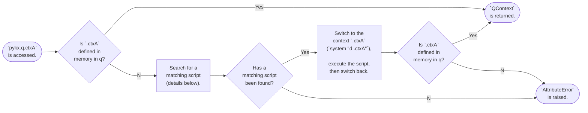

# Using q functions in a Pythonic way

For many users of PyKX the q programming language is not their language of choice when developing analytics and applications. However, when dealing with large volumes of kdb+ data or operations where vector analytic performance is of paramount importance they may desire or need to make use of q.

Functionality within the PyKX library makes the access and use of this functionality easier, this is known as the Context Interface

## The Context Interface

The Context Interface provided with PyKX provides an easy to use way of accessing q contexts (also known as namespaces when at the top level.) For more information about contexts/namespaces in q please refer to [Chapter 12 of Q for Mortals](https://code.kx.com/q4m3/12_Workspace_Organization/).

This provides users who are unfamiliar with kdb+/q analytic development to gain from the expertise of domain experts in this area through the consumption of common libraries and utilities.

Both the embedded q instance at pykx.q, and pykx.QConnection instances, have attributes for q namespaces, which are exposed in Python as pykx.QContext objects. These context objects have attributes for their members, which can either be sub-contexts or K objects. For example:

* pykx.q.Q is a KdbContext instance for the builtin .Q context/namespace
* pykx.q.ctxA.ctxB is a KdbContext instance for the .ctxA.ctxB context
* pykx.q.ctxA.ctxB.kObject is a pykx.K instance for the .ctxA.ctxB.kObject K object

Just as in q, the .q context is accessible at the top-level, so for instance instead of accessing pykx.q.q.md5, you can access it as pykx.q.md5. Some q builtins cannot be accessed like this such as or and not as these result in Python syntax errors. Such functions can instead be accessed either with getattr, or by evaluating them as q code (e.g. pykx.q('not')).

Accessing attributes of pykx.q (or a pykx.QConnection instance) which do not correspond to a context that has been loaded in memory in q will result in it trying to find a script with a matching name. This process is detailed in the flowchart below:



The fact that the context might not be defined even after the context interface changes the context
and executes the script might be confusing. This can happen because the script can switch into
other contexts, which overrides the context switch done by the context interface. Additionally the
script might use fully qualified names for its definitions, which can bypass the effect of
switching contexts.

Note that context switches persists across `pykx.q` calls (but not `pykx.QConnection(...)` calls).
One should take care when switching contexts, as unexpectedly being in an different context can
result in undesirable behavior. `QContext` objects are Python context managers, which means they
can be used with the `with` statement like so:

```python
# q code here executes in the global context
with q.myctx:
    # q code here executes in the `.myctx` context
    pass
# q code here executes in the global context
```

If you would like to switch into a q context using a string for the context name, use `getattr`
like so:

```python
# q code here executes in the global context
with getattr(q, 'myctx'):
    # q code here executes in the `.myctx` context
    pass
# q code here executes in the global context
```

The following provides a number of examples of the context interface being used:

* Access a variety of functions for use from the `.q`, `.Q` and `.j` namespaces

	```python
	>>> import pykx as kx
	>>> kx.q.max
	pykx.UnaryPrimitive(pykx.q('max'))
	>>> kx.q.max([1, 2, 3])
	pykx.LongAtom(pykx.q('3'))
    >>>
	>>> kx.q.mavg
	pykx.Lambda(pykx.q('k){msum[x;0.0^y]%mcount[x;y]}'))
	>>> kx.q.mavg(3, kx.q('til 10'))
	pykx.FloatVector(pykx.q('0 0.5 1 2 3 4 5 6 7 8'))
	>>>
	>>> kx.q.Q
	<pykx.ctx.QContext of .Q with [ajf0, k, K, host, addr, gc, ts, gz, w, res, addmonths, Xf, Cf, f, fmt, ff, fl, opt, def, qt, v, qp, V, ft, ord, nv, tx, tt, fk, t, ty, nct, fu, fc, A, a, n, nA, an, b6, Aa, id, j10, x10, j12, x12, btoa, sha1, prf0, l, sw, tab, t0, s1, s2, S, s, hap, hmb, hg, hp, a1, a0, IN, qa, qb, vt, bv, pm, pt, MAP, dd, d0, p1, p2, p, view, L, cn, pcnt, dt, ind, fp, foo, a2, qd, xy, x1, x0, x2, ua, q0, qe, ps, enxs, enx, en, ens, par, dpts, dpt, dpfts, dpft, hdpf, fsn, fs, fpn, fps, dsftg, M, chk, Ll, Lp, Lx, Lu, Ls, fqk, fql, btx, bt, sbt, trp, dr, dw, pl0, pl, jl8, srr, prr, lu, DL, dbg, err, BP, bp, bs, bu, bd, bc]>
	>>> kx.q.Q.ty(np.array([1, 2, 3]))
	pykx.CharAtom(pykx.q('"j"'))
	>>>
	>>> kx.q.j
	<pykx.ctx.QContext of .j with [e, q, s, es, J, k, jd, j]>
	>>> kx.q.j.j({'test': 2, 'dict' : [1, 2, 3]})
	pykx.CharVector(pykx.q('"{\"test\":2,\"dict\":[1,2,3]}"'))
	```

* Generate a script containing a context and make use of its functionality
	* Generate the script saving it to `QHOME`
		```python
		>>> demo_extension_source = '''
		... \d .demo_extension
		... N:100
		... test_data:([]N?`a`b`c;N?1f;N?10;N?0b)
		... test_function:{[data]
		...   analytic_keys :`max_x1`avg_x2`med_x3;
		...   analytic_calcs:(
		...     (max;`x1);
		...     (avg;`x2);
		...     (med;`x3));
		...   ?[data;
		...     ();
		...     k!k:enlist `x;
		...     analytic_keys!analytic_calcs
		...     ]
		...   }
		... '''
		>>>
		>>> demo_extension_filename = kx.qhome/'demo_extension.q'
		>>> with open(demo_extension_filename, 'w') as f:
		...     f.write(demo_extension_source)
		```
	* Access the defined context using the variables and functions defined
		```python
		>>> kx.q.demo_extension
		<pykx.ctx.QContext of .demo_extension with [N, test_data, test_function]>
		>>> kx.q.demo_extension.test_data
		pykx.Table(pykx.q('
		x x1         x2 x3
		------------------
		c 0.2086614  2  0 
		a 0.9907116  1  1 
		a 0.5794801  8  1 
		b 0.9029713  8  0 
		a 0.2011578  1  0 
		..
		'))
		>>> kx.q.demo_extension.test_function
		pykx.SymbolicFunction(pykx.q('`.demo_extension.test_function'))
		>>> kx.q.demo_extension.test_function(kx.q.demo_extension.test_data)
		pykx.KeyedTable(pykx.q('
		x| max_x1    avg_x2   med_x3
		-| -------------------------
		a| 0.9907116 4.74359  1     
		b| 0.9550901 4.580645 1     
		c| 0.9830794 4.433333 0     
		'))
		```

## Script Search Logic

When the context interface cannot find a namespace (i.e. a top-level context) that is being
accessed it attempts to find a q/k script that has a matching name. This process is done via a
depth first search of a tree where each node corresponds to part of the path, and each leaf
corresponds to a possible file. Only the first file found that exists is executed. If none of the
files exist then an `AttributeError` is raised.

The layers of the tree are as follows:

- Each of the paths in `pykx.q.paths`/`pykx.ipc.Connection(...).paths` (which defaults to
  `pykx.ctx.default_paths`)
- `.` prefix or not
- The name of the attribute accessed (i.e. `pykx.q.script` -> `script`)
- `.q` or `.k`
- No trailing `_` or a trailing `_` ([n.b. why a q/k script path would end with an
  underscore](https://code.kx.com/q/basics/syscmds/#_-hide-q-code))

So for example if `pykx.q.script` was accessed, the context `.script` was not defined in memory in
q, and `paths` was set to `['.', pykx.qhome]`
(where `pykx.qhome == pathlib.Path('/opt/kdb')`), then the following paths would be checked
in order until one is found to exist, or they have all been checked:

1.  `./.script.q`
2.  `./.script.q_`
3.  `./.script.k`
4.  `./.script.k_`
5.  `./script.q`
6.  `./script.q_`
7.  `./script.k`
8.  `./script.k_`
9.  `/opt/kdb/.script.q`
10. `/opt/kdb/.script.q_`
11. `/opt/kdb/.script.k`
12. `/opt/kdb/.script.k_`
13. `/opt/kdb/script.q`
14. `/opt/kdb/script.q_`
15. `/opt/kdb/script.k`
16. `/opt/kdb/script.k_`

??? "Failure to find a script"

	Failure to find a script associated with your defined extension will result in an error being raised, the following error message provides a truncated example of this when attempting to retrieve a context `test_extension`:

	```python
	>>> kx.q.test_extension
	Traceback (most recent call last):
	  File "/usr/local/anaconda3/lib/python3.8/site-packages/pykx/__init__.py", line 118, in __getattr__
	    self.__getattribute__('_register')(name=key)
	  File "/usr/local/anaconda3/lib/python3.8/site-packages/pykx/__init__.py", line 189, in _register
	    path = _first_resolved_path([''.join(x) for x in it.product(
	  File "/usr/local/anaconda3/lib/python3.8/site-packages/pykx/__init__.py", line 47, in _first_resolved_path
	    raise FileNotFoundError(f'Could not find any of the following files:\n{unfound_paths}')
	FileNotFoundError: Could not find any of the following files:
	.test_extension.q
	.test_extension.q_
	/usr/local/anaconda3/lib/python3.8/site-packages/pykx/lib/test_extension.k
	/usr/local/anaconda3/lib/python3.8/site-packages/pykx/lib/test_extension.k_

	The above exception was the direct cause of the following exception:

	Traceback (most recent call last):
	  File "<stdin>", line 1, in <module>
	  File "/usr/local/anaconda3/lib/python3.8/site-packages/pykx/__init__.py", line 122, in __getattr__
	    raise attribute_error from inner_error
	  File "/usr/local/anaconda3/lib/python3.8/site-packages/pykx/__init__.py", line 115, in __getattr__
	    return ctx.__getattr__(key)
	  File "/usr/local/anaconda3/lib/python3.8/site-packages/pykx/ctx.py", line 267, in __getattr__
	    raise AttributeError(
	AttributeError: 'pykx.ctx.QContext' object has no attribute 'test_extension'
	```

### Adding context interface search locations

In addition to the default search locations users can add additional locations to be searched through appending of additional search paths to the `kx.q.paths` list which underpins the search. The following shows a practical example of this accessing a file `my_context.q` at a new location `/tmp/files`, in this example we attempt initially to access the namespace without this location set for search

```python
>>> import pykx as kx
>>> from pathlib import Path
>>> kx.q.my_context
Traceback (most recent call last):
  File "/usr/local/anaconda3/lib/python3.8/site-packages/pykx/__init__.py", line 132, in __getattr__
..
>>> kx.q.paths.append(Path('/tmp/files'))
>>> kx.q.my_context
<pykx.ctx.QContext of .my_context with [func]>
```

## Best Practices

To take full advantage of the automatic script loading one should ensure that every q/k script
defines at most one public context. Ideally every q/k script should define exactly one context,
and the name of the context should be equivalent to the name of the file without the file
extension. For instance, `script.q` should place its definitions within the `.script` namespace.
This ensures that when the context interface executes a script to load a context, it doesn't load
in more contexts than intended. Furthermore the context name matching the file name ensures that
when that file is executed because its name matches the desired context, that context will actually
be defined.

When these best practices cannot be followed it may be impossible to use the automatic loading of
scripts via the context interface. In that case we can resort to manually loading scripts either
by executing the q code `system "l <path to script>"`, or by calling `pykx.q._register` with the
path to the script.

When switching contexts within a script, one should always save the context they were in prior to
their context switch, and then switch back into it afterwards, rather than explicitly switching
into the global context.

## Execution Contexts for Functions

Functions returned by the context interface are provided as [`pykx.SymbolicFunction`][] instances.

These objects are symbol atoms whose symbol is a named function (with a fully-qualified name). They
can be called like regular [`pykx.Function`][] objects, but unlike regular [`pykx.Function`][]
objects, they will execute in the `pykx.Q` instance (also known as its "execution context") in
which it was defined.

The following shows an example of the retrieval of a function from a context vs defining the function itself:

* Function retrieved via a context

	```python
	>>> kx.q.extension.func
	pykx.SymbolicFunction(pykx.q('`.extension.func'))
	>>> kx.q.extension.func(2)
	pykx.LongAtom(pykx.q('3'))
	```

* Function defined locally and retrieved

	```python
	>>> qfunc = kx.q('{x+1}')
	>>> qfunc
	pykx.Lambda(pykx.q('{x+1}'))
	>>> qfunc(2)
	pykx.LongAtom(pykx.q('3'))
	```
