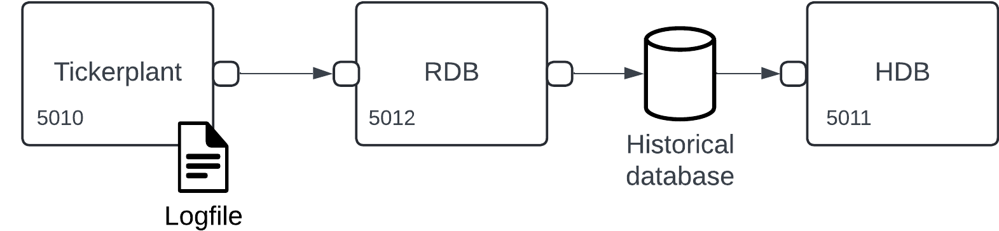

# Basic streaming ingest

_This page outlines the steps required to create a high-velocity data ingest infrastructure using PyKX._

!!! warning "Disclaimer"

	 The functionality outlined below provides the necessary tools for users to build complex streaming infrastructures. The generation and management of such workflows rest solely with the users. KX supports only individual elements used to create these workflows, not the end-to-end applications.   

## Introduction

The most fundamental task in managing high-velocity data is consuming and persisting this data in the order it arrives. The core components of any workflow that aims to achieve this must manage the following coordinated actions:

1. Capture and log the ingested data allowing for data replay in failure scenarios.
2. Maintain a record of the most recent data available and allow users/analytics to access it.
3. Persist and make available data from previous days to facilitate more complex analytics.

These steps are managed by three separate processes known as the Tickerplant, Real-Time Database (RDB), and Historical Database (HDB). In combination, these processes form the 'basic' building block of any ingest workflow using PyKX. We will break these processes down in more depth later. For now, let's visualize one of their simplest arrangement:



## Get started

Start this basic infrastructure by running the following commands:

```python
import pykx as kx
trade = kx.schema.builder({
    'time': kx.TimespanAtom  , 'sym': kx.SymbolAtom,
    'price': kx.FloatAtom, 'volume': kx.LongAtom})
agg = kx.schema.builder({
    'time': kx.TimespanAtom, 'sym': kx.SymbolAtom,
    'max_price': kx.FloatAtom , 'median_volume': kx.FloatAtom})
basic = kx.tick.BASIC(
    tables = {'trade': trade, 'aggregate': agg},
    log_directory = 'log',
    database = 'db')
    
basic.start()
```

Congratulations you now have a fully functional high-volume ingestion pipeline running! But did we configure it?

The call to `#!python kx.tick.BASIC` above provides several keyword arguments which help to manage the initialization of the various processes:

1. `#!python tables`: Provides a dictionary mapping the names of tables to be ingested and persisted to their schema. This is the only parameter required for initializing the basic infrastructure.
2. `#!python log_directory`: Generates a directory (if not currently available) and persists a log of each incoming message to a log-file associated with today's date.
3. `#!python database`: If omitted, the HDB process outlined above will not be initialized. The `#!python database` denoted here should point to a directory containing a partitioned kdb+ database, for more information on this form of database see [here](../database/index.md).

For a full breakdown of the BASIC API functionality go [here](../../../api/tick.md#pykx.tick.BASIC).


If you want to know more about the individual components of the basic streaming infrastructure, read through the next section, otherwise jump to [Next Steps](#next-steps) where you can continue to develop your system.

??? "API documentation"
    The following bullet-points provide links to the various functions used within the above section

    - [`kx.tick.BASIC`](../../../api/tick.md#pykx.tick.BASIC)
    - [`basic.start`](../../../api/tick.md#pykx.tick.BASIC.start)

## Component breakdown

To understand how the basic infrastructure operates, it's helpful to understand the role that Tickerplant, RDB and HDB processes play in the data lifecycle. The following sections describe each of these components.

### Tickerplant

The role of a tickerplant is to coordinate the following actions within the lifecycle of streaming data:

- Write all incoming messages to a central log file which can be used to replay data in situations where the Tickerplant process is unexpectedly killed.
- Push all data received to an upstream RDB to maintain a record of all data.
- Push all or a subset of data to more complex processes or upstream subscriber.
- Send a message to all subscribing processes at the end of day (EOD) to execute their end-of-day function.

!!! Warning

    Tickerplants operate as a central source of truth when building streaming applications. Their constant operation is important, particularly in cases where data volumes are extreme.

Should the Tickerplant process be killed and need to recover or data be replayed to repopulate the Database at a later point, the log file is centrally important. When the tickerplant receives messages, it persists each of them to the disk, in a file named `#!python log<current date>` within a user-specified directory. 

Data is logged as a list with the first argument being the function which should be executed on log replay and the remaining elements being the arguments to this function. Within the PyKX streaming workflows, the function called is `#!python .u.upd` and it takes two arguments: `#!python table_name` and `#!python message`. As such, our log file may consist of the following information (in human readable form below).

```q
(`.u.upd;`trade;(0D11:31:30.758665000;`AAPL;42.0))
(`.u.upd;`trade;(0D11:31:30.758666000;`MSFT;40.2))
(`.u.upd;`trade;(0D11:31:30.758667000;`AAPL;42.1))
```

Tickerplants can run into issues when subscribers consume their data slower than it can be produced. To explore this problem in more depth, go to the [Real-Time Analytic](rta.md) development page.

### Real-Time Database

A Real-Time Database (RDB) stores today’s data in-memory and writes it to the HDB at the end of day. For persistence of raw data in high-throughput scenarios, avoid to apply analytics on data along the critical path. At a minimum, it's recommended to have RAM of at least 4× expected data size. Therefore, for 5 GB data per day, the machine should have at least 20 GB RAM. In practice, you can use much larger RAM.

### Historical Databases

The Historical Database (HDB) contains data for all available days of processed data before the current day. This data is stored on-disk and loaded into the process as a memory-mapped dataset. Interactions with this data and its management are more complex than in-memory data. You can manage this data in the [Database API for PyKX](../database/index.md) and you can also [query](../../fundamentals/query/index.md) it.

!!! info "Important"

    PyKX allows to load only one database at a time on an HDB. The HDB connecting to an RDB/RTE should have the same tables defined to avoid issues with missing partitions.

## Next steps

Now that you have your basic infrastructure up and running, you might be interested in some of the following:

- Learn how to publish data to your streaming infrastructure [here](publish.md).
- Learn how to subscribe to data from your streaming infrastructure [here](subscribe.md).
- If you need more fine-grained control over your infrastructure, see [here](complex.md)

For some further reading, here are some related topics:

- Learn how to generate a Historical Database [here](../database/index.md).
