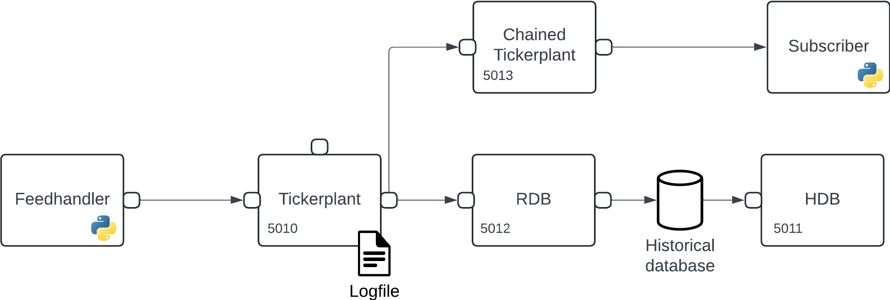

# Analyze streaming data

_This page outlines how you can apply analytics to your streaming data._

!!! Warning "Disclaimer"

         The functionality outlined below provides the necessary tools for users to build complex streaming infrastructures. The generation and management of such workflows rest solely with the users. KX supports only individual elements used to create these workflows, not the end-to-end applications.

In previous sections we have walked through how to build a [basic streaming infrastructure](basic.md), [publish data](publish.md) and [subscribe to updates](subscribe.md). In more complex scenarios users may wish to apply analytics to the real-time data that is being consumed by their infrastructure. This can be completed in a subscribing process or, more formally, in a Real-Time Processor (RTP).

With PyKX, an RTP subscribes to data from a tickerplant and completes one of the following:

1. Operates as a Real-Time Database (RDB) ingesting data as quickly as possible, making it available for query during the day and coordinating data persistence at end of day.
1. Allows analytic application on data prior to and post insertion into the in-memory database (RDB).

!!! note "Have your say"

	The above usage patterns provide flexibility in application development but are not the only approaches to real-time processing possible in data-streaming. If there is functionality that you'd like to see, let us know by opening an issue [here](https://github.com/KxSystems/pykx/issues).


In the following sections we will walk through how to limit the impact of slow running analytics, subscribe to specific tables on which our analytics will be built and developing Pythonic pre and post-processing analytics to filter data and derive insights.

The steps discussed below depend on the [basic infrastructure](basic.md) and [publishing](publish.md) sections, so if you don't have a running system with flowing data, revisit these sections.

## Protect data ingest

The following explanation relating to slow subscribers was previously covered [here](subscribe.md#protect-data-ingest) if you are comfortable with the techniques used to limit the impact of slow running analytics you can skip to the [next section](#build-real-time-processors).

As mentioned [here](basic.md#tickerplant) when describing issues that can impact tickerplants, subscribers who process messages too slowly can cause significant issues which can critically impact your streaming infrastructure. Typically, a zero-latency tickerplant (which the basic infrastructure tickerplant is one of) will publish too much data for complex analytics to process.

To reduce the impact of slow subscribers a chained tickerplant can subscribe to all messages from the zero-latency TP and publish messages to down-stream subscribers at a slower rate. An important characteristic of a chained tickerplant is that while it can provide down-stream subscribers with data it does not maintain a log of processed data, as such a chained tickerplant should always connect to a zero-latency tickerplant to ensure data processing in failure events.

An example of such a setup can be seen below and is what we will generate throughout the following sections:



Before providing a demonstration of subscribing to new messages, we first must generate the chained tickerplant to which users will subscribe. This is achieved using the `kx.tick.TICK` class and setting the `chained` keyword to `True`.

```python
>>> chained_tp = kx.tick.TICK(port=5013, chained=True)
>>> chained_tp.start({'tickerplant': 'localhost:5010'})
```

In the above code we are setting the chained tickerplant on port 5013 to provide access to external processes. Additionally, on start of the chained tickerplant, we state that it should subscribe to messages from the zero-latency tickerplant on port 5010.

??? "API documentation"
    The following bullet-points provide links to the various functions used within the above section

    - [`kx.tick.TICK`](../../../api/tick.md#pykx.tick.TICK)
    - [`chained_tp.start`](../../../api/tick.md#pykx.tick.TICK.start)

## Build real-time processors

Now that a chained tickerplant has been established which can be used for slow subscribers, we can generate some analytics from the data supplied by this process. To achieve this, we use a Real-Time Processor (RTP) which runs pre-processing and post-processing analytics. We generate Python analytics that achieve the following:

1. Pre-process all messages to remove any data which is sourced from a table other than the `#!python trade` table.
2. A post-processing function written in Python which uses PyKX and numpy to calculate the `#!python min`, `#!python max` and `#!python spread` of prices per symbol from the processed trade data.
3. Publishes the results of your aggregated information back to the primary tickerplant to ensure the aggregate data is persisted for future inspection.

The reference architecture used for this is as follows:


### Start your RTP

To start building and iterating the development of your RTP, first, you need to configure and start your RTP instance. The basic requirements as required by the steps outlined above are:

1. RTP will be started on port 5014
2. RTP should subscribe to `#!python trade` table messages only from port 5013
3. The RTP should facilitate complex analytics denoted by setting the keyword `#!python vanilla=False` 

```python
rtp = kx.tick.RTP(port=5014,
                  subscriptions = ['trade'],
                  vanilla=False)
```

Now that you initialized your RTP process, you can begin to add analytics to the process to run pre and post processing analytics.

??? "API documentation"
    The following bullet-points provide links to the various functions used within the above section

    - [`kx.tick.RTP`](../../../api/tick.md#pykx.tick.RTP)

### Add pre/post processors

To add a set of Python analytics we first need to define the Python libraries that will be required to run your analytics. Use the `#!python libraries` method for the RTP instance. This method takes a dictionary as its input parameter which maps the alias name of the library to the true name of the library. For example, if you require access to both `#!python numpy` and `#!python pykx` named as `#!python np` and `#!python kx` explicitly within your function you would add this:

```python
rtp.libraries({'np': 'numpy', 'kx': 'pykx'})
```

The above example is equivalent to running `#!python import numpy as np` and `#!python import pykx as kx` on the RTP.

Now that the RTP process has access to PyKX and Numpy, we can define the pre-processor function. If this pre-processor returns a `#!python None` object, the data received will not be inserted into the RTP's in-memory database. This function must take two parameters:

1. Name of the table whose data is being processed
2. The data that is being processed

```python
def preprocessor(table, data):
    if table == 'trade':
        return data
    else:
        return None
```

Now that you defined the function, you can register the pre-processor:

```python
rtp.pre_processor(preprocessor)
```

Next, we can add the final function which calculates aggregate data information on the `#!python trade` table following data insertion into the in-memory table. This function takes two parameters:

1. Name of the table whose data is being processed
2. The data that was processed

In the below function we calculate the `#!python min`, `#!python max` and `#!python spread` of the trade price by symbol and finally publish this data back to the primary tickerplant on port 5010.

```python
def postprocessor(table, data):
    agg = kx.q[table].select(
        columns = {'min_px':'min price',
                   'max_px': 'max price',
                   'spread_px': 'max[price] - min price'},
         by = {'symbol': 'symbol'})
    kx.q['agg'] = agg # Make the table accessible from q
    with kx.SyncQConnection(port=5010, wait=False, no_ctx=True) as q:
        q('.u.upd', 'aggregate', agg._values)
    return None
```

Now that you defined this function, set the pre-processor function on the RTP process:

```python
rtp.post_processor(postprocessor)
```

On successful application of this function, start your RTP to begin processing:

```python
rtp.start({'tickerplant': 'localhost:5014'})
```

Now that you initialized your RTP, validate that data is available by calling the `#!python rtp` process directly and requesting the `#!python aggregate` data:

```python
rtp('aggregate')
```

Aggregate messages will be available to any subscribers to all data that you may have configured during the [subscriber generation](subscribe.md).

!!! info "Important"

    When developing your system for the first time, the above workflow allows you to iteratively develop your processing functions quickly before and after the ingestion of data begins. In scenarios where you need to restart your RTP or configuration is cached, running your configuration and starting as single-shot calls makes management of the system easier.

??? "API documentation"
    The following bullet-points provide links to the various functions used within the above section

    - [`rtp.start`](../../../api/tick.md#pykx.tick.RTP.start)
    - [`rtp.libraries`](../../../api/tick.md#pykx.tick.RTP.start)
    - [`rtp.pre_processor`](../../../api/tick.md#pykx.tick.RTP.pre_processor)
    - [`rtp.post_processor`](../../../api/tick.md#pykx.tick.RTP.post_processor)


### Run all setup at once

The following code configures end-to-end the RTP outlined in the above sections:

```python
def preprocessor(table, data):
    if table == 'trade':
        return data
    else:
        return None

def postprocessor(table, data):
    agg = kx.q[table].select(
        columns = {'min_px':'min price',
                   'max_px': 'max price',
                   'spread_px': 'max[price] - min price'},
         by = {'symbol': 'symbol'})
    kx.q['agg'] = agg # Make the table accessible from q
    with kx.SyncQConnection(port=5010, wait=False, no_ctx=True) as q:
        q('.u.upd', 'aggregate', agg._values)
    return None

rtp = kx.tick.RTP(port=5014,
                  subscriptions = ['trade'],
                  libraries={'kx': 'pykx'},
                  pre_processor=preprocessor,
                  post_processor=postprocessor,
                  vanilla=False)
rtp.start({'tickerplant': 'localhost:5013'})
```

The advantage of this approach is that it allows for process/workflow restart in the scenario that you need lose connection to a downstream process for example. As all definitions are cached in configuration they can easily be restarted.

```python
rtp.restart()
```

??? "API documentation"
    The following bullet-points provide links to the various functions used within the above section

    - [`kx.tick.RTP`](../../../api/tick.md#pykx.tick.RTP)
    - [`rtp.start`](../../../api/tick.md#pykx.tick.RTP.start)
    - [`rtp.restart`](../../../api/tick.md#pykx.tick.RTP.restart)

## Next steps

Now that you have created a data subscriber you may be interested in the following:

- Perform complex analysis on your real-time data following the instructions [here](rta.md).
- Query your real-time and historical data using custom APIs [here](custom_apis.md).

For some further reading, here are some related topics:

- Learn more about Interprocess Communication (IPC) [here](../ipc.md).
