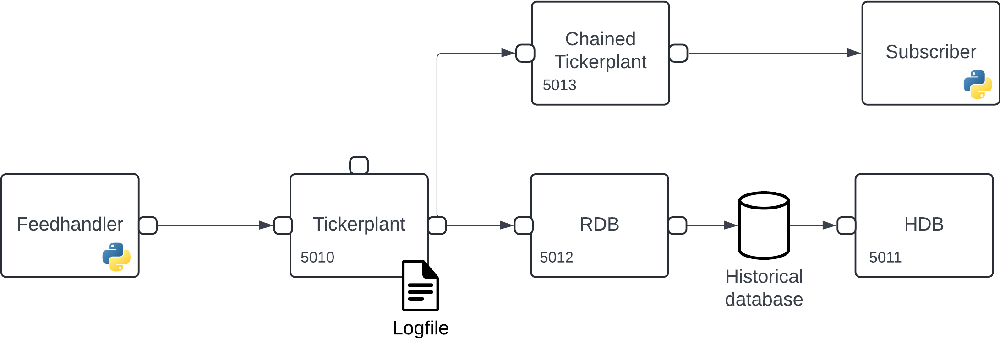

# Subscribe to data

_This page outlines how you can get real-time updates from your streaming infrastructure._

!!! Warning "Disclaimer"

        The functionality outlined below provides the necessary tools for users to build complex streaming infrastructures. The generation and management of such workflows rest solely with the users. KX supports only individual elements used to create these workflows, not the end-to-end applications. 

In previous sections we have walked through how to build a [basic streaming infrastructure](basic.md) and [publish data](publish.md). As this data is being consumed users may wish to access it in real-time. This is achieved by subscribing to updates from the tickerplant and using Python/q as in the examples below.

Subscribing to data gives you the ability to derive analytic insights into your data. However, caution should be taken when creating subscriptions in high-throughput scenarios. More details in the next section.

## Protect data ingest

As mentioned [here](basic.md#tickerplant) when describing issues that can impact tickerplants, subscribers who process messages too slowly can cause significant issues. This can critically impact your streaming infrastructure. Typically, a zero-latency tickerplant (which the basic infrastructure tickerplant is one of) will publish too much data for complex analytics to process.

To reduce the impact of slow subscribers, a chained tickerplant can subscribe to all messages from the zero-latency TP and publish messages to down-stream subscribers at a slower rate. An important characteristic of a chained tickerplant is that while it can provide down-stream subscribers with data it does not maintain a log of processed data, as such a chained tickerplant should always connect to a zero-latency tickerplant to ensure data processing in failure events.

An example of such a setup can be seen below and is what we will generate throughout the following sections:



Before providing a demonstration of subscribing to new messages we first must generate the chained tickerplant to which users will subscribe. This is achieved using the `kx.tick.TICK` class setting the `chained` keyword to `True`.

```python
>>> chained_tp = kx.tick.TICK(port=5013, chained=True)
>>> chained_tp.start({'tickerplant': 'localhost:5010'})
```

In the above code we are setting the chained tickerplant on port 5013 to provide access to external processes, additionally on start of the chained tickerplant we state that it should subscribe to messages from the zero-latency tickerplant on port 5010.

??? "API documentation"
    The following bullet-points provide links to the various functions used within the above section

    - [`kx.tick.TICK`](../../../api/tick.md#pykx.tick.TICK)
    - [`chained_tp.start`](../../../api/tick.md#pykx.tick.TICK.start)

## Receive updates

The below sections provide examples in Python and q showing how users can subscribe for all updates or can be more specific to get access to specific tables or symbols within their data.

In all cases subscription is achieved through execution of the `#!python .u.sub` function on the tickerplant process which is being connected to. This function takes two parameters:

1. The name(s) of the table(s) for which you are subscribing to, in the case that you are subscribing to all data this argument should be an empty str in Python or ````` in q.
2. The name(s) of the symbol(s) to which you are subscribing, in the case that you are subscribing to all symbols within the tables this should be an empty str in Python or ````` in q.

### Python

The code blocks provided in the below tabs show how a user can subscribe to all updates from all tables or selectively choose to get updates from a single table and symbol.

=== "Subscribing to all data"

	```python
	import pykx as kx

	import sys
	import asyncio

	trade = kx.schema.builder({
	    'time': kx.TimespanAtom  , 'sym': kx.SymbolAtom,
	    'price': kx.FloatAtom, 'volume': kx.LongAtom})


	async def main_loop(q, trade):
	    while True:
	        await asyncio.sleep(0.005)
	        result = q.poll_recv()
	        if result is None:
	            continue
	        table = result[1]
	        if table == 'trade':
	            trade.upsert(result[2], inplace=True)
	        sys.stdout.write(f"Trade count: {len(trade)}\r")
	        sys.stdout.flush()


	async def main():
	    global trade
	    async with kx.RawQConnection(port=5013) as q:
	        await q('.u.sub', '', '')
	        await main_loop(q, trade)


	if __name__ == '__main__':
	    try:
	        asyncio.run(main())
	    except KeyboardInterrupt:
	        print('Subscriber suspended')
	```

=== "Subscribing to AAPL within the trade table"

	```python
	import pykx as kx

	import sys
	import asyncio

	trade = kx.schema.builder({
	    'time': kx.TimespanAtom  , 'sym': kx.SymbolAtom,
	    'price': kx.FloatAtom, 'volume': kx.LongAtom})


	async def main_loop(q, trade):
	    while True:
	        await asyncio.sleep(0.005)
	        result = q.poll_recv()
	        if result is None:
	            continue
	        table = result[1]
	        if table == 'trade':
	            trade.upsert(result[2], inplace=True)
	        sys.stdout.write(f"Trade count: {len(trade)}\r")
	        sys.stdout.flush()


	async def main():
	    global trade
	    async with kx.RawQConnection(port=5013) as q:
	        await q('.u.sub', 'trade', 'AAPL')
	        await main_loop(q, trade)


	if __name__ == '__main__':
	    try:
	        asyncio.run(main())
	    except KeyboardInterrupt:
	        print('Subscriber suspended')
	```

### q

The code blocks provided in the below tabs show how a user can subscribe to all updates from all tables or selectively choose to get updates from a single table and symbol.

=== "Subscribing to all data"

	```q
	h:hopen 5013
	upd:insert
	h(`.u.sub;`;`)

	\t 1000
	.z.ts:{show count trade;}
	```

=== "Subscribing to AAPL within the trade table"

	```q
	h:hopen 5013
	upd:insert
	h(`.u.sub;`trade;`AAPL)

	\t 1000
	.z.ts:{show count trade;}
	```


## Next steps

Now that you have created a data subscriber you may be interested in the following:

- Perform complex analysis on your real-time data following the instructions [here](rta.md).
- Query your real-time and historical data using custom APIs [here](custom_apis.md).

For some further reading, here are some related topics:

- Learn more about Interprocess Communication (IPC) [here](../ipc.md).
