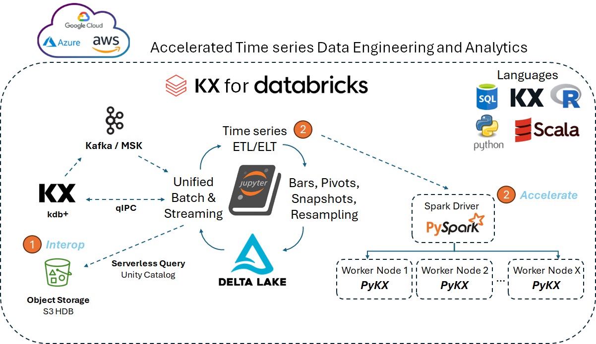

# KX for Databricks
_This page briefly describes PyKX on Databricks use cases and capabilities._

KX for Databricks brings the full capability of KX's time series engine to Databricks. KX's PyKX, the Python-first interface already familiar to data scientists and quants, turbocharges workloads and research on use cases such as:

- Algorithmic trading strategy development and backtesting​
- Large-scale pre- and post-trade analytics
- Macro-economic research and analysis using large datasets​
- Cross-asset analytics with deep historical data​
 
KX for Databricks leverages PyKX directly inside Databricks, for Python and distributed Spark workloads. Use it on existing Delta Lake datasets without external KX dependencies, or choose to flexibly interop with other KX products to leverage the power of your broader KX systems estate.

## Get started and workflows 

Refer to the [Get started](getStarted.md) page if you wish to complete the following actions:

- [Install](getStarted.md#1-install-pykx) PyKX on Databricks.
- Check what type of [license](getStarted.md#2-licensing) you need.
- [Load data](getStarted.md#3-load-data-using-spark-dataframes) using Spark Dataframes.
- [Use PyKX pythonic vs. q magic (%%)](getStarted.md#4-pykx-pythonic-vs-q-magic-).

Next, learn how to [set up a cluster](clusterSetups.md), depending on the type of workflow you need:

- Work with a [single node/driver](clusterSetups.md#1-single-node-workflow) on analytic calculation of OHLC, VWAP pricing, volatility, spread, and trade execution analysis (slippage).
- Work with a [multi/distributed nodes](clusterSetups.md#2-multi-node-workflow) cluster on slippage calculation with PySpark.
